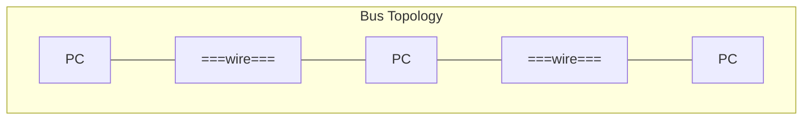
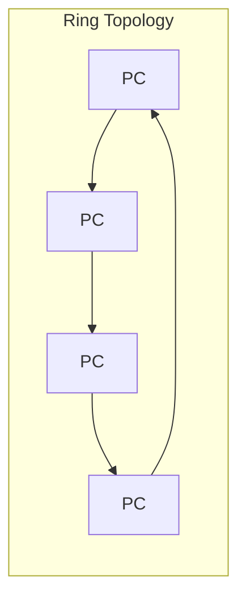
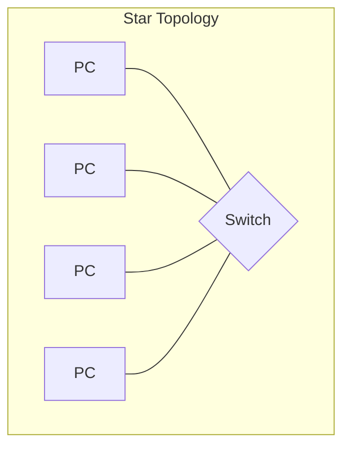
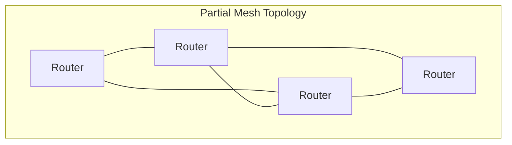
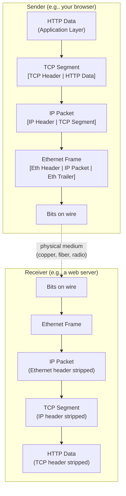

# Module 01: Introduction to Computer Networks

[← Topic Home](../../README.md) | [Next →](../02_physical-and-datalink/)

---


---

## Table of Contents

1. [Overview](#overview)
2. [Prerequisites](#prerequisites)
3. [Objectives](#objectives)
4. [Theory](#theory)
5. [Key Concepts](#key-concepts)
6. [Examples](#examples)
7. [Common Pitfalls](#common-pitfalls)
8. [Cross-Links](#cross-links)
9. [Summary](#summary)

---

## Overview

This module answers the most fundamental question in networking: what is a computer network and how does data actually move from one machine to another? We will build the conceptual scaffolding — the mental models and vocabulary — that every subsequent module depends on.

The central challenge in networking is coordination without centralization. When you send a message from your laptop to a server in another country, your data must traverse multiple independent organizations' equipment, using protocols designed by different groups at different times, and it must arrive correctly despite packet loss, reordering, and duplication along the way. The reason this works at all is the layered model: a disciplined agreement that each layer does one job and communicates with the layers above and below through well-defined interfaces.

By the end of this module, you will have the vocabulary to describe what is happening at each step when data crosses a network, and you will understand why the layered model exists — not just as an abstract diagram but as the solution to a concrete engineering problem.

---

## Prerequisites

- No networking prerequisites — this is the starting point
- Ability to use a command-line terminal (to run `ping`, `traceroute`)
- Familiarity with what a computer program is

---

## Objectives

By the end of this module, you will be able to:

1. Define what a computer network is and explain why packet switching was a breakthrough over circuit switching
2. Describe the 7 layers of the OSI model and name the PDU, key protocols, and key devices at each layer
3. Describe the 4 layers of the TCP/IP model and map each OSI layer to its TCP/IP equivalent
4. Explain encapsulation: how data is wrapped at each layer as it travels down the sender's stack and unwrapped as it travels up the receiver's stack
5. Distinguish between hubs, switches, and routers, and explain which OSI layer each operates at
6. Use `ping`, `traceroute`, and `netstat` to observe network behavior from the command line
7. Trace a simple web request (typing a URL and pressing Enter) through all network layers

---

## Theory

### Network Topologies

A topology describes how nodes (devices) are physically or logically connected. Before TCP/IP abstracted away topology differences, the physical topology determined what kinds of failures were survivable. Understanding topologies builds intuition for why modern networks are designed as they are.



*Bus topology: all devices share a single cable. Simple but fragile — one break isolates everyone.*



*Ring topology: each device connects to exactly two neighbors. Token Ring (IBM) used this. One break isolates the network unless dual rings are used.*



*Star topology: all devices connect to a central switch or hub. Today's dominant LAN topology. A single device failure isolates only that device.*



*Mesh topology: devices have multiple paths between them. The internet uses a partial mesh at the router level. Multiple redundant paths mean failures are survivable.*

The internet's resilience comes from its mesh topology at the routing level: there is rarely only one path between two points, and routing protocols automatically find alternate paths around failures.

---

### The OSI Model: 7 Layers

The Open Systems Interconnection (OSI) model, developed by ISO in 1984, is the canonical framework for describing network protocols. It was designed to enable interoperability between equipment from different manufacturers — if every device uses the same layered interfaces, devices can communicate regardless of who built them.

The OSI model divides network communication into 7 layers. Each layer communicates with the layer directly above it (providing a service) and the layer directly below it (using a service), and with the corresponding layer on the remote machine (through peer-to-peer protocol communication).

| Layer | Name | PDU | Key Protocols | Key Devices | Responsibility |
|-------|------|-----|--------------|-------------|----------------|
| 7 | Application | Data | HTTP, DNS, SMTP, FTP, SSH | Application servers | End-user protocols and data formats |
| 6 | Presentation | Data | TLS, JPEG, ASCII | — | Encoding, encryption, compression |
| 5 | Session | Data | NetBIOS, RPC | — | Session management, dialog control |
| 4 | Transport | Segment | TCP, UDP | Stateful firewalls | End-to-end delivery, flow control |
| 3 | Network | Packet | IP, ICMP, OSPF | Routers | Logical addressing, routing |
| 2 | Data Link | Frame | Ethernet, 802.11, ARP | Switches, bridges | Physical addressing (MAC), error detection |
| 1 | Physical | Bit | Ethernet (copper/fiber), Wi-Fi | Hubs, NICs, cables | Transmission of raw bits over a medium |

**The key insight:** each layer only needs to know about its immediate neighbors. A TCP implementation does not care whether the network below uses Ethernet or Wi-Fi. An HTTP server does not care whether the transport below uses a wired or wireless connection. This separation of concerns is why the same application protocol (HTTP) can run over any underlying network technology.

**Memory aids:**
- Top to bottom: "All People Seem To Need Data Processing" (Application, Presentation, Session, Transport, Network, Data Link, Physical)
- Bottom to top: "Please Do Not Throw Sausage Pizza Away"

---

### The TCP/IP Model: 4 Layers

While OSI is the conceptual standard, the actual internet runs on the TCP/IP model, developed by Vint Cerf and Bob Kahn in the early 1970s and formalized through the RFC process. The TCP/IP model has 4 layers (sometimes described as 5 when the Physical and Data Link layers are separated):

| TCP/IP Layer | Roughly Covers OSI | Key Protocols |
|-------------|-------------------|--------------|
| Application | OSI 5, 6, 7 | HTTP, HTTPS, DNS, SMTP, SSH, FTP |
| Transport | OSI 4 | TCP, UDP |
| Internet | OSI 3 | IP (IPv4, IPv6), ICMP |
| Link | OSI 1, 2 | Ethernet, Wi-Fi (802.11), ARP |

The OSI model is more precise for teaching (it separates Session, Presentation, and Application), but TCP/IP is what exists in practice. In real implementations, the Session and Presentation functions (like TLS encryption) are handled by Application-layer code or by the Transport layer — there is no separate OS-level Session or Presentation layer.

When engineers say "Layer 3 problem" or "Layer 7 load balancer," they are speaking OSI, even though the actual protocols are TCP/IP. Both models are worth knowing.

---

### How Data Travels: Encapsulation

Encapsulation is the process by which each layer adds its own header (and sometimes trailer) to the data it receives from the layer above. Think of it like nested envelopes: each layer puts the payload inside its own envelope and addresses that envelope using its own addressing scheme.



*Encapsulation: the sender wraps data at each layer; the receiver unwraps it in reverse order.*

The encapsulation process, step by step on the sender's side:

1. **Application Layer:** HTTP creates an HTTP request message (e.g., `GET / HTTP/1.1\r\nHost: example.com\r\n\r\n`)
2. **Transport Layer:** TCP wraps this in a TCP segment, adding source port, destination port, sequence number, and checksum
3. **Network Layer:** IP wraps the TCP segment in an IP packet, adding source IP, destination IP, and TTL
4. **Data Link Layer:** Ethernet wraps the IP packet in a frame, adding source MAC address, destination MAC address, and a Frame Check Sequence (FCS) for error detection
5. **Physical Layer:** The frame is converted to electrical signals, light pulses, or radio waves and transmitted

The receiver reverses this process exactly: each layer strips its own header and passes the inner payload up to the next layer.

**The critical point about frames:** Ethernet frames carry MAC addresses, and MAC addresses are local to a single network segment. When an IP packet crosses a router, the router strips the Ethernet frame (Layer 2) and creates a new one for the next segment. The IP packet (Layer 3) passes through unchanged; only the frame (Layer 2) is recreated at each hop.

---

### Key Network Devices

Understanding which layer a device operates at tells you what it can and cannot do:

| Device | OSI Layer | What It Reads | What It Does |
|--------|-----------|---------------|-------------|
| Hub | Layer 1 | Bits only | Repeats every signal to every port — no intelligence; causes collisions |
| Switch | Layer 2 | Frame (MAC addresses) | Forwards frames only to the port where the destination MAC is known |
| Router | Layer 3 | Packet (IP addresses) | Routes packets across networks using a routing table; creates new frames for each hop |
| Firewall (stateless) | Layer 3–4 | IP + Port | Allows/denies packets based on IP address and port rules |
| Firewall (stateful) | Layer 4 | Connection state | Tracks connection state; knows if a packet is part of an established session |
| Load Balancer (L7) | Layer 7 | Full HTTP request | Routes requests to backend servers based on URL, cookies, or content |

**Hub vs. Switch:** Hubs are "dumb" — they repeat every signal to every connected device, causing all devices to contend for the medium (CSMA/CD). Switches are "smart" — they learn which MAC address is on which port and forward frames only to the correct port. Almost all modern networks use switches; hubs are effectively obsolete.

**Switch vs. Router:** Switches operate within a single network segment (Layer 2 domain). Routers connect different networks and make decisions based on IP addresses. When your traffic leaves your home network and travels to Google, it passes through many routers — each one reads the destination IP address, looks it up in a routing table, and forwards the packet toward its destination.

---

### Practical Examples: Using ping, traceroute, and netstat

These tools let you observe the network stack from the command line. They are indispensable for troubleshooting — we will see them again in Module 11.

```bash
# ping: sends ICMP Echo Request and measures Round-Trip Time (RTT)
# This tells you: is the host reachable, and how long does a round trip take?
ping -c 4 google.com
```

```
PING google.com (142.250.80.46): 56 data bytes
64 bytes from 142.250.80.46: icmp_seq=0 ttl=117 time=12.3 ms
64 bytes from 142.250.80.46: icmp_seq=1 ttl=117 time=11.9 ms
64 bytes from 142.250.80.46: icmp_seq=2 ttl=117 time=12.1 ms
64 bytes from 142.250.80.46: icmp_seq=3 ttl=117 time=12.4 ms
```

```bash
# traceroute: discovers the path packets take by sending packets with
# increasing TTL values (1, 2, 3...) — each router that decrements TTL
# to 0 sends back an ICMP Time Exceeded message, revealing itself.
traceroute google.com
```

```
traceroute to google.com (142.250.80.46), 30 hops max
 1  192.168.1.1      1.2 ms   (your home router)
 2  10.0.0.1         8.5 ms   (ISP first hop)
 3  203.0.113.1     10.1 ms   (ISP backbone)
 4  72.14.232.85    11.8 ms   (Google's edge)
 5  142.250.80.46   12.3 ms   (Google's server)
```

```bash
# netstat / ss: show active connections and listening ports
# -t: TCP, -u: UDP, -l: listening, -n: numeric addresses, -p: show process
ss -tulnp
```

```
Netid  State   Local Address:Port   Peer Address:Port  Process
tcp    LISTEN  0.0.0.0:22           0.0.0.0:*          sshd
tcp    LISTEN  127.0.0.1:5432       0.0.0.0:*          postgres
tcp    ESTAB   192.168.1.5:52341    142.250.80.46:443   chrome
```

---

## Key Concepts

**Protocol** — A set of rules governing how two systems communicate. A protocol defines message format (syntax), message meaning (semantics), and timing (when to send, how long to wait). See [[networks#protocol]].

**Packet switching** — The technique where data is broken into discrete packets that are independently routed through a network. Packets from different communications can share the same link simultaneously, making much more efficient use of network capacity than circuit switching (which reserves a dedicated path for the duration of a call).

**Encapsulation** — The process of adding headers (and sometimes trailers) at each layer as data travels down the protocol stack. The headers of each layer become the "payload" of the layer below. [[networks/modules/03_ip-networking]] covers the IP header in detail; [[networks/modules/04_transport-layer]] covers the TCP/UDP header.

**PDU (Protocol Data Unit)** — The name for the unit of data at each layer: bits (Layer 1), frame (Layer 2), packet (Layer 3), segment (TCP) or datagram (UDP) (Layer 4), and "data" or "message" at the upper layers.

**Latency vs. Bandwidth** — Latency is the delay (time for a packet to travel from A to B, typically measured as round-trip time). Bandwidth is the capacity (bits per second the link can carry). High bandwidth does not equal low latency. A satellite link might have high bandwidth but 600ms latency. See [[networks#latency]].

**MAC address** — A 48-bit hardware address burned into a network interface card (NIC), used at Layer 2 (Data Link) for addressing within a local network segment. Unlike IP addresses, MAC addresses are locally significant — they are not routable across network boundaries. [[networks/modules/02_physical-and-datalink]] covers MAC addresses in detail.

---

## Examples

### Example 1: Tracing a Web Request Through All Layers

**Scenario:** You type `http://example.com` into your browser and press Enter. What happens at each layer?

**Tracing the request:**

1. **Application Layer (Layer 7):** Your browser creates an HTTP GET request: `GET / HTTP/1.1\r\nHost: example.com\r\n\r\n`

2. **Transport Layer (Layer 4):** TCP takes the HTTP request and creates a TCP segment. It adds a source port (e.g., 52341 — ephemeral) and destination port (80 — HTTP). If this is the first request, TCP first performs a 3-way handshake to establish the connection.

3. **Network Layer (Layer 3):** IP takes the TCP segment and creates an IP packet. It adds your source IP (e.g., 192.168.1.5) and the destination IP of example.com (93.184.216.34 — resolved via DNS beforehand). It sets TTL=64.

4. **Data Link Layer (Layer 2):** Ethernet wraps the IP packet in a frame. The destination MAC address is your default gateway (home router), not example.com — because example.com is on a different network. Your system performs ARP to find the router's MAC address if it doesn't already know it.

5. **Physical Layer (Layer 1):** The Ethernet frame becomes electrical signals on your network cable (or radio waves over Wi-Fi).

6. **At the first router (your home router):** It strips the Ethernet frame (Layer 2), reads the destination IP in the IP packet (Layer 3), looks up the route in its routing table, and creates a new Ethernet frame addressed to the next hop (your ISP's router). The IP packet passes through unchanged (except TTL is decremented by 1).

7. **This repeats at every router** along the path until the packet reaches example.com's server.

8. **At the destination:** Each layer unwraps its envelope in reverse order until example.com's HTTP server receives the GET request and generates a response.

This process — where Layer 2 headers are replaced at each hop while Layer 3 headers pass through unchanged — is one of the most important things to internalize in networking.

---

### Example 2: Understanding Why Traceroute Works

**Scenario:** How does `traceroute` discover the intermediate routers?

**Explanation:** Every IP packet has a TTL (Time To Live) field — a counter that starts at a value set by the sender (typically 64 or 128) and is decremented by 1 at each router. When TTL reaches 0, the router discards the packet and sends back an ICMP "Time Exceeded" message to the source.

`traceroute` exploits this mechanism:

```python
# Pseudocode showing the traceroute algorithm
for ttl in range(1, 30):
    send_packet(destination=target, ttl=ttl)
    # Router at hop `ttl` will decrement TTL to 0 and send ICMP Time Exceeded
    response = wait_for_icmp_reply()
    print(f"Hop {ttl}: {response.source_ip}, RTT: {response.rtt}ms")
    if response.is_final_destination:
        break
```

The ICMP Time Exceeded message comes from the router that decremented TTL to 0, revealing that router's IP address. Three probes are sent at each TTL value (to measure RTT variance). This is entirely passive — `traceroute` never communicates with the intermediate routers directly.

---

## Common Pitfalls

**Pitfall 1: Confusing OSI and TCP/IP layers**

When an engineer says "that's a Layer 7 issue," they mean OSI Layer 7 (Application). When they say "Layer 3 routing," they mean the IP layer. These terms are borrowed from OSI even when describing TCP/IP. New learners sometimes expect to find 7 distinct software layers in their system — but in practice, Layers 5 and 6 don't exist as separate OS components; their functionality is implemented in application code (e.g., TLS is in the Application layer in TCP/IP).

Wrong mental model:
```
OS has: Physical | DataLink | Network | Transport | Session | Presentation | Application
Reality:          [kernel]                        [libraries + app code]
```

Right mental model:
```
OS kernel: Physical + DataLink + Network + Transport
User space: Application (which may include TLS, session management, etc.)
```

---

**Pitfall 2: Thinking Layer 2 addressing (MAC) works across routers**

Many beginners believe that MAC addresses uniquely identify a device globally and are used to deliver packets end-to-end. MAC addresses are local — they are only meaningful within a single network segment (broadcast domain). When your packet crosses a router, the old Ethernet frame is stripped and a new one is created for the next segment. The destination MAC changes at every hop; the destination IP does not.

Wrong:
```
Your PC (MAC: aa:bb:cc:dd:ee:ff) → ... →  example.com (MAC: 11:22:33:44:55:66)
Frame: dst_mac = 11:22:33:44:55:66  ← This is WRONG for packets crossing routers
```

Right:
```
Your PC → Router1 → Router2 → example.com
Frame 1: dst_mac = router1's MAC
Frame 2: dst_mac = router2's MAC
Frame 3: dst_mac = example.com's MAC (in its local segment)
IP packet: dst_ip = example.com's IP  (unchanged throughout)
```

---

**Pitfall 3: Treating latency and bandwidth as the same thing**

Bandwidth is how wide the pipe is; latency is how long the pipe is. A video streaming service benefits primarily from high bandwidth (it needs to deliver many bits per second). An interactive trading system benefits primarily from low latency (it needs each packet to arrive as quickly as possible). Confusing these leads to over-provisioning bandwidth when latency is the real problem, or adding compression (CPU-intensive) when bandwidth was never the bottleneck.

```
# Wrong: "Our network is slow, we need more bandwidth"
# Right: check latency first with ping/traceroute

ping -c 10 your_service.com  # If RTT > 100ms, latency is likely the issue
iperf3 -c your_service.com   # Only run this if ping looks fine
```

---

**Pitfall 4: Assuming `ping` silence means the host is down**

Many firewalls drop ICMP packets (ping). A host that doesn't respond to ping may still be serving TCP connections normally. Always check with a protocol the target is known to accept:

```bash
# If ping fails, try connecting to a known open port
nc -zv example.com 80    # Try TCP port 80 (HTTP)
nc -zv example.com 443   # Try TCP port 443 (HTTPS)
curl -I http://example.com   # Try a real HTTP request
```

---

## Cross-Links

- [[pentesting-security]] — understanding network layers is essential for understanding how attacks work; most network attacks operate at specific OSI layers
- [[devops-platform-engineering]] — cloud load balancers, security groups, and VPCs are all built on these networking fundamentals
- [[systems-architecture]] — distributed systems design depends on understanding network latency, partitions, and the CAP theorem's relationship to network behavior
- [[networks/modules/02_physical-and-datalink]] — the next module covers Ethernet, MAC addresses, and ARP in depth
- [[networks/modules/03_ip-networking]] — IP addressing and routing builds directly on the network-layer concepts introduced here

---

## Summary

- A **computer network** is a set of nodes connected by links and governed by protocols; the internet is a network of networks using the TCP/IP protocol suite
- **Packet switching** breaks data into discrete packets that are independently routed; this is far more efficient than circuit switching for data communication
- The **OSI model** has 7 layers (Physical, Data Link, Network, Transport, Session, Presentation, Application); each layer has a defined PDU name, key protocols, and key devices
- The **TCP/IP model** has 4 layers (Link, Internet, Transport, Application) and is what the actual internet implements; OSI terminology is still commonly used for layer numbers
- **Encapsulation** is the process of wrapping data in successive headers as it travels down the sender's stack; each layer header is stripped at the corresponding layer on the receiver's side
- **Frames** (Layer 2) carry MAC addresses and are local to a single network segment; **packets** (Layer 3) carry IP addresses and survive router hops
- **Hubs** repeat to all ports; **switches** forward frames to the correct port using MAC tables; **routers** forward packets across networks using IP routing tables
- `ping` tests reachability using ICMP; `traceroute` discovers the path by exploiting TTL expiry; `netstat`/`ss` show active connections and listening ports
- The journey of a web request spans all layers simultaneously: HTTP (Layer 7) → TCP (Layer 4) → IP (Layer 3) → Ethernet (Layer 2) → physical medium (Layer 1)
