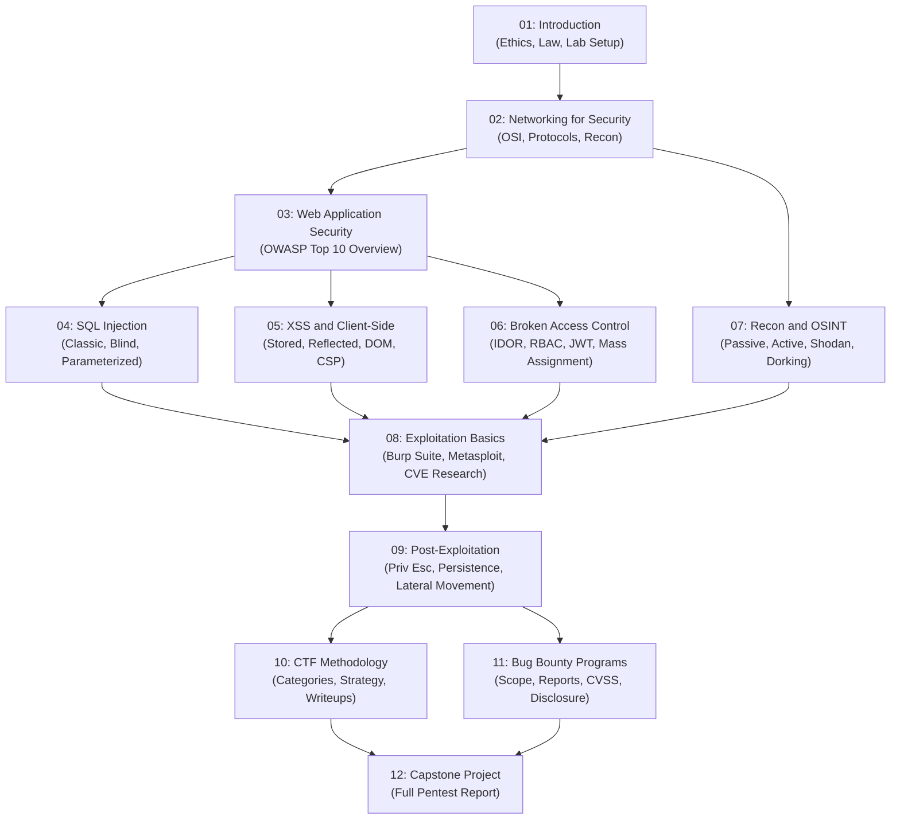

# Roadmap: Pentesting, Security, Privacy and CTF/Bug Bounty

> This roadmap explains how the modules connect, what learning paths are available,
> and how this topic fits into the broader leaps curriculum.

---

## Table of Contents

- [Learning Path Overview](#learning-path-overview)
- [Module Dependencies](#module-dependencies)
- [Recommended Learning Paths](#recommended-learning-paths)
- [Related Topic Connections](#related-topic-connections)
- [Certification Alignment](#certification-alignment)

---

## Learning Path Overview

This topic is designed as a linear progression, but learners with existing experience can
skip ahead with awareness of what they are missing. The map below shows the dependency
relationships between modules.

_Module dependency graph showing prerequisite relationships_

---

## Recommended Learning Paths

### Path A: Complete Beginner (no security background)

Follow the modules in order: 01 → 02 → 03 → 04 → 05 → 06 → 07 → 08 → 09 → 10 → 11 → 12

**Estimated time:** 100–120 hours over 3–6 months

### Path B: Developer or Sysadmin (networking/programming background)

You may start at Module 03 after reviewing Module 01 for ethics and legal requirements.
Module 02 is still recommended if you have not studied networking from an attacker perspective.

**Estimated time:** 60–80 hours over 2–4 months

### Path C: CTF Focus

Complete Modules 01–03, then jump to Module 10 for CTF methodology. Return to Modules
04–09 to fill in technical depth as you encounter those vulnerability classes in competitions.

### Path D: Bug Bounty Focus

Complete Modules 01–08 thoroughly, then prioritize Module 11 (Bug Bounty Programs). Module
12's capstone pentest report is excellent preparation for professional bug bounty reporting.

---

## Related Topic Connections

| Topic | Relationship |
|-------|-------------|
| [[networks]] | Prerequisite — TCP/IP, DNS, HTTP fundamentals are assumed by Module 02+ |
| [[devops-platform-engineering]] | Extension — cloud attack surfaces, container escapes, CI/CD poisoning |
| [[python]] | Complement — scripting exploits, automating recon, writing custom tools |
| [[javascript-typescript-react]] | Complement — essential for understanding web application vulnerabilities |

---

## Certification Alignment

This curriculum maps to the following industry certifications:

| Certification | Modules Most Relevant |
|--------------|----------------------|
| CompTIA Security+ | 01, 02, 03, 07 |
| eJPT (eLearnSecurity Junior Penetration Tester) | 01–09 |
| OSCP (Offensive Security Certified Professional) | 01–12 (full curriculum) |
| CEH (Certified Ethical Hacker) | 01–11 |
| Web Application Hacker (BSCP — Burp Suite Certified Practitioner) | 03–06, 08 |

> [!NOTE]
> Completing this leaps topic does not itself grant certification. Certifications require
> separate examination. This curriculum provides the foundational knowledge — the practical
> experience comes from hours spent on HackTheBox, TryHackMe, and real bug bounty programs.
