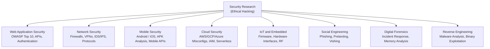
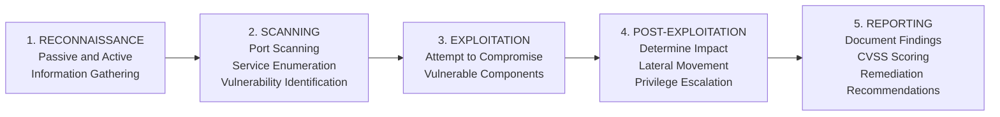

# Module 01: Introduction to Ethical Hacking

[← Topic Home](../../README.md) | [Next: Networking for Security →](../02_networking-for-security/README.md)

---


> Security is a mindset before it is a skill set. This module establishes the ethical,
> legal, and conceptual foundation that every security practitioner must internalize before
> touching a single tool.

> [!IMPORTANT]
> **Read this module before doing anything else in this topic.** The ethical and legal
> framework covered here is not optional background reading — it is the foundation upon
> which all subsequent learning is built. Operating without authorization is illegal in
> virtually every jurisdiction. This module explains exactly what that means in practice.

---

## Table of Contents

1. [Overview](#overview)
2. [Prerequisites](#prerequisites)
3. [Objectives](#objectives)
4. [Theory](#theory)
5. [Key Concepts](#key-concepts)
6. [Examples](#examples)
7. [Common Pitfalls](#common-pitfalls)
8. [Cross-Links](#cross-links)
9. [Summary](#summary)

---

## Overview

Cybersecurity is one of the fastest-growing fields in technology, and ethical hacking sits at
its cutting edge. An ethical hacker — also called a penetration tester, security researcher, or
red teamer — applies the same techniques as malicious actors to find vulnerabilities in systems
before attackers do. The key word is "ethical": every technique in this curriculum is taught in
the context of authorization, responsibility, and the goal of improving security for everyone.

This module does two things: it establishes the non-negotiable ethical and legal framework for
all the work that follows, and it orients you to the full landscape of security domains so you
know where each subsequent module fits. You will also set up a legal, safe environment for
practicing everything taught in this topic — using intentionally vulnerable applications and
dedicated CTF platforms rather than real systems.

The "hacker's mindset" is not about malice or chaos. It is about systematic curiosity: looking
at systems and asking "what assumptions did the designer make, and what happens when those
assumptions are violated?" That mindset, applied responsibly, is what makes security researchers
invaluable to the organizations and users who depend on secure systems.

---

## Prerequisites

### Required Modules

- No prior modules in this topic — this is Module 01

### Required Concepts

- **Basic Linux command line** — navigating directories, running commands, using a text editor in terminal
- **Basic networking concepts** — what an IP address is, what a port is, what HTTP means
- **Comfort reading code** — you don't need to write complex code yet, but you should be able to read Python scripts

> [!TIP]
> If any of these prerequisites feel shaky, spend 15–30 minutes reviewing them before continuing.
> See [[networks]] for networking fundamentals. For Linux basics, any introductory Linux tutorial
> will cover what you need for this module.

---

## Objectives

By the end of this module, you will be able to:

1. **Explain** the legal and ethical distinction between authorized security research and unauthorized access
2. **Identify** which laws govern computer access in the US and Brazil, and understand the general principle applied internationally
3. **Describe** the five phases of the penetration testing methodology (recon → scan → exploit → post-exploit → report)
4. **Set up** a legal, safe practice environment using Kali Linux, DVWA, and a CTF platform
5. **Apply** the attacker's mindset — asset identification, trust boundaries, entry points — to a simple system
6. **Categorize** the major security domains (web app, network, mobile, cloud, IoT, social engineering)

---

## Theory

### The Ethics and Legal Framework

Authorization is everything in security research. The difference between a cybercriminal and a
security professional is not the tools they use or the techniques they know — it is whether they
have **explicit written permission** to test the systems they are accessing.

In the United States, the **Computer Fraud and Abuse Act (CFAA)** (18 U.S.C. § 1030) makes it
a federal crime to access a computer "without authorization" or in a way that "exceeds authorized
access." The law is intentionally broad. You do not need to cause damage to be prosecuted — simply
accessing a system without permission is a crime. Penalties range from probation to multi-year
federal prison sentences for repeat offenses.

In Brazil, **Lei nº 12.737/2012** (the "Lei Carolina Dieckmann") criminalized unauthorized access
to computer systems, and the **Marco Civil da Internet** (Lei nº 12.965/2014) establishes rights
and duties for internet use. Similar laws exist in the United Kingdom (Computer Misuse Act 1990),
the European Union (Directive 2013/40/EU), and effectively every country with a modern legal system.

The key principle is universal: **without explicit, documented authorization, do not test systems
you do not own.**

In practice, authorization for a penetration test takes the form of:
- A **Statement of Work (SoW)** signed by both the tester and the client
- A **Rules of Engagement (RoE)** document specifying what is in scope, what is out of scope, what techniques are allowed, what constitutes a finding, and emergency contact procedures
- A **get-out-of-jail letter** — a document the tester carries that confirms the engagement, in case law enforcement is involved

For CTF competitions, the platform itself provides authorization — you are explicitly permitted
to attack the machines in the competition. For bug bounty programs, the program's policy page
defines the scope and constitutes the authorization.

The moment you go outside defined scope — even accidentally — you have potentially committed an
unauthorized access offense. This is why scope management is one of the most important professional
skills a security tester develops.

### Security Domains Overview

Security is not a monolith. Different specializations require different knowledge, tools, and
threat models. Understanding the landscape prevents you from thinking "security" means only
one thing.

The major domains are:



_The major security research domains — this curriculum focuses primarily on web application security and network penetration testing_

**Web Application Security** is the most accessible entry point and the most common focus of
bug bounty programs. This is where the majority of this curriculum lives. Web applications
have a relatively standard set of vulnerability classes (codified in the OWASP Top 10) that
can be studied systematically.

**Network Security** covers the protocols, devices, and techniques for attacking and defending
networked systems — port scanning, protocol exploitation, firewall bypass, and VPN security.
Module 02 covers this domain.

**Cloud Security** has grown dramatically as organizations move infrastructure to AWS, GCP, and
Azure. Misconfigurations are the dominant vulnerability class — S3 buckets left public, overly
permissive IAM roles, metadata service exposure.

**Social Engineering** exploits human psychology rather than technical vulnerabilities. Phishing
(deceptive emails), vishing (deceptive phone calls), and pretexting (fabricating scenarios) are
consistently among the most effective attack vectors in real-world breaches.

### The Penetration Testing Methodology

A penetration test is not random clicking around an application hoping to find bugs. It is a
systematic process with defined phases. Every serious practitioner follows some version of this
methodology, whether they call it PTES (Penetration Testing Execution Standard), OWASP Testing
Guide, or their own variant.



_The five phases of a penetration test — each phase feeds information into the next_

**Phase 1: Reconnaissance** — Gather information about the target. Passive reconnaissance uses
public sources (OSINT): DNS records, WHOIS data, LinkedIn for employee names, Shodan for exposed
services, certificate transparency logs for subdomains. Active reconnaissance involves directly
interacting with target systems: port scanning, banner grabbing, web crawling.

**Phase 2: Scanning** — Use the information from reconnaissance to systematically map the attack
surface: which ports are open, which services are running, which versions are deployed, which known
vulnerabilities exist for those versions.

**Phase 3: Exploitation** — Attempt to prove that identified vulnerabilities are actually
exploitable. The goal is to demonstrate impact, not to cause damage. A successful exploit proves
the vulnerability is real; the evidence (screenshots, output) becomes part of the report.

**Phase 4: Post-Exploitation** — After gaining access, determine the actual impact: what data is
accessible, whether lateral movement to other systems is possible, whether privilege escalation
is achievable. This phase answers the question "so what?" — turning a technical finding into a
business impact statement.

**Phase 5: Reporting** — The final deliverable. A penetration test report communicates findings
to the client in two registers: an executive summary (non-technical, business impact focused)
and detailed technical findings (exact steps to reproduce, evidence, CVSS score, remediation).
A report that a developer cannot act on is a failed report.

### Setting Up Your Lab Environment

Practicing security techniques requires a safe, legal environment. Using real websites or
systems without authorization is illegal — even for learning. The following setup gives you a
complete, free environment for this entire curriculum.

**Recommended Setup:**

1. **Kali Linux or Parrot OS** — The industry-standard penetration testing distributions,
   pre-loaded with every tool in this curriculum. Options:
   - Run as a VM in VirtualBox (free) or VMware Workstation
   - Boot from a USB drive
   - Use the Windows Subsystem for Linux (WSL2) version (limited but accessible)

2. **DVWA (Damn Vulnerable Web Application)** — A PHP application intentionally vulnerable
   to every OWASP Top 10 category. Run it locally with Docker:

```bash
# Run DVWA locally with Docker (completely safe and offline)
docker run --rm -it -p 80:80 vulnerables/web-dvwa

# Then open http://localhost in your browser
# Default credentials: admin / password
```

3. **Metasploitable 2** — A deliberately insecure Ubuntu VM. Download from VulnHub.
   Run in VirtualBox on a host-only network (never expose it to the internet).

4. **Online Practice Platforms** (no VM required):
   - **TryHackMe** (tryhackme.com) — Browser-based, guided rooms, excellent for beginners
   - **HackTheBox** (hackthebox.com) — Industry-standard, more challenging machines

> [!WARNING]
> When running vulnerable VMs like Metasploitable, **always use a host-only network adapter**
> in VirtualBox/VMware. Never expose a deliberately vulnerable machine to your home network or
> the internet — any device on that network could be compromised.

### The Attacker's Mindset: Thinking Like an Adversary

The most important skill in security is not knowing a list of vulnerabilities — it is the
ability to look at a system and systematically identify where it could fail. This is often
called "threat modeling" in the defensive context and "attack surface analysis" in the offensive
context. The underlying process is the same.

The attacker's mental model asks four questions:

1. **What are the assets?** — What does this system hold or do that is valuable? User data?
   Financial records? Authentication tokens? Compute resources? The attacker cares about assets;
   the defenses should protect them proportionally.

2. **What are the trust boundaries?** — Where does the system trust input? Where does it
   trust identities? Where does execution cross from one privilege level to another? Trust
   boundaries are where vulnerabilities live: the web server trusts the client's cookies;
   the database trusts the query from the application layer; the API trusts the JWT in the header.

3. **What are the entry points?** — Every URL, every parameter, every file upload, every API
   endpoint, every authentication form is an entry point. The attacker enumerates entry points
   systematically and tests each one.

4. **What assumptions did the designer make?** — "The user won't modify the cookie." "The user
   won't send more than 100 items." "The filename will always be a PDF." Every assumption that is
   not enforced is a potential vulnerability. The attacker looks for violated assumptions.

A practical example: consider a simple login form with a username and password field. The designer
assumed: (1) users will type their username, not SQL code; (2) users cannot forge session cookies;
(3) rate limiting on failed logins prevents brute force; (4) the application correctly validates
that the authenticated user matches the resource they request. An attacker challenges every one
of these assumptions. Any that are wrong become vulnerabilities.

---

## Key Concepts

**Authorization** — The explicit, documented permission to test specific systems. Without it,
security testing is a crime. Authorization is always in writing and defines the scope (what
is permitted) and the rules of engagement (what techniques are allowed). See [[shared/glossary#authorization]].

**Scope** — The boundary defining what is and is not included in a security engagement. In a
bug bounty program, scope is published on the program page. In a penetration test, scope is
defined in the Statement of Work. Going out of scope — even accidentally — is potentially an
unauthorized access offense.

**Vulnerability** — A weakness in a system that can be exploited to compromise the confidentiality,
integrity, or availability (the "CIA triad") of the system or its data. Vulnerabilities may be
in code (SQL injection), configuration (open S3 bucket), design (missing rate limiting), or
human processes (susceptibility to phishing).

**Exploit** — Code or a technique that takes advantage of a vulnerability to achieve an
unauthorized result. Finding a vulnerability is the first step; an exploit is the proof that
the vulnerability is actually exploitable.

**Attack Surface** — The sum of all entry points where an attacker could potentially enter a
system. Reducing the attack surface — disabling unused services, removing unnecessary features,
closing unused ports — is one of the most effective security controls.

**CIA Triad** — The three core security properties: **Confidentiality** (data is only accessible
to authorized parties), **Integrity** (data has not been tampered with), **Availability** (the
system is usable when needed). Every security control exists to protect one or more of these
properties.

---

## Examples

### Example 1: Identifying Authorization Scope

**Scenario:** You want to practice security testing and find a web application with a
`robots.txt` file that lists many restricted directories. You wonder if you should test those.

**Analysis:**

```text
# Example robots.txt found on a site
User-agent: *
Disallow: /admin/
Disallow: /api/internal/
Disallow: /backup/
Disallow: /config/
```

**Answer:** `robots.txt` is not authorization. It is a file that instructs search engine crawlers
not to index certain paths. It has no legal significance for security testing. If you do not have
written authorization to test this application, you may not test it — regardless of what
`robots.txt` says. If you do have authorization, `robots.txt` is a valuable reconnaissance
artifact that hints at interesting paths to investigate.

**The lesson:** Never conflate "interesting to investigate" with "authorized to test."

---

### Example 2: Setting Up DVWA and Verifying It Works

**Scenario:** You want to confirm your local DVWA installation is set up correctly and set the
security level to "Low" for initial learning.

```bash
# Start DVWA with Docker
docker run --rm -d -p 80:80 --name dvwa vulnerables/web-dvwa

# Verify it's running
docker ps
# Expected: You should see the dvwa container listed as "Up"

# Open in browser
# URL: http://localhost
# Login: admin / password
# If first run, click "Setup / Reset DB" button
```

```python
# Simple Python check to verify DVWA is responding
import urllib.request

try:
    response = urllib.request.urlopen("http://localhost/login.php")
    if response.status == 200:
        print("[+] DVWA is running and responding")
    else:
        print(f"[-] Unexpected status: {response.status}")
except Exception as e:
    print(f"[-] DVWA not reachable: {e}")
    print("    Make sure Docker is running and the container is started")
```

Once logged in, navigate to **DVWA Security** and set the level to **Low** for initial exercises.
This disables most defensive controls, making vulnerabilities easier to demonstrate while learning.

---

### Example 3: Applying the Attacker's Mindset to a Login Form

**Scenario:** You are doing an authorized test of a web application and encounter a login form.
Walk through the attacker's mental checklist.

```python
"""
Attacker's mental checklist for a login form — for CTF/authorized testing only.
This script does NOT perform any actual testing — it documents the thought process.
"""

# Observed: POST /login with fields: username, password
# What assumptions might the developer have made?

checklist = {
    "SQL Injection": "Does the app safely parameterize the username/password fields?",
    "Brute Force": "Is there rate limiting or account lockout on failed attempts?",
    "Username Enumeration": "Does the error message differ for 'wrong user' vs 'wrong password'?",
    "Session Management": "Is the session cookie HttpOnly and Secure? Is the session ID random?",
    "Password Reset": "Is the reset flow secure? Token expiry? Single use?",
    "Multi-factor Auth": "Is MFA enforced? Can it be bypassed?",
    "Transport Security": "Is the form submitted over HTTPS? Is HTTP redirected to HTTPS?",
    "Default Credentials": "Have default username/password combinations been changed?",
}

for category, question in checklist.items():
    print(f"[?] {category}: {question}")
```

**Output:**
```text
[?] SQL Injection: Does the app safely parameterize the username/password fields?
[?] Brute Force: Is there rate limiting or account lockout on failed attempts?
[?] Username Enumeration: Does the error message differ for 'wrong user' vs 'wrong password'?
[?] Session Management: Is the session cookie HttpOnly and Secure? Is the session ID random?
[?] Password Reset: Is the reset flow secure? Token expiry? Single use?
[?] Multi-factor Auth: Is MFA enforced? Can it be bypassed?
[?] Transport Security: Is the form submitted over HTTPS? Is HTTP redirected to HTTPS?
[?] Default Credentials: Have default username/password combinations been changed?
```

This mental checklist — applied to every feature you encounter during an authorized test — is
the core of the penetration tester's methodology.

---

## Common Pitfalls

**Pitfall 1: Testing without written authorization.**

This is the most serious mistake, and it is the mistake with criminal consequences. Many
beginners think "I'm just learning, I won't cause any damage" — but the CFAA and equivalent
laws do not require damage, only unauthorized access. Even port scanning a target without
permission can constitute unauthorized access under some jurisdictions.

```text
# WRONG — Never do this without explicit written authorization
nmap scanme.example.com  # Unless the site explicitly says you can (scanme.nmap.org is an exception)

# RIGHT — Only scan systems you own or have written permission to scan
nmap 127.0.0.1            # Your own machine
nmap 192.168.56.101       # Your own VM on a host-only network
```

The fix: Before touching any tool, confirm in writing that you are authorized to test the target.
For learning, use HackTheBox, TryHackMe, or your own local DVWA/Metasploitable setup.

---

**Pitfall 2: Scope creep — following interesting paths outside authorized scope.**

During a penetration test or bug bounty, you may find a link or redirect to a system not in
scope. The temptation to follow it is understandable — it might be a more interesting target.
Doing so is unauthorized access.

```text
# Authorized scope: *.example.com (*.example.com means all subdomains)
# During testing, you find a link to: third-party-vendor.com/admin

# WRONG: "I'll just take a quick look at third-party-vendor.com"
# This is outside scope. Stop here and document the finding (discovery of
# a third-party system) without testing it.

# RIGHT: Document in your report:
# "During testing of shop.example.com, we observed a redirect to
# third-party-vendor.com/admin. Testing of this out-of-scope system
# was not performed. Recommend client review their third-party
# vendor's security posture."
```

---

**Pitfall 3: Not documenting your activities as you test.**

Professional penetration testers log everything as they go: every command run, every finding,
every timestamp. This serves three purposes: it creates the evidence you need for the report,
it protects you if questions arise about what you did during the engagement, and it lets you
reproduce findings that might otherwise be lost.

```bash
# WRONG: Running commands and hoping you remember what you found
nmap -sV 10.10.10.100

# RIGHT: Log everything in real time
mkdir -p ~/pentest/target_10.10.10.100/recon
nmap -sV 10.10.10.100 -oA ~/pentest/target_10.10.10.100/recon/nmap_initial
# The -oA flag saves output in all three formats: .nmap, .gnmap, .xml
```

Tools like `tmux` (terminal multiplexer) with logging enabled, or `script` (Linux command that
records a terminal session), are invaluable for maintaining complete activity logs.

---

**Pitfall 4: Underestimating the impact of your testing.**

Even "safe" testing can have unintended consequences. A port scan can trigger IDS alerts and
cause an incident response. A fuzzing attack against a production application can cause database
lock-up. A vulnerability demonstration that exfiltrates even a single record of real customer
data is a data breach, even if you immediately delete the data.

In authorized engagements, this is why Rules of Engagement specify testing windows (often off-peak
hours) and require notification of the client before testing potentially disruptive techniques.
In CTF and lab environments, this is a non-issue — but the habit of thinking about impact should
be built from day one.

---

## Cross-Links

- [[networks]] — The networking fundamentals module covers TCP/IP, DNS, and HTTP, which are
  prerequisites for understanding network scanning (Module 02) and web application testing
  (Modules 03+)
- [[devops-platform-engineering]] — Cloud infrastructure and container concepts appear throughout
  the advanced modules; understanding how systems are deployed helps understand how they can be
  misconfigured
- [[pentesting-security/modules/02_networking-for-security]] — The next module applies the
  attacker's mindset to network-level protocols and tools

---

## Summary

- **Authorization is non-negotiable.** Never test a system without explicit written permission.
  The Computer Fraud and Abuse Act (US), Lei nº 12.737/2012 (Brazil), and equivalent laws
  worldwide criminalize unauthorized access regardless of intent.
- **The ethical hacker's goal** is to improve security, not to cause harm. Every technique
  taught in this curriculum is paired with its defensive countermeasure.
- **Security spans many domains:** web application, network, mobile, cloud, IoT, social
  engineering, digital forensics, and reverse engineering. This curriculum focuses primarily
  on web and network security.
- **The penetration testing methodology** follows five phases: reconnaissance → scanning →
  exploitation → post-exploitation → reporting. Each phase feeds the next.
- **Your lab environment** for this topic is: Kali Linux (or Parrot OS) + DVWA + Metasploitable
  (host-only network) + HackTheBox/TryHackMe accounts. All legal, all free.
- **The attacker's mindset** is systematic curiosity: identify assets, identify trust boundaries,
  enumerate entry points, challenge designer assumptions.
- **Document everything.** A finding without evidence is a finding without a report.
