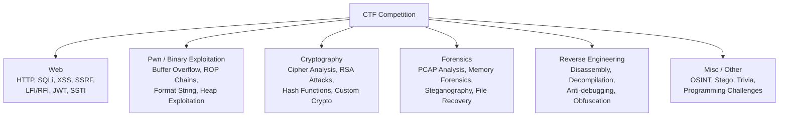

# Module 10: CTF Methodology

[← Module 09: Post-Exploitation](../09_post-exploitation/README.md) | [Topic Home](../../README.md) | [Next: Bug Bounty Programs →](../11_bug-bounty-program/README.md)

---


> CTF competitions are the gym for security skills — structured, legal, and designed
> to teach by breaking things in an environment built to be broken.

> [!NOTE]
> **Stub Module** — Full theory content will be expanded in a future update.

---

## Table of Contents

1. [Overview](#overview)
2. [Prerequisites](#prerequisites)
3. [Objectives](#objectives)
4. [Theory](#theory)
5. [Key Concepts](#key-concepts)
6. [Examples](#examples)
7. [Common Pitfalls](#common-pitfalls)
8. [Cross-Links](#cross-links)
9. [Summary](#summary)

---

## Overview

Capture The Flag (CTF) competitions are structured security challenges where participants solve
puzzles to find hidden strings ("flags") in intentionally vulnerable systems. CTFs are the most
effective way to develop practical security skills in a legal, structured environment. The best
practitioners in the world use CTFs for continuous skill development.

This module teaches the meta-skill of CTF competition: how to approach an unfamiliar challenge,
how to triage challenges across a competition, how to read writeups from past CTFs, and how to
systematically work through each major category (web, pwn, crypto, forensics, reversing, misc).

---

## Prerequisites

- [[pentesting-security/modules/08_exploitation-basics]] — Web and network exploitation fundamentals
- [[pentesting-security/modules/09_post-exploitation]] — Linux enumeration and privilege escalation

---

## Objectives

By the end of this module, you will be able to:

1. **Describe** the major CTF categories and the primary skills each tests
2. **Apply** a systematic approach to starting a new challenge in each category
3. **Triage** a CTF competition effectively — prioritize challenges by points-per-effort
4. **Read** existing CTF writeups to learn from other teams' approaches
5. **Write** a clear, educational CTF writeup for a solved challenge
6. **Identify** which CTF platforms and competitions match your current skill level

---

## Theory

### CTF Categories



**Web Challenges** — Test web application exploitation skills. Common challenge types: SQLi,
XSS, SSRF, Local File Inclusion (LFI), SSTI (Server-Side Template Injection), JWT manipulation,
GraphQL introspection, prototype pollution. Overlaps heavily with Modules 03–06.

**Pwn (Binary Exploitation)** — Exploit compiled binary programs running on a server. Start
with buffer overflows (classic stack smashing), then progress to: return-oriented programming
(ROP), format string vulnerabilities, heap exploitation. Requires assembly language understanding.

**Cryptography** — Exploit weaknesses in cryptographic implementations. Not implementing
well-known attacks on AES (which is secure) — exploiting bad uses of crypto: ECB mode,
padding oracles, RSA with small exponents, custom cipher designs. Mathematical background helps.

**Forensics** — Analyze files, network captures, and disk images to find hidden data. Tools:
Wireshark (PCAP), Volatility (memory forensics), binwalk (file extraction), strings, xxd.
Steganography (data hidden in images/audio) often appears here.

**Reverse Engineering** — Analyze binaries to understand what they do without source code.
Tools: Ghidra (free, NSA-developed), IDA Pro (industry standard, expensive), radare2, gdb.
Skills: reading assembly/disassembly, understanding compiler output, defeating obfuscation.

### CTF Competition Strategy

```text
COMPETITION TRIAGE PROCESS:

1. SURVEY FIRST (first 30 minutes)
   - Read ALL challenge descriptions
   - Note point values and solve counts
   - Identify which categories you are strongest in
   - Identify "low-hanging fruit" (most solves = easiest for the competition)

2. CHOOSE STRATEGY
   Option A: Hunt easy points first — maximize score with quick wins
   Option B: Focus on your strongest category — gain deep points
   Option C: Team strategy — split categories among team members

3. DURING SOLVING
   - Note your approach and what you tried (for writeup)
   - Check hints/point values when reducing
   - Time-box each challenge: if no progress after 45 min, move on
   - Return to stuck challenges with fresh eyes

4. WHEN TRULY STUCK
   - Read any released hints
   - Take a break (seriously — fresh eyes find obvious things)
   - Talk through the problem with a teammate
   - Check if a similar challenge appeared in past CTFs

5. POST-COMPETITION
   - Read writeups for challenges you didn't solve
   - Understand the intended solution vs. your approach
   - Write up your own solutions for challenges you solved
```

### Approach to Web Challenges

```text
SYSTEMATIC WEB CTF APPROACH:

1. Enumerate the application (same as pentest recon)
   - View page source (Ctrl+U)
   - Check robots.txt
   - Check /sitemap.xml
   - Run gobuster for hidden paths
   - Open browser DevTools → Network tab, watch all requests

2. Identify the technology stack
   - HTTP response headers (Server, X-Powered-By, Set-Cookie names)
   - HTML source comments, js file names, cookie names
   - Error messages revealing framework

3. Check for quick wins
   - Default credentials (admin/admin, admin/password, admin/[app name])
   - Source code comments with hints
   - Robots.txt mentioning interesting paths
   - Debug endpoints (/debug, /status, /phpinfo.php)

4. Test each input systematically
   - URL parameters
   - POST body parameters
   - Cookie values
   - HTTP headers (User-Agent, Referer, X-Forwarded-For)

5. Think about the challenge design
   - CTF web challenges usually have ONE intended vulnerability
   - The challenge title/description usually hints at it
   - Look for the thing that seems "off" or overly complex
```

### Writing CTF Writeups

Writeups are a cornerstone of CTF culture. They document solutions, help others learn, and
build your reputation. A good writeup:

```markdown
# Challenge Name — Category (CTF Name YYYY)

**Points:** 250
**Difficulty:** Medium (2/5)
**Files:** [challenge.zip](link)

## Description
> [Paste the original challenge description here]

## Initial Recon
[What you saw when you first looked at the challenge]

## Identifying the Vulnerability
[How you identified what the challenge was about]
[What clues or hints pointed you in the right direction]

## Exploitation
[Step-by-step explanation of your solution]
[Include all commands, code, and relevant output]

```python
# Your solution code here, with comments
```

## Getting the Flag
```
flag{this_is_the_flag}
```

## What I Learned
[What new skill or technique this challenge taught you]
[What you would do differently next time]

## References
[Links to relevant resources that helped you]
```

---

## Key Concepts

**Flag Format** — CTF flags are strings in a specific format defined by the competition.
Common formats: `flag{...}`, `CTF{...}`, `picoCTF{...}`. Some competitions use custom formats
stated in the problem or rules.

**SSTI (Server-Side Template Injection)** — A web vulnerability where user input is inserted
into a template and executed by the template engine. Each template engine (Jinja2, Twig,
FreeMarker) has different exploitation payloads. A common and powerful CTF web category.

**ROP (Return-Oriented Programming)** — A binary exploitation technique that chains together
small pieces of existing code (gadgets) to bypass modern mitigations (NX/DEP, ASLR).
Fundamental skill for advanced pwn challenges.

**CTFtime.org** — The central calendar and archive for CTF competitions. Lists upcoming events,
team rankings, and links to past writeups. Essential resource for finding competitions and
learning from past solutions.

---

## Examples

### Example 1: Python Script for Crypto CTF Challenge

```python
#!/usr/bin/env python3
"""
Example: Solving a simple Caesar cipher CTF challenge
This demonstrates the approach to basic crypto challenges
"""

def caesar_decrypt(ciphertext: str, shift: int) -> str:
    """Decrypt Caesar cipher with a given shift."""
    result = []
    for char in ciphertext:
        if char.isalpha():
            base = ord('A') if char.isupper() else ord('a')
            decrypted = chr((ord(char) - base - shift) % 26 + base)
            result.append(decrypted)
        else:
            result.append(char)
    return ''.join(result)

def brute_force_caesar(ciphertext: str) -> None:
    """Try all 26 possible shifts — classic CTF approach."""
    print(f"Ciphertext: {ciphertext}\n")
    for shift in range(26):
        decrypted = caesar_decrypt(ciphertext, shift)
        print(f"Shift {shift:2d}: {decrypted}")
    print("\nLook for the line with readable English — that's your flag!")

# Example ciphertext from a CTF
ciphertext = "synt{fvzcyr_prnfne_pvcure}"
brute_force_caesar(ciphertext)

# shift 13 (ROT13) → flag{simple_caesar_cipher}
```

---

## Common Pitfalls

**Pitfall 1: Trying to solve every challenge.** In a 48-hour competition with 50 challenges,
you cannot solve them all. Strategic triage and choosing battles wisely beats brute-force
grinding through every challenge in order.

**Pitfall 2: Not reading writeups after competitions.** The writeup reading phase is where the
most learning happens. Every unsolved challenge you understand through a writeup is a problem
you can solve next time.

**Pitfall 3: Guessing at the intended solution.** CTF challenges are designed to be solvable
with the right approach. If you've been trying random things for 30+ minutes, step back and
think about what the challenge is actually testing.

---

## Cross-Links

- [[pentesting-security/modules/03_web-application-security]] — Web CTF challenges test these skills
- [[pentesting-security/modules/09_post-exploitation]] — Machine-based CTFs (HackTheBox) use these skills
- [[pentesting-security/modules/12_capstone-project]] — CTF methodology supports the capstone project

---

## Summary

- CTF competitions are legal, structured environments for practicing all security skills
- Major categories: web, pwn/binary exploitation, cryptography, forensics, reverse engineering, misc
- Strategic triage (survey all challenges first) beats solving in order
- Web CTF approach: enumerate technology, check for quick wins, test each input systematically
- Writeups are a cultural cornerstone — read them after competitions to maximize learning
- CTFtime.org is the central resource for finding competitions and past writeups
