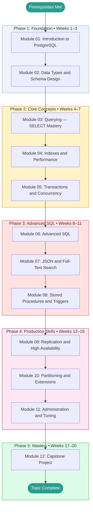

# PostgreSQL — Learning Roadmap

> This roadmap is your study plan. Work through the phases in order.
> Each phase builds directly on the previous one.
> Mark your current position with **← You Are Here** and update it as you progress.

---

## Prerequisites Map

Confirm you have working knowledge of these before entering Phase 1:

```
Command-line basics  ──┐
                        ├──► PostgreSQL  (start here)
Basic programming    ──┘
```

If either prerequisite is missing, complete it first and return here.
Module 01 is designed for absolute beginners to databases — you only need a terminal.

---

## Learning Path Visualization



---

## Phase Breakdown

### Phase 1: Foundation

**Goal:** Understand what PostgreSQL is, why it matters, and build comfort with
the core vocabulary, tooling, and basic SQL. Leave Phase 1 able to create
a database, define a schema, and perform CRUD operations without referencing notes.

| Module | Name | Est. Hours | Key Skill Gained |
|--------|------|-----------|-----------------|
| 01 | Introduction to PostgreSQL | 6–8 h | Relational model; psql navigation; CREATE/INSERT/SELECT/UPDATE/DELETE |
| 02 | Data Types and Schema Design | 7–9 h | Choosing the right types; NOT NULL/UNIQUE/CHECK/FK constraints; 1NF–3NF normalization |

**Phase 1 Exit Criteria:**

- [ ] Can explain what a relation, tuple, and attribute are without notes
- [ ] PostgreSQL is installed and `psql` works on your machine (or Docker setup is running)
- [ ] Scored ≥ 70% on Module 01 and Module 02 tests
- [ ] Completed at least one Beginner project from PROJECTS.md
- [ ] GLOSSARY.md has entries for: relation, tuple, attribute, primary key, foreign key, constraint

**Milestone unlocked:** Foundation Built

---

### Phase 2: Core Concepts

**Goal:** Develop genuine fluency with SELECT queries, indexing strategy, and
transaction semantics. Leave Phase 2 able to write non-trivial queries and
explain why they perform the way they do.

| Module | Name | Est. Hours | Key Skill Gained |
|--------|------|-----------|-----------------|
| 03 | Querying — SELECT Mastery | 8–10 h | All JOIN types; GROUP BY/HAVING; window functions; LATERAL |
| 04 | Indexes and Performance | 8–10 h | Index types and when to use each; reading EXPLAIN ANALYZE output |
| 05 | Transactions and Concurrency | 7–9 h | ACID properties; isolation levels; MVCC; locking patterns |

**Phase 2 Exit Criteria:**

- [ ] Can write a query using window functions without referencing documentation
- [ ] Can read an EXPLAIN ANALYZE plan and identify the most expensive node
- [ ] Understand what happens when two transactions try to update the same row simultaneously
- [ ] Scored ≥ 75% on all Phase 2 module tests
- [ ] Completed at least one Intermediate project from PROJECTS.md

**Milestone unlocked:** Core Mastery

---

### Phase 3: Advanced SQL

**Goal:** Apply knowledge to complex, realistic SQL patterns. Combine features
across modules. Leave Phase 3 able to approach novel SQL problems confidently.

| Module | Name | Est. Hours | Key Skill Gained |
|--------|------|-----------|-----------------|
| 06 | Advanced SQL | 8–10 h | CTEs; recursive queries; UPSERT; RETURNING; advanced aggregations |
| 07 | JSON and Full-Text Search | 8–10 h | JSONB storage and querying; tsvector/tsquery; GIN index strategy |
| 08 | Stored Procedures and Triggers | 7–9 h | PL/pgSQL functions; triggers; generated columns; error handling |

**Phase 3 Exit Criteria:**

- [ ] Can write a recursive CTE for hierarchical data without hints
- [ ] Can implement full-text search on a table and explain why GIN is used
- [ ] Can write a PL/pgSQL trigger function that enforces a business rule
- [ ] Scored ≥ 80% on all Phase 3 module tests
- [ ] GLOSSARY.md covers all terms encountered through Module 08

**Milestone unlocked:** Applied Practitioner

---

### Phase 4: Production Skills

**Goal:** Understand how PostgreSQL runs in production. Configure, monitor,
replicate, partition, and back up a live database. Leave Phase 4 confident
operating PostgreSQL at a professional level.

| Module | Name | Est. Hours | Key Skill Gained |
|--------|------|-----------|-----------------|
| 09 | Replication and High Availability | 9–11 h | Streaming and logical replication; Patroni architecture; failover |
| 10 | Partitioning and Extensions | 8–10 h | RANGE/LIST/HASH partitioning; PostGIS; pg_trgm; TimescaleDB overview |
| 11 | Administration and Tuning | 10–12 h | VACUUM/autovacuum; memory tuning; pg_stat_* monitoring; pg_dump/pg_restore |

**Phase 4 Exit Criteria:**

- [ ] Can set up streaming replication between two Postgres instances
- [ ] Can choose the right partitioning strategy for a given table and query pattern
- [ ] Can diagnose table bloat and plan an appropriate VACUUM strategy
- [ ] Scored ≥ 80% on all Phase 4 module tests
- [ ] CHEATSHEET.md has entries for all major administration commands

**Milestone unlocked:** Production Ready

---

### Phase 5: Mastery

**Goal:** Synthesize everything. Design and implement a production-grade
multi-tenant SaaS database that demonstrates mastery across all topic areas.

| Activity | Est. Hours | Description |
|----------|-----------|-------------|
| Module 12: Capstone Project | 15–20 h | Design and implement a multi-tenant SaaS database with RLS, partitioning, full-text search, and replication |
| Topic Review | 5–8 h | Revisit modules where test scores were below 80% |
| Teaching Exercise | 3–5 h | Write a blog post, explain to someone else, or create a demo |

**Phase 5 Exit Criteria:**

- [ ] Capstone project complete and documented in PROJECTS.md
- [ ] Overall topic score ≥ 80% across all module tests
- [ ] CHEATSHEET.md is complete and genuinely useful as a reference
- [ ] GLOSSARY.md has all 15 seed terms plus any additional terms encountered
- [ ] At least one teaching artifact exists (write-up, recorded explanation, etc.)

**Milestone unlocked:** Topic Mastery

---

## Time Estimates Summary

| Phase | Weeks | Est. Hours | Cumulative |
|-------|-------|-----------|------------|
| Phase 1: Foundation | 1–3 | 13–17 h | 13–17 h |
| Phase 2: Core Concepts | 4–7 | 23–29 h | 36–46 h |
| Phase 3: Advanced SQL | 8–11 | 23–29 h | 59–75 h |
| Phase 4: Production Skills | 12–16 | 27–33 h | 86–108 h |
| Phase 5: Mastery | 17–20 | 23–33 h | 109–141 h |
| **Total** | **20** | **~100 h** | |

> [!NOTE]
> These estimates assume roughly **5–8 focused hours per week**.
> If you're studying part-time or in concentrated bursts, adjust accordingly.
> Consistency matters more than pace — even 1 focused hour per day compounds rapidly.

---

## Milestone Definitions

| Milestone | Earned When | Point Threshold |
|-----------|------------|----------------|
| First Step | Module 01 complete | Any score |
| Foundation Built | Phase 1 complete, all tests ≥ 70% | 40 pts |
| Core Mastery | Phase 2 complete, all tests ≥ 75% | 100 pts |
| Applied Practitioner | Phase 3 complete, all tests ≥ 80% | 180 pts |
| Production Ready | Phase 4 complete, all tests ≥ 80% | 280 pts |
| Topic Mastery | Phase 5 complete, capstone done, overall ≥ 80% | 400 pts |
| Query Wizard | 100% on Module 03 test | — |
| Deep Diver | All modules complete | 350 pts |

---

## Alternative Paths

### Fast Track (If You Have Prior SQL Experience)

If you already know basic SQL (SELECT, INSERT, UPDATE, DELETE, simple JOINs):

```
Skim Module 01 → Take Module 01 test → If ≥ 85%, start at Module 02
Skim Module 02 → Take Module 02 test → If ≥ 85%, start at Module 03
```

Take each test cold. If you score ≥ 85%, your existing knowledge covers the module — skip to the next.

### Deep Dive Path (Maximum Understanding)

For maximum depth, add these supplementary activities between phases:

- **After Phase 1:** Read the PostgreSQL official documentation chapters on Data Types and SQL Syntax
- **After Phase 2:** Study actual query plans from a real application you have access to
- **After Phase 3:** Read the PostgreSQL source code for a feature you find interesting (the MVCC implementation in `src/backend/access/heap/` is well-commented)

### Project-First Path (Learn by Building)

If you learn best by doing rather than reading:

```
Module 01 → B1 Project → Module 02 → B2 Project → Module 03 → I1 Project → ...
```

Alternate one module of theory with one hands-on project at each step.

---

## You Are Here

> **Current Phase:** _Not started_
>
> **Current Module:** _None — begin at [Module 01](./modules/01_introduction/README.md)_
>
> **Last Completed Module:** _None_
>
> **Next Action:** Open Module 01 and read the Overview section.
>
> _Update this section each time you advance to a new module or phase._
