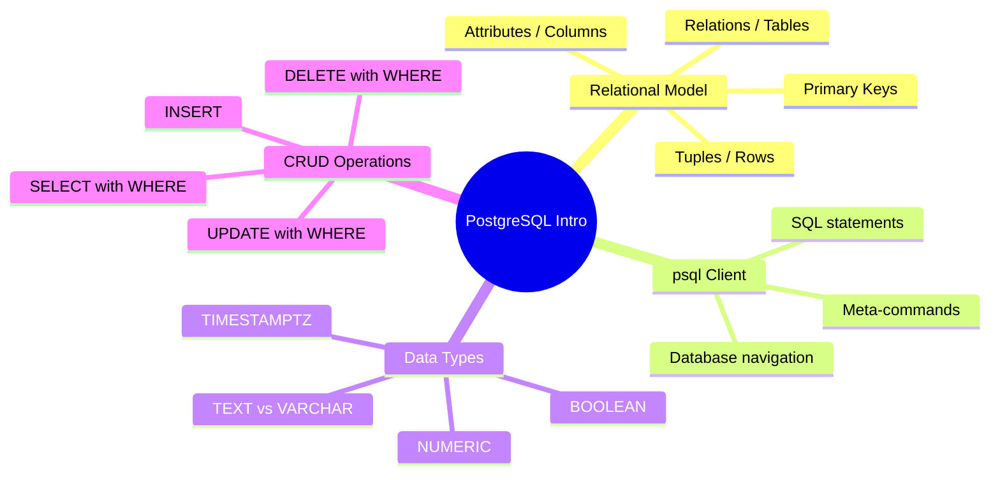

# Notes — Module 01: Introduction to PostgreSQL

> These are your personal study notes. Write freely and honestly.
> Incomplete notes are fine — they show where your understanding still needs work.
> Return to this file to add insights as they develop over time.

**Module:** [[modules/01_introduction]]
**Topic:** [[postgresql]]
**Date started:** _Fill in when you start_
**Status:** Not started

---

## Concept Map

_Sketch how the concepts in this module relate to each other._



_Alternative: draw this on paper, photo it, and link the image here._

---

## Key Insights

_The "aha moments" — the things that, once understood, made the rest clear._

1. _Fill in as you study_
2. _Fill in as you study_

---

## My Understanding

_Explain the core concepts in your own words, as if teaching them to someone else._

### The Relational Model

_Your explanation here_

_What I'm still unsure about:_ _Fill in_

### Why SQL is Declarative

_Your explanation here_

_What I'm still unsure about:_ _Fill in_

### NULL Behavior

_Your explanation here_

---

## Connections to Other Topics

| This module's concept | Connects to | How |
|----------------------|-------------|-----|
| SQL query language | [[django-fastapi-flask]] | Django ORM generates SQL; understanding it helps debug ORM behavior |
| Data types | [[async-python]] | asyncpg maps Postgres types to Python types |
| Schema design basics | [[systems-architecture]] | Database schema is part of overall system architecture |

---

## Questions That Arose

_Log questions as they appear. Don't stop to answer them now — just capture them._

- [ ] _Add questions here as you study_

---

## Code Snippets Worth Remembering

### Template for Creating a Table

```sql
CREATE TABLE entity_name (
    id          BIGSERIAL   PRIMARY KEY,
    name        TEXT        NOT NULL,
    created_at  TIMESTAMPTZ NOT NULL DEFAULT now(),
    updated_at  TIMESTAMPTZ NOT NULL DEFAULT now()
);
```

_Why I'm saving this: good starting point for any new table_

---

### Safe Update / Delete Pattern

```sql
-- Always test with SELECT first using the same WHERE clause
SELECT * FROM table WHERE condition;
-- If the results look right, run the UPDATE or DELETE
UPDATE table SET column = value WHERE condition;
```

_Why I'm saving this: prevents accidental full-table updates_

---

## What Tripped Me Up

_Mistakes I made, misconceptions I had, things that confused me more than they should have._

- _Fill in as you study_

---

## Summary in My Own Words

_Write a 3–5 sentence summary of this entire module without looking at any notes._

_Fill in after completing the module._

---

_Last updated: Fill in date_
