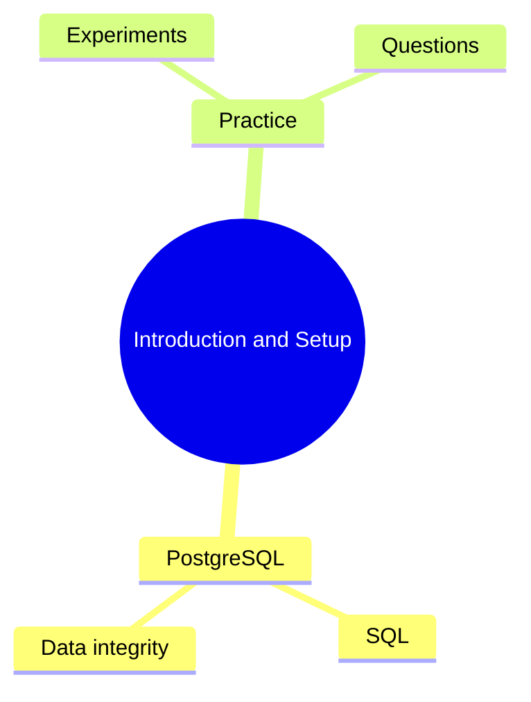

# Notes: Module 01 — Introduction and Setup

> These are your personal study notes. Write freely and honestly.
> Never delete notes — this is your learning record.

---

## Concept Map

_This Mermaid diagram is scaffolded and unverified in Mermaid Live Editor._

## Key Insights

- Add insights as you discover them.

## My Understanding

Write your explanation of this module in your own words.

## Open Questions

- Add questions here or in `QUESTIONS.md`.
