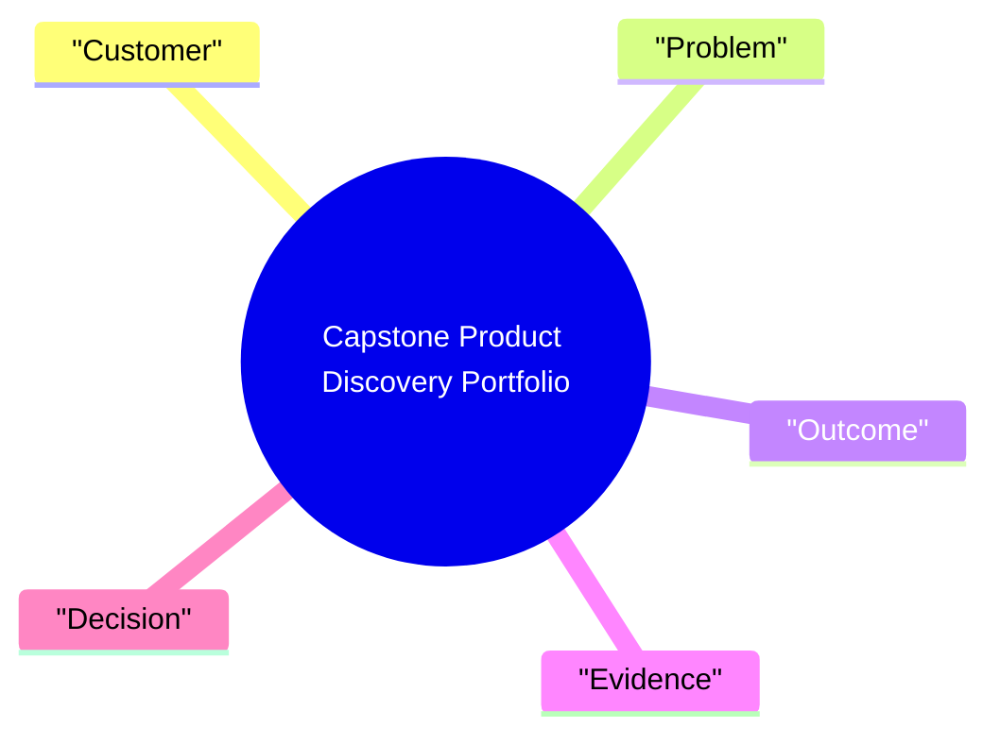

# Notes: Module 12 — Capstone Product Discovery Portfolio

> These are your personal study notes. Write freely and honestly.
> Never delete student notes; append new insights as your understanding develops.

**Module:** [[product-management-design-discovery/12_capstone_product_discovery_portfolio]]
**Topic:** [[product-management-design-discovery]]
**Date started:** 2026-06-09
**Status:** In progress

---

## Concept Map

_The diagram is a starting sketch. Refine it as you learn._

## Key Insights

1. _Add your first insight here._
2. _Add your second insight here._

## My Understanding

Explain the module in your own words.

## Questions That Arose

- [ ] _Move substantial questions to QUESTIONS.md._
