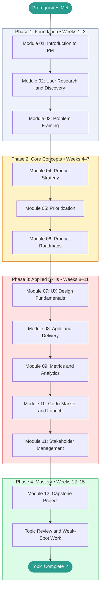

# Product Management, Design and Discovery — Learning Roadmap

> This roadmap is your study plan. Work through the phases in order.
> Each phase builds directly on the previous one.
> Mark your current position with **← You Are Here** and update it as you progress.

---

## Prerequisites Map

No hard prerequisites. The following background helps but is not required:

```text
[General business literacy]  ──┐
                                ├──► Product Management  (start here)
[Software product awareness]  ──┘
```

If you have neither, spend an hour reading about how a tech company's product team works before beginning Module 01.

---

## Learning Path Visualization



---

## Phase Breakdown

### Phase 1: Foundation

**Goal:** Understand what product management is, why it exists, and build comfort with the core vocabulary and mental models. Leave Phase 1 able to describe the PM role clearly and articulate the difference between discovery and delivery.

| Module | Name | Est. Hours | Key Skill Gained |
|--------|------|-----------|-----------------|
| 01 | Introduction to Product Management | 3–4 | PM role clarity; discovery vs. delivery mental model |
| 02 | User Research and Discovery | 4–5 | Conducting user interviews; JTBD framework |
| 03 | Problem Framing | 3–4 | Writing validated problem statements; HMW technique |

**Phase 1 Exit Criteria:**

- [ ] Can explain the PM role to a non-expert in 2 minutes without notes
- [ ] Can describe the difference between product discovery and product delivery
- [ ] Has conducted or can describe how to conduct a structured user interview
- [ ] Scored ≥ 70% on all Phase 1 module tests
- [ ] GLOSSARY.md has at least 10 entries filled in

**Milestone unlocked:** Foundation Built

---

### Phase 2: Core Concepts

**Goal:** Develop fluency with the strategic and organizational tools a PM uses daily. Leave Phase 2 able to write a product strategy, prioritize a backlog, and construct a roadmap.

| Module | Name | Est. Hours | Key Skill Gained |
|--------|------|-----------|-----------------|
| 04 | Product Strategy | 4–5 | Vision and strategy documents; North Star metric |
| 05 | Prioritization | 4–5 | RICE, ICE, Kano scoring; defensible prioritization |
| 06 | Product Roadmaps | 3–4 | Outcome-based roadmaps; audience-appropriate communication |

**Phase 2 Exit Criteria:**

- [ ] Can write a one-page product strategy for a real or hypothetical product
- [ ] Can apply RICE scoring to a list of features and defend the ranking
- [ ] Has produced at least one outcome-based roadmap artifact
- [ ] Scored ≥ 75% on all Phase 2 module tests
- [ ] CHEATSHEET.md has entries for RICE, ICE, OKR template, and roadmap types

**Milestone unlocked:** Framework Fluent

---

### Phase 3: Applied Skills

**Goal:** Apply knowledge to realistic, cross-functional problems. Combine discovery, strategy, metrics, and delivery into a coherent PM practice. Leave Phase 3 ready to do PM work in a real environment.

| Module | Name | Est. Hours | Key Skill Gained |
|--------|------|-----------|-----------------|
| 07 | UX Design Fundamentals | 3–4 | Design thinking; wireframe literacy; user flows |
| 08 | Agile and Delivery | 3–4 | User story writing; backlog management; sprint rituals |
| 09 | Metrics and Analytics | 4–5 | Funnel analysis; A/B test design; metric trees |
| 10 | Go-to-Market and Launch | 3–4 | GTM plans; launch tiers; pricing and positioning |
| 11 | Stakeholder Management | 3–4 | Managing up/across; saying no; roadmap defense |

**Phase 3 Exit Criteria:**

- [ ] Has written at least 10 well-formed user stories with acceptance criteria
- [ ] Can design a basic A/B test with correct metric selection and sample size rationale
- [ ] Has produced a GTM plan for a real or hypothetical feature launch
- [ ] Scored ≥ 80% on all Phase 3 module tests
- [ ] QUESTIONS.md open questions are mostly resolved (status 🟢)

**Milestone unlocked:** Applied Practitioner

---

### Phase 4: Mastery

**Goal:** Synthesize everything. Build a complete product discovery and definition package for a real product idea. Leave Phase 4 confident enough to do PM work professionally.

| Activity | Est. Hours | Description |
|----------|-----------|-------------|
| Capstone Project | 8–12 | Full product discovery and definition package — interviews, problem framing, strategy, roadmap, metrics, OKRs |
| Topic Review | 2–4 | Revisit modules where test scores were below 80% |
| Teaching Exercise | 2–3 | Write a brief post or explain PM to someone else — the best test of understanding |
| Final Self-Assessment | 1–2 | Retake weakest module tests; verify overall score ≥ 80% |

**Phase 4 Exit Criteria:**

- [ ] Capstone project complete and documented
- [ ] Overall topic score ≥ 80%
- [ ] CHEATSHEET.md is complete and genuinely useful as a reference
- [ ] GLOSSARY.md has definitions for every term encountered throughout the topic
- [ ] At least one teaching artifact exists (blog post, slide deck, or recorded explanation)

**Milestone unlocked:** Topic Mastery

---

## Time Estimates Summary

| Phase | Weeks | Est. Hours | Cumulative |
|-------|-------|-----------|------------|
| Phase 1: Foundation | 1–3 | 10–13 hrs | 10–13 hrs |
| Phase 2: Core Concepts | 4–7 | 11–14 hrs | 21–27 hrs |
| Phase 3: Applied Skills | 8–11 | 16–21 hrs | 37–48 hrs |
| Phase 4: Mastery | 12–15 | 13–21 hrs | 50–69 hrs |
| **Total** | **15** | **50–69 hrs** | |

> [!NOTE]
> These estimates assume roughly **4–5 focused hours per week**.
> If you're studying part-time, the calendar weeks will stretch accordingly.
> Adjust the schedule to fit your life — consistency matters more than pace.

---

## Milestone Definitions

| Milestone | Earned When | Point Threshold |
|-----------|------------|----------------|
| First Step | Module 01 complete | Any score |
| Foundation Built | Phase 1 complete, all tests ≥ 70% | 60 pts |
| Framework Fluent | Phase 2 complete, all tests ≥ 75% | 120 pts |
| Applied Practitioner | Phase 3 complete, all tests ≥ 80% | 240 pts |
| Discovery Practitioner | Real user interview conducted and documented | — |
| Topic Mastery | Phase 4 complete, capstone done, overall ≥ 80% | 400 pts |

---

## Alternative Paths

### Fast Track (If You Have Prior Product Experience)

If you already work in a product-adjacent role (engineer, designer, or founder who does PM informally):

```text
Skim Module 01 → Start at Module 03 → Continue normally
```

Take the Module 01 test first. If you score ≥ 85%, skip to Module 03.

### Deep Dive Path (Maximum Understanding)

For maximum depth, add these supplementary activities between phases:

- **After Phase 1:** Read Part 1 of *Inspired* by Marty Cagan (the role and the team)
- **After Phase 2:** Read *Continuous Discovery Habits* by Teresa Torres, Chapters 1–5
- **After Phase 3:** Read *Shape Up* by Ryan Singer (free online at basecamp.com/shapeup)

### Project-First Path (Learn by Building)

If you learn best by doing rather than reading:

```text
Module 01 → Pick a real product problem → Module 02 → Run real user interviews → Module 03 → ...
```

Apply each module to your chosen product problem before moving to the next module.

---

## You Are Here

> **Current Phase:** _Not started_
>
> **Current Module:** _None — begin at [Module 01](./modules/01_introduction/README.md)_
>
> **Last Completed Module:** _None_
>
> **Next Action:** Open Module 01 and read the Overview section.
>
> _Update this section each time you advance to a new module or phase._
