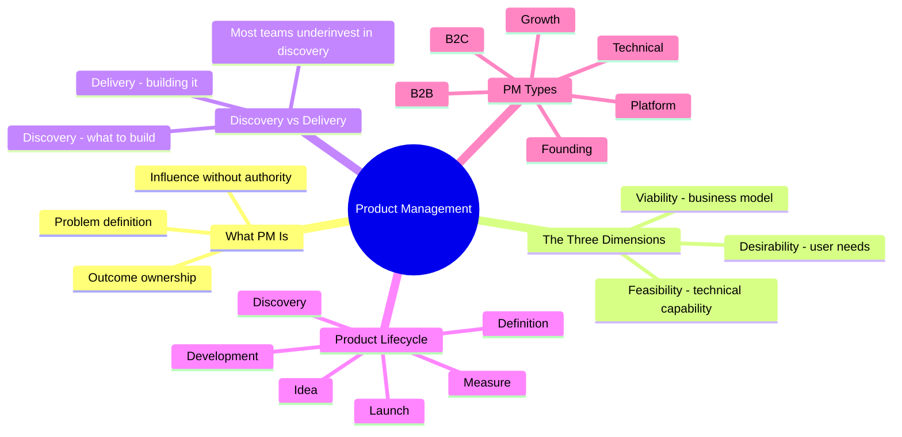

# Notes — Module 01: Introduction to Product Management

> These are your personal study notes. Write freely and honestly.
> Incomplete notes are fine — they show where your understanding still needs work.
> Return to this file to add insights as they develop over time.

**Module:** [[modules/01_introduction]]
**Topic:** [[product-management]]
**Date started:** _Fill in when you begin_
**Status:** In progress

---

## Concept Map

_Sketch how the concepts in this module relate to each other._

_Alternative: draw this on paper, photo it, and link the image here._

---

## Key Insights

_The "aha moments" — the things that, once understood, made the rest clear._

1. **PM without authority:** _Fill in — what surprised you about the PM role's lack of direct authority?_
2. **Discovery underinvestment:** _Fill in — why does skipping discovery feel rational even when it's costly?_
3. _Add insights as you discover them_

---

## My Understanding

_Explain the core concepts in your own words, as if teaching them to someone else._

### What Product Management Is

_Write your own explanation here_

_What I'm still unsure about:_ _Fill in_

### Discovery vs. Delivery

_Write your own explanation here_

_What I'm still unsure about:_ _Fill in_

### The Three PM Dimensions

_Write your own explanation here_

---

## Connections to Other Topics

| This module's concept | Connects to | How |
|----------------------|-------------|-----|
| Product lifecycle (launch/measure phases) | [[feature-flags-monitoring]] | Feature flags enable safe launches and phased rollouts; monitoring validates whether launches achieved intended outcomes |
| Discovery (validating problem hypotheses) | [[qa-testing]] | QA is how delivery validates that what was built matches what was defined |
| Delivery and deployment | [[devops-platform-engineering]] | DevOps infrastructure defines how fast and safely a team can ship |

---

## Questions That Arose

_Log questions as they appear. Don't stop to answer them now — just capture them._
_Then move the serious ones to [QUESTIONS.md](./QUESTIONS.md)._

- [ ] _Question 1 — add to QUESTIONS.md if it persists_
- [ ] _Question 2_

---

## What Tripped Me Up

- _Fill in after completing the module_

---

## Summary in My Own Words

_Write a 3–5 sentence summary of this entire module without looking at any notes._
_If you can't do this, you need more study time._

_Fill in after completing the module_

---

_Last updated: 2026-06-09_
