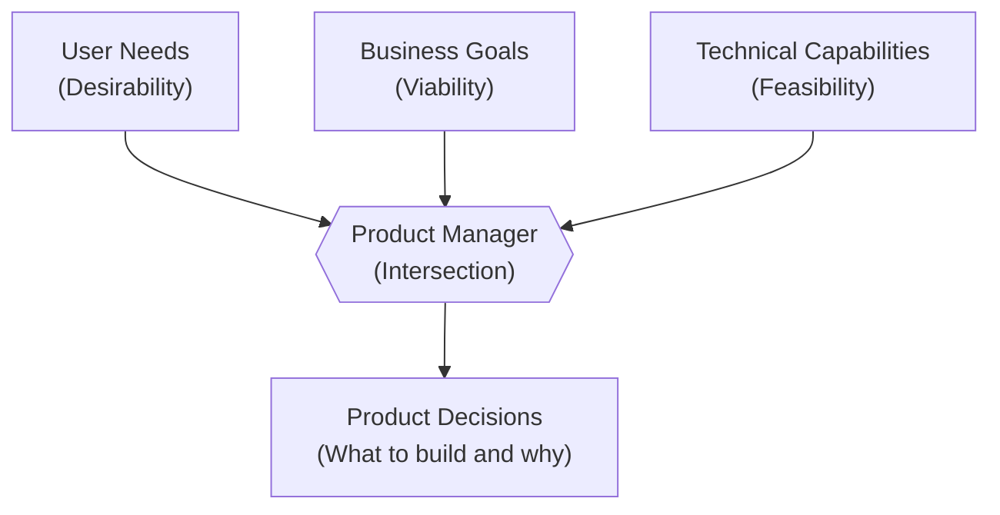
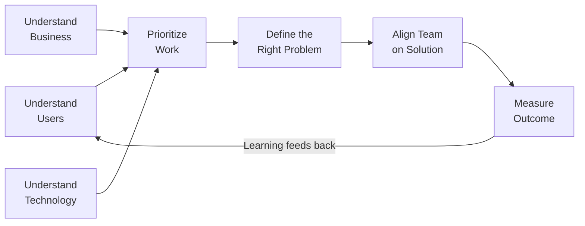
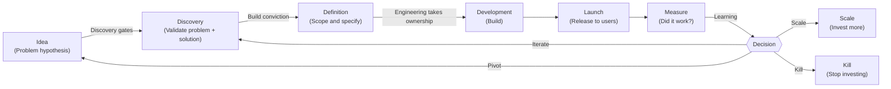

# Module 01: Introduction to Product Management

[← Topic Home](../../README.md) | [Next → Module 02: User Research and Discovery](../02_user-research-and-discovery/)

---


---

## Table of Contents

1. [Overview](#overview)
2. [Prerequisites](#prerequisites)
3. [Objectives](#objectives)
4. [Theory](#theory)
   - [What Product Management Is (and Isn't)](#what-product-management-is-and-isnt)
   - [The PM's Core Responsibilities](#the-pms-core-responsibilities)
   - [Discovery vs. Delivery](#discovery-vs-delivery)
   - [The Product Development Lifecycle](#the-product-development-lifecycle)
   - [Types of PMs and Career Paths](#types-of-pms-and-career-paths)
5. [Key Concepts](#key-concepts)
6. [Examples](#examples)
7. [Common Pitfalls](#common-pitfalls)
8. [Cross-Links](#cross-links)
9. [Summary](#summary)

---

## Overview

This module is your orientation to product management as a discipline. Before diving into specific frameworks and techniques, you need a clear mental model of what this job actually is — and what it is not — so that everything else builds on a solid foundation.

Product management is one of the most misunderstood roles in the technology industry. It is not project management. It is not engineering management. It is not design. And the popular "CEO of the product" metaphor, while partially useful, is more misleading than it is enlightening. By the end of this module, you will have a precise understanding of what makes PM work distinct, why it matters, and how modern product teams are organized around it.

The central insight of this module — and arguably of the entire discipline — is the distinction between *discovery* and *delivery*. Most product teams spend 90% of their time on delivery (building) and 10% on discovery (figuring out what to build). The evidence strongly suggests this ratio should be reversed, or at least rebalanced, especially early in a product's life.

**Difficulty:** Beginner &nbsp;|&nbsp; **Estimated time:** 3–4 hours

---

## Prerequisites

No prior product management knowledge is assumed. This is the starting point.

### Helpful Background (Not Required)

- General familiarity with how software gets built — awareness that teams include engineers and designers, that products go through development cycles, and that features get released and updated
- Any exposure to a real software product team, whether as an employee, contractor, or close observer
- Basic business literacy — the concepts of customers, revenue, and market competition

> [!TIP]
> If you have worked as an engineer or designer at a software company, you already have valuable context.
> Your job in this module is to shift your mental frame from "building things" to "figuring out which things to build."

---

## Objectives

By the end of this module, you will be able to:

1. Define product management precisely and distinguish it from project management, engineering management, and UX design
2. Explain the "PM at the intersection of business, technology, and user needs" model using your own words and a diagram
3. Describe the difference between product discovery and product delivery, and explain why discovery is underinvested in most teams
4. Trace the product development lifecycle from idea to measured outcome using the standard phases
5. Compare at least three types of PM roles (B2C, B2B, platform, growth) and identify which would suit different career goals
6. Apply the "A Day in the Life" mental model to evaluate whether a given work activity is discovery, delivery, or neither

---

## Theory

### What Product Management Is (and Isn't)

Product management is the function responsible for deciding *what* a product team should build and *why*. This sounds simple. In practice it is one of the most intellectually demanding and politically complex roles in any technology organization.

Let's start by clearing away the confusion.

**It is not project management.** A project manager tracks schedules, budgets, and deliverables. They ensure work is done on time and within scope. A product manager decides which work should exist in the first place. The two roles sometimes overlap in smaller teams, but confusing them produces the worst outcome: a team that executes a plan efficiently without ever questioning whether it is the right plan.

**It is not engineering management.** An engineering manager grows engineers, conducts performance reviews, resolves team conflicts, and owns the technical architecture of their team's area. A product manager partners with engineers to define problems but does not manage their careers or their code. At companies like Airbnb and Spotify, PMs and engineering managers are explicitly peer roles — equals in responsibility, distinct in domain.

**It is not design.** A designer owns how the product looks, feels, and functions at the interaction level. A product manager owns the problem space — which user needs are worth solving and whether a proposed solution addresses them. The best product teams have PMs and designers working in tight collaboration, but the PM is not the designer's manager, and the designer is not building what the PM specifies.

The "CEO of the product" metaphor captures something real: PMs are accountable for the product's success in a way that no other single role is. But it breaks down immediately because PMs have no direct authority over anyone. They cannot fire a designer who ignores their feedback. They cannot force an engineer to reprioritize. Every PM influence happens through persuasion, shared understanding, and trust — not authority. This is the hardest part of the job for many people who come from roles where authority comes with the title.

Marty Cagan's "empowered product team" model, developed at Silicon Valley Product Group (SVPG), offers a more precise framing: a product team consists of a product manager, a designer, and a small number of engineers who are jointly given a *problem to solve*, not a *feature list to execute*. The team has the autonomy to discover the best solution and the accountability to deliver measurable outcomes. The PM's role is to ensure the team is working on the most important problem, that the team understands why it matters, and that the team has the context — about users, the business, and the competitive landscape — to make good decisions.



*The PM sits at the intersection of three forces. Products fail when any one of these is ignored — a product that users love but the business can't monetize, a technically elegant solution nobody wants, or a business priority disconnected from real user needs.*

This three-way intersection is not just a diagram. It is a daily practice. Every product decision a PM makes involves consulting all three perspectives. "Should we build this feature?" requires: Do users actually need this? (desirability) Can we build it in reasonable time and cost? (feasibility) Does it advance business goals that matter? (viability)

---

### The PM's Core Responsibilities

The PM's responsibilities can be organized into four areas, each of which is explored in depth in later modules.

**1. Understand users and customers deeply**

This is the most important responsibility and the most frequently neglected. A PM must have direct, continuous contact with the people who use the product. Not mediated through customer support tickets, not filtered through account managers, not summarized by a market research report. Direct contact: conversations, observations, data.

The distinction between "users" and "customers" matters here. In consumer products, users and customers are often the same person. In B2B products, the customer is the company that pays (often represented by a procurement team or an executive), while the users are the employees who actually use the product. A PM must understand both — the customer's purchasing decision and the user's day-to-day experience — because they are rarely identical.

**2. Understand the business context**

A product that serves users but harms the business is not sustainable. A PM must understand how the company makes money, what the strategic priorities are, what competitors are doing, and how the PM's team's work connects to business outcomes. This is not "being a business drone" — it is the context within which trade-offs are made.

The most common failure mode here is a PM who advocates so strongly for users that they lose sight of business viability. The best PMs hold both simultaneously: they can explain why a user-serving decision also advances business goals, and they can push back on business-only decisions that erode user trust.

**3. Understand technical capabilities**

A PM does not need to write code. But they must understand enough about how software is built to have productive conversations with engineers about what is possible, what is expensive, what is fast, and what has long-term maintenance implications. A PM who proposes solutions that require rebuilding core infrastructure every quarter has not understood technical feasibility.

The test for this is not "can you code?" but "can you participate in a technical discussion without slowing it down?" PMs who can do this earn enormous respect from engineering teams and get better information — engineers share more context with PMs they trust to use it well.

**4. Prioritize work that creates value**

Given a nearly infinite list of possible things to build, the PM must make defensible choices about what to work on next. This is the prioritization function, explored deeply in Module 05. The core skill is not the framework (RICE, ICE, MoSCoW) — it is the judgment about what "value" means in this context, for this product, at this stage.



*The PM's responsibilities form a cycle. Understanding feeds prioritization. Prioritization produces problem definition. Problem definition enables alignment. Alignment enables delivery. Delivery produces data. Data feeds understanding.*

---

### Discovery vs. Delivery

The single most important mental model in modern product management is the distinction between discovery and delivery.

**Delivery** is the work of building: writing code, designing screens, testing, deploying, and releasing. This is visible work. It produces tangible artifacts. Progress is measurable. Teams have well-established processes — Scrum, Kanban, CI/CD — for doing delivery work reliably.

**Discovery** is the work of figuring out what to build: interviewing users, running experiments, testing prototypes, analyzing data, and ultimately deciding which problems are worth solving and how to solve them. This work is less visible, harder to measure, and has fewer established processes. Most teams do it poorly.

The classic mistake is treating discovery as something that happens once ("we did user research when we started the company") rather than as an ongoing practice. Teresa Torres coined the term "continuous discovery habits" to describe the practice of teams that maintain a weekly cadence of direct customer contact, integrating it into their normal workflow rather than treating it as a special activity.

Why does discovery matter so much? Because **the most expensive mistakes in product development are discovering that you built the wrong thing after you built it.** Engineering time, design work, and user trust are all finite. A feature that took three months to build and that users don't use is not just wasted effort — it adds complexity to the codebase, confuses new users, and crowds the roadmap.

Studies of software project failures consistently find that misunderstood requirements and wrong prioritization account for more failures than poor execution. In other words, building things correctly is not the main challenge; building the *right things* is.

> [!IMPORTANT]
> The goal of discovery is not to eliminate uncertainty — that is impossible. The goal is to identify and reduce the most important uncertainties before committing to delivery. A discovery phase that answers "do users have this problem?" is more valuable than six months of building before asking.

The "dual-track Agile" model — where one track handles discovery and one handles delivery — represents an organizational attempt to address this. In practice, the most effective product teams don't separate the two tracks cleanly; they integrate discovery and delivery work continuously, with PMs and designers always a step ahead of engineering in understanding the problem space.

---

### The Product Development Lifecycle

Software products move through a recognizable lifecycle, though different organizations label the phases differently. Understanding this lifecycle helps PMs know which mode of work is appropriate at each stage.



*Every feature and product passes through this cycle. The PM's role is heaviest in Idea, Discovery, and Definition phases. Engineering's role is heaviest in Development. Launch is shared. Measure is again PM-heavy.*

**Idea phase:** A hypothesis that solving a particular problem in a particular way might create value. Inputs come from user feedback, data analysis, competitive observation, executive vision, or a PM's own insight. Ideas are cheap; the PM's job is to evaluate which ones are worth investigating further.

**Discovery phase:** The work of validating that the problem is real, that users want a solution, and that a proposed solution would actually work. Outputs include validated problem statements, user research findings, and tested solution hypotheses. Most features should pass through here, but most teams skip it or rush through it.

**Definition phase:** Translating a validated hypothesis into a specification clear enough for engineering to build. This includes user stories, acceptance criteria, edge case handling, and scope decisions. The PM and designer co-own this phase; engineering is consulted throughout.

**Development phase:** Engineering builds. The PM's role shifts from leading to supporting: answering questions, clarifying edge cases, making small scope decisions, and staying out of engineering's way. PMs who micromanage this phase damage trust and slow teams down.

**Launch phase:** Releasing to users. This is more complex than "merge to main and deploy." It includes instrumentation setup, staged rollouts, internal communication, support team preparation, and — for significant features — a go-to-market plan. Module 10 covers this in depth.

**Measure phase:** Evaluating whether the launch achieved its intended outcome. This requires having defined success metrics *before* launch (not after, when results are known). Measurement feeds the next cycle, either confirming success, identifying what to iterate on, or providing evidence to kill a feature.

---

### Types of PMs and Career Paths

Not all PM roles are the same. The skills required, the stakeholder landscape, and the day-to-day work vary significantly depending on the type of product and company.

| PM Type | Product Focus | Typical Stakeholders | Key Skills | Example Companies |
|---------|--------------|---------------------|-----------|------------------|
| **B2C PM** | Consumer apps used directly by individuals | Engineering, design, marketing | User empathy, A/B testing, growth metrics | Spotify, Instagram, Airbnb |
| **B2B PM** | Products sold to businesses, used by employees | Sales, customer success, enterprise customers | Stakeholder management, contract requirements, segmentation | Salesforce, Atlassian, Workday |
| **Platform PM** | Infrastructure used by other developers or internal teams | Engineering, developer relations, partner teams | Technical depth, API design thinking, ecosystem thinking | Stripe, Twilio, AWS |
| **Growth PM** | Acquisition, activation, retention, monetization | Marketing, data, finance | Experimentation, funnel analysis, statistical reasoning | Many companies; Duolingo, LinkedIn |
| **Technical PM** | Products requiring deep engineering context (ML, infrastructure, developer tools) | Engineering leadership, research | Strong technical background, able to evaluate feasibility independently | Google, Meta, OpenAI |
| **Founding PM** | Early-stage startup products | Founders, early customers, investors | All of the above; comfort with extreme uncertainty | Any Series A or earlier startup |

**Career Paths**

Most PMs enter the role from one of three backgrounds:
- **Engineering background:** Strong on technical feasibility and earning engineering team trust; often needs to develop user empathy and business acumen
- **Design background:** Strong on user empathy and discovery work; often needs to develop business strategy and stakeholder management skills
- **Business / MBA background:** Strong on strategy and stakeholder management; often needs to develop hands-on product craft and technical literacy

Senior IC paths include Senior PM, Lead PM, and Principal PM. People management paths move toward Group PM → Director of Product → VP of Product → Chief Product Officer (CPO). At some companies, the CPO sits on the executive team and shapes overall company strategy.

Dylan Field, founder and CEO of Figma, is an interesting case study in the product founder archetype. Field led product design decisions at Figma from its founding in 2012 through its growth to a $20B valuation — embodying the "PM as user-obsessed problem solver" model in a domain (design tooling) he deeply understood.

Amazon's Working Backwards process is a well-documented example of PM discipline at scale. Before any feature is built, the PM (in Amazon's terminology, the "single-threaded owner") writes a mock press release describing the product as if it has already launched — forcing clarity about the user benefit and business case before any engineering begins.

---

## Key Concepts

**Product manager (PM):** The person responsible for defining the *what* and *why* of a product. The PM does not manage engineers or designers directly but influences through persuasion, context-sharing, and shared understanding. The PM is accountable for the product's outcomes.

**Empowered product team:** Marty Cagan's model of a cross-functional team (PM + designer + engineers) given a problem to solve and the autonomy to discover the best solution. Contrasted with "feature teams" that are handed a list of features to execute and have no ownership of outcomes.

**Product discovery:** The ongoing process of validating assumptions about users, problems, and solutions before committing to delivery. Includes user interviews, prototype testing, data analysis, and hypothesis-driven experimentation. The goal is to reduce risk, not eliminate uncertainty.

**Product delivery:** The work of building, testing, and releasing validated solutions. Delivery is more visible and easier to measure than discovery, which is why most teams overinvest in it.

**North Star metric:** The single metric that best captures the core value a product delivers to users. If this metric improves, the product is succeeding in its mission. See [[shared/glossary#north-star-metric]].

**Outcome vs. output:** Output is a thing you shipped (a feature, a release). Outcome is a change in user behavior or business metric that the output produced. PMs who measure outputs fool themselves; PMs who measure outcomes hold themselves accountable.

**Roadmap:** A prioritized plan showing what the team will work on over some time horizon. A good roadmap communicates outcomes and problems to be solved; a bad roadmap is a feature list masquerading as strategy.

---

## Examples

### Example 1: Framing a PM Problem

**Scenario:** Your product is a mobile banking app. Usage data shows that 40% of users who download the app never complete the sign-up flow. Your manager says, "We need to fix the sign-up flow."

**The feature-first (wrong) framing:** "Let's redesign the sign-up screens."

**The PM framing:**
1. What do we know? 40% drop before completing sign-up.
2. What do we not know? *Where* in the flow do users drop? *Why* do they drop? Is it confusion, friction, distrust, or lack of motivation? Is the drop-off normal (industry benchmark) or abnormal?
3. What discovery work is needed? Funnel analysis to identify drop-off point; session replay review; user interviews with people who abandoned; A/B test of friction reduction vs. trust-building messages.
4. What problem are we actually solving? The problem is not "the sign-up screens look bad." The problem might be "users don't trust the app with their financial information" or "the identity verification step is too cumbersome for most phones." These are different problems with different solutions.

The PM's job is to resist the jump to solution and insist on problem clarity first.

---

### Example 2: A Feature Decision Gone Wrong — Netflix Quick Laughs

In 2020, Netflix launched a feature called "Quick Laughs" — a TikTok-style vertical video feed of short comedy clips. The feature was visible in the main navigation. It was subsequently removed relatively quickly with minimal public announcement.

While Netflix has not published a full post-mortem, this episode illustrates a common PM failure: **copying a successful pattern from a competitor without validating whether your users have the same underlying job to be done.** TikTok's success is built on an algorithm designed from the ground up for short-form content discovery. Netflix users come to the app with a fundamentally different job: they want to choose something to watch and commit to it. The feature did not address a problem Netflix users actually had.

The PM lesson: "It worked for them" is a hypothesis, not a strategy. Validate it.

---

### Example 3: A Feature Decision Gone Right — Spotify Discover Weekly

In 2015, Spotify launched Discover Weekly — a personalized playlist of 30 songs refreshed every Monday, unique to each user, based on their listening history.

The feature's origins are instructive. Spotify had extensive data on listening behavior and had experimented with algorithmic recommendations before. The key insight came from user research: users frequently described the experience of discovering new music through a human friend who "just knows what you'll like" as one of the best music experiences they could have. The product team's job was not to "add a recommendations feature" but to deliver the *feeling* of that human discovery experience through software.

The distinction matters enormously. "Add recommendations" is a feature. "Deliver the feeling of music discovery through a trusted friend" is a problem to solve. The latter opens up the design space and produces better solutions.

Discover Weekly launched, went viral, and became one of Spotify's most beloved features within weeks.

---

## Common Pitfalls

### Pitfall 1: Building Without Discovery

**The mistake:** Treating feature requests from customers, executives, or sales as validated requirements and immediately sending them to engineering for estimation.

**What it looks like:**

```text
Sales team: "A customer said they need bulk export. Can we add that?"
PM: "Okay, I'll add it to the backlog. Engineering, can you estimate?"
```

**The correct approach:**

```text
Sales team: "A customer said they need bulk export. Can we add that?"
PM: "Interesting. Let's talk to 3-5 customers who've mentioned this.
     What job are they trying to do? Who actually uses exports — the
     end user or their IT team? What format do they need? How often?
     Is this blocking renewal or just a nice-to-have?"
```

**Why it matters:** One customer's request is a data point, not a validated user need. Building in response to single requests produces a feature graveyard — dozens of specialized features that each serve one customer but add cognitive load for everyone else.

---

### Pitfall 2: Mistaking User Requests for User Needs

**The mistake:** Taking what users say they want literally, without investigating the underlying job they're trying to get done.

**What it looks like:**

```text
User interview: "I want a search filter for status."
PM: "Add status filter to the backlog."
```

**The correct approach:**

```text
User interview: "I want a search filter for status."
PM: "Interesting — what were you trying to find when you looked for that?"
User: "I was trying to find all the overdue items so I could prioritize my day."
PM: [realizes the job is 'prioritize daily work', not 'filter by status';
     now considers: an overdue items view, a daily digest email,
     a priority inbox, a status filter — and can evaluate which
     actually solves the job best]
```

**Why it matters:** Henry Ford's (apocryphal) quote captures this perfectly: "If I had asked people what they wanted, they would have said faster horses." Users articulate solutions, not problems. The PM's job is to find the problem.

---

### Pitfall 3: Roadmaps as Feature Lists

**The mistake:** Publishing a roadmap that looks like a list of features with dates.

**What it looks like:**

```text
Q1: Dark mode, CSV export, SSO support
Q2: Mobile app, Zapier integration, API v2
Q3: Analytics dashboard, AI-powered suggestions
```

**The correct approach:**

```text
Now (Q1): Reduce onboarding drop-off — target: activation rate 23% → 40%
Next (Q2): Unlock enterprise adoption — target: support SSO, audit logs,
           and admin controls for 20+ person teams
Later (Q3): Deepen engagement for power users — target: D30 retention 55% → 70%
```

**Why it matters:** A feature-list roadmap creates three problems: it commits the team to specific solutions before discovery is complete; it gives stakeholders false certainty about timing; and it measures progress in outputs (did we ship it?) rather than outcomes (did it work?). An outcome-based roadmap is a hypothesis about what will create value, not a promise about what will be built.

---

### Pitfall 4: The "CEO of the Product" Trap

**The mistake:** Taking the "CEO of the product" metaphor literally and acting as though you have authority over engineers and designers.

**What it looks like:** PMs who dictate solutions, bypass engineers in design decisions, or treat their "product decisions" as final without consulting the team.

**Why it matters:** This destroys trust and degrades team quality. Engineers and designers have information the PM doesn't have. The PM's job is to make the team better at deciding together, not to make decisions unilaterally. PMs who act like the boss lose the best engineers and designers first — the ones who have options.

---

## Cross-Links

- [[qa-testing]] — Quality assurance is part of the delivery side of the lifecycle covered in this module; PMs need to understand how QA fits into the development cycle and what "definition of done" means
- [[feature-flags-monitoring]] — Feature flags are how PMs enable safe launches and A/B tests in delivery; monitoring is how PMs validate whether their launches are producing the intended outcomes
- [[devops-platform-engineering]] — DevOps and platform engineering define the constraints on how fast a team can ship and how safely; PMs who understand this context make better delivery decisions

---

## Summary

- Product management is the function responsible for deciding *what* to build and *why* — not managing engineers, not managing schedules, not designing interfaces
- The PM sits at the intersection of user needs (desirability), business goals (viability), and technical capabilities (feasibility); ignoring any one of these dimensions produces bad products
- The "CEO of the product" metaphor is partially useful but fundamentally misleading: PMs have accountability without authority; every PM influence happens through persuasion, not command
- Discovery (figuring out what to build) and delivery (building it) are distinct modes of work; most teams radically underinvest in discovery and pay for it with features users don't use
- The product development lifecycle runs: idea → discovery → definition → development → launch → measure → iterate (or pivot, or scale, or kill)
- PM types vary significantly: B2C vs. B2B, platform vs. growth vs. technical; the skills needed shift with the type of product and company stage
- The most important PM habits are: talk to users regularly, validate before building, measure outcomes not outputs, and say no to most things so you can say yes to the most important ones
