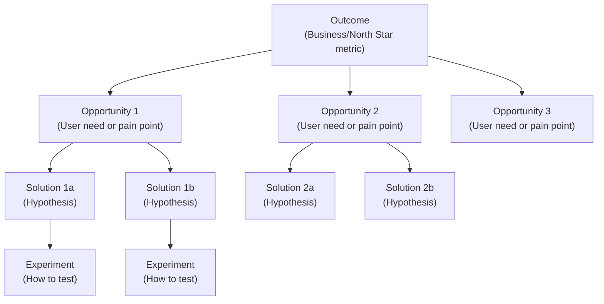

# Module 02: User Research and Discovery

[← Module 01: Introduction](../01_introduction/) | [Topic Home](../../README.md) | [Next → Module 03: Problem Framing](../03_problem-framing/)

---


---

## Table of Contents

1. [Overview](#overview)
2. [Prerequisites](#prerequisites)
3. [Objectives](#objectives)
4. [Theory](#theory)
5. [Key Concepts](#key-concepts)
6. [Examples](#examples)
7. [Common Pitfalls](#common-pitfalls)
8. [Cross-Links](#cross-links)
9. [Summary](#summary)

---

## Overview

Discovery without user research is guesswork. This module teaches you how to build a genuine understanding of the people who use (or might use) your product — not through surveys and personas, but through direct conversation and structured observation.

The module covers the mechanics of user interviews (how to structure them, which questions work, which questions backfire), the Jobs-to-be-Done (JTBD) framework for understanding *why* people use products, Teresa Torres's opportunity solution tree for connecting user insights to product decisions, and the continuous discovery habits model that makes user research a weekly team practice rather than a quarterly project.

**Difficulty:** Beginner &nbsp;|&nbsp; **Estimated time:** 4–5 hours

---

## Prerequisites

- Module 01: Introduction to Product Management — the discovery vs. delivery distinction and why discovery matters

---

## Objectives

By the end of this module, you will be able to:

1. Conduct a 30-minute structured user interview using an appropriate discussion guide
2. Avoid the most common interviewing mistakes (leading questions, solution validation, feature elicitation)
3. Apply the Jobs-to-be-Done framework to synthesize interview findings into job statements
4. Build a basic opportunity solution tree connecting an outcome to user opportunities to potential solutions
5. Describe the continuous discovery habits model and explain what "weekly customer touchpoints" means in practice
6. Synthesize findings from multiple interviews into themes that inform prioritization

---

## Theory

### User Interviews: Structure and Purpose

The goal of a user interview is not to get feature ideas. It is to understand the user's world: their current behavior, their goals, their frustrations, and the context in which they experience the problem your product is trying to solve.

A well-structured interview follows three phases:

**Phase 1: Context setting (5 minutes)**
Introduce yourself and the purpose. Explain that you're trying to learn about their experience, not test a product. Emphasize there are no right answers. Ask for permission to record (if desired). Ask a warm-up question about their role or background.

**Phase 2: Exploration (20 minutes)**
Focus on current behavior, not hypothetical behavior. Ask about specific past experiences, not general opinions. Probe with "why?" and "tell me more" until you reach underlying motivations. Resist the urge to show your product or describe your proposed solution.

```text
Effective interview question progression:

WARM-UP:
"Walk me through a typical week at work. What does a normal day look like?"

BEHAVIOR-FOCUSED:
"Can you tell me about the last time you tried to [do the thing related to your problem area]?"
"What were you doing right before that? What happened next?"
"What tools or processes did you use?"

MOTIVATION-PROBING:
"Why was that important to you at the time?"
"What would have happened if you hadn't done that?"
"How did that make you feel when it worked / didn't work?"

AVOID:
"Would you use a feature that does X?" (Hypothetical, not behavioral)
"Don't you think it would be helpful if...?" (Leading)
"What features do you want?" (Solution elicitation, not problem discovery)
```

**Phase 3: Wrap-up (5 minutes)**
Ask if there's anything important you didn't cover. Thank them for their time. Leave the door open for a follow-up.

### Jobs-to-be-Done (JTBD) Framework

JTBD is a framework rooted in the insight that people don't buy products — they "hire" products to help them make progress in their lives. Developed through Clayton Christensen's work and formalized by Bob Moesta and Chris Spiek, JTBD asks not "who is our user?" but "what job is the user trying to get done?"

A job statement has this structure:
`[Verb] + [Object] + [Context] + [Desired Outcome]`

**Example:** "Help me feel on top of my finances (verb + object) during my busy work week (context) so I don't have the Sunday-night anxiety of not knowing where my money went (desired outcome)."

This job might be served by budgeting apps, calendar apps, automated savings tools, or even a Friday-afternoon calendar block. JTBD analysis opens up the solution space rather than constraining it.

**Functional vs. Emotional vs. Social Jobs**

Jobs have three layers:
- **Functional job:** The practical task the user is trying to accomplish ("track my spending")
- **Emotional job:** How the user wants to feel ("feel in control and not anxious")
- **Social job:** How the user wants to be perceived ("be seen as financially responsible by my partner")

Products that address only the functional layer are easier to replicate. Products that address emotional and social jobs as well build stronger loyalty.

### Opportunity Solution Trees

Teresa Torres's opportunity solution tree is a visual framework for connecting product outcomes to user research findings to solution ideas.



*An opportunity solution tree starts from a product outcome, branches into user opportunities (needs and pains), and then branches into solution hypotheses and experiments. The tree keeps solutions connected to the problems they solve.*

An "opportunity" in Torres's model is a user need, pain, or desire — something you learned from direct customer contact. Solutions are hypotheses about how to address an opportunity. The tree ensures you don't jump to solutions without grounding them in validated opportunities.

### Continuous Discovery Habits

The core practice: a product team (PM + designer + at least one engineer) talks to at least one customer per week, every week. Not as a research project. Not quarterly. Every week.

This cadence produces several benefits: the team never loses touch with real user context; insights accumulate over time, enabling pattern recognition; and the team develops the habit of connecting every decision to specific user evidence.

The weekly interview is not the only practice. Torres recommends pairing regular interviews with "assumption testing" — quick, cheap experiments that validate or invalidate specific assumptions about user behavior before committing to building.

---

## Key Concepts

**User interview:** A structured conversation with a current or potential user aimed at understanding their context, behavior, and motivations — not at validating a specific solution.

**Jobs-to-be-Done (JTBD):** A framework for understanding why people use products, framed as the "job" (progress the user is trying to make) rather than the feature or product they use to do it.

**Opportunity:** In Teresa Torres's model, an unmet user need, pain point, or desire identified through direct customer contact. Opportunities live between the outcome and the solution in the opportunity solution tree.

**Opportunity solution tree:** A visual framework connecting a product outcome to user opportunities to solution hypotheses to experiments, ensuring solutions remain grounded in validated problems.

**Continuous discovery:** The practice of maintaining a regular (ideally weekly) cadence of direct customer contact integrated into the team's normal workflow — not treated as a special research phase.

---

## Examples

### Example 1: Interview Question That Reveals the Real Job

**Weak approach:** "Would you use a feature that automatically categorizes your spending?"
(Hypothetical; elicits a guess, not a behavior; user can't tell you if they'd actually use it)

**Strong approach:** "Tell me about the last time you wanted to understand where your money had gone. What happened? What were you trying to figure out? What did you do?"

The strong question reveals actual behavior, context, and motivation — the raw material for a JTBD analysis.

---

### Example 2: JTBD in Practice — Why People Buy Milkshakes

Clayton Christensen's famous milkshake study is the canonical JTBD example. A fast food chain wanted to increase milkshake sales. Traditional market research (surveying customers about taste preferences) produced no useful insights.

Christensen's team observed that ~40% of milkshakes were sold in the morning. Interviews revealed those customers hired the milkshake for a specific morning commute job: "give me something to do with one hand during my long boring drive, that fills me up until lunch, that doesn't make a mess." Competitors weren't other milkshakes — they were bananas, bagels, and donuts. The product team used this insight to improve the morning milkshake (thicker, so it lasted longer), leading to sales increases.

The lesson: the "competitor" and the "user need" only become visible when you look at the job, not the product category.

---

## Common Pitfalls

**Pitfall 1: Running validation interviews instead of discovery interviews**
The mistake is forming a hypothesis first and then interviewing users to confirm it. This produces confirmation bias — users pick up on your enthusiasm for the idea and provide socially positive responses. Run discovery interviews before forming solutions, not after.

**Pitfall 2: Asking about hypothetical behavior**
"Would you use a feature that...?" questions are unreliable because people are bad at predicting their own behavior. Ask about past behavior: "Tell me about the last time you..."

**Pitfall 3: Staying at the surface level**
If a user says "I want better search," most PMs stop there and build search. A discovery-oriented PM asks: "What were you looking for the last time you used search? What happened? What made that frustrating?" and finds the real job.

**Pitfall 4: Interviewing only your most vocal users**
Your heaviest users, power users, and most vocal customers are not representative of your broader user population. Their needs and behaviors skew toward advanced use cases. Actively recruit participants from quieter segments.

---

## Cross-Links

- [[product-management/modules/01_introduction]] — Discovery vs. delivery framework this module builds on
- [[product-management/modules/03_problem-framing]] — This module's findings feed directly into the problem framing process
- [[product-management/modules/04_product-strategy]] — User research insights inform the opportunity areas that strategy bets on
- [[qa-testing]] — Quality assurance and user acceptance testing share the practice of observing real users interact with software

---

## Summary

- User interviews are the primary tool for product discovery; their goal is to understand behavior and motivation, not to validate a specific solution
- Effective interviews ask about past behavior, not hypothetical future behavior; avoid leading questions and solution-framing
- Jobs-to-be-Done reframes user understanding from "who are our users?" to "what progress are users trying to make?"; jobs have functional, emotional, and social dimensions
- The opportunity solution tree connects business outcomes → user opportunities → solution hypotheses → experiments, keeping solutions grounded in validated problems
- Continuous discovery means talking to at least one customer per week, every week — not as a project, but as an ongoing team practice
- The biggest research mistake is running interviews after forming a solution hypothesis, which produces confirmation rather than discovery
