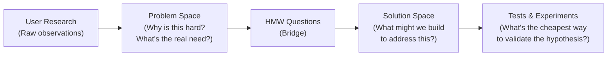

# Module 03: Problem Framing

[← Module 02: User Research and Discovery](../02_user-research-and-discovery/) | [Topic Home](../../README.md) | [Next → Module 04: Product Strategy](../04_product-strategy/)

---


---

## Table of Contents

1. [Overview](#overview)
2. [Prerequisites](#prerequisites)
3. [Objectives](#objectives)
4. [Theory](#theory)
5. [Key Concepts](#key-concepts)
6. [Examples](#examples)
7. [Common Pitfalls](#common-pitfalls)
8. [Cross-Links](#cross-links)
9. [Summary](#summary)

---

## Overview

Research without framing produces observations, not decisions. This module covers how to transform user interview findings and data into clear, actionable problem statements that a team can rally around and prioritize.

Problem framing is the bridge between discovery (finding user needs) and strategy (deciding which needs to address). It involves writing problem statements, estimating opportunity size, applying the "How Might We" (HMW) technique to open up the solution space, and learning to stay in the problem space rather than jumping to solutions prematurely.

**Difficulty:** Beginner–Intermediate &nbsp;|&nbsp; **Estimated time:** 3–4 hours

---

## Prerequisites

- Module 01: Introduction to Product Management
- Module 02: User Research and Discovery — the interview and JTBD techniques that produce raw material for problem framing

---

## Objectives

By the end of this module, you will be able to:

1. Write a well-formed problem statement that specifies the user, the struggle, the context, the root cause, and the consequence
2. Apply the "How Might We" (HMW) technique to open up the solution space without anchoring on a specific implementation
3. Estimate opportunity size for a problem using a basic framework (user population × frequency × severity)
4. Distinguish between problems that live in the problem space and solutions that live in the solution space
5. Use Jobs-to-be-Done insights (from Module 02) to anchor problem statements in real user behavior
6. Evaluate the quality of a problem statement using at least three criteria

---

## Theory

### What Makes a Good Problem Statement

A problem statement is not a complaint. It is a precise, falsifiable description of a gap between the current state (what users experience now) and the desired state (what would be better). A good problem statement:

1. **Names the user** — Not "users" generically, but a specific type of user in a specific context
2. **Describes the struggle** — The specific task or goal they fail to accomplish, not a vague dissatisfaction
3. **Identifies the context** — When and where this problem occurs
4. **Points at a root cause** — Why the struggle exists (not a feature gap, but an underlying cause)
5. **States the consequence** — What happens as a result of the problem going unsolved

**Template:**

```text
[User type] struggles to [task/goal]
when [context/situation]
because [root cause],
which results in [negative consequence].
```

**Weak problem statement:** "Users don't like our onboarding."

**Strong problem statement:** "New users (first 7 days) struggle to complete their first project setup when they log in for the first time, because the home screen presents 12 equal-weight features with no guidance about where to start, which results in 62% of new users leaving without creating a project and not returning within 30 days."

The strong version is actionable, specific, and measurable. You can verify whether a solution addressed it.

### How Might We (HMW) Technique

Developed at IDEO and popularized through design thinking, the HMW technique transforms a problem statement into an open-ended question that invites creative solutions without prescribing them.

The format is simple: "How might we [problem statement reframed as a positive goal]?"

```text
Problem: New users struggle to find their first action in the product.

Too narrow HMW: "How might we add a tooltip to the first-login screen?"
(This prescribes a specific solution, which closes the solution space)

Too broad HMW: "How might we improve user experience?"
(This is so vague it generates no useful ideas)

Good HMW: "How might we help new users discover what to do first?"
"How might we make the value of the product immediately obvious?"
"How might we guide users to their first success within 5 minutes?"
```

HMW questions are typically brainstormed in groups. Generate many, then cluster and vote on the most promising ones to pursue.

### Opportunity Sizing

Before committing to solving a problem, estimate whether the opportunity is large enough to justify the investment. A simple framework:

```text
Opportunity Size = User Population × Frequency × Severity

Where:
- User Population: How many of your active users experience this problem?
- Frequency: How often do they encounter it? (per day, week, month)
- Severity: How badly does it hurt? (blocks progress vs. minor inconvenience)
```

This is not a precise formula — it's a forcing function for explicit thinking. A problem that affects 5% of users, once a month, with mild frustration is a much smaller opportunity than one affecting 40% of users, multiple times a day, that causes them to abandon the product.

Use opportunity sizing to compare problems, not to get exact numbers. The goal is relative prioritization.

### Problem Space vs. Solution Space

The problem space is everything the user experiences: their goals, their context, their frustrations, their current behavior. The solution space is everything you might build: features, UX flows, algorithms, integrations.

The most common product mistake is jumping from a surface-level user complaint directly to a specific solution without spending time in the problem space. This produces solutions that address symptoms rather than root causes.



*Move through this sequence deliberately. The most expensive shortcut is jumping from observation directly to solution.*

### Jobs-to-be-Done in Problem Framing

The JTBD insights from Module 02 feed directly into problem framing. A well-formed job statement describes what the user is trying to accomplish; a well-formed problem statement describes what gets in the way of them accomplishing it.

This connection is critical for staying in the problem space. If your problem statement sounds like "users can't use feature X," you're in the solution space already. If it sounds like "users can't accomplish Y in context Z," you're in the problem space.

---

## Key Concepts

**Problem statement:** A structured description of a user struggle that specifies who experiences it, what they can't accomplish, why (root cause), and what happens as a result. A precondition for making good product decisions.

**How Might We (HMW):** A brainstorming technique that reframes a problem as an open question, inviting creative solutions without prescribing a specific approach. Originated at IDEO.

**Opportunity sizing:** A rough estimation of the size of an opportunity based on user population, frequency, and severity. Used for relative comparison, not precise calculation.

**Problem space:** The domain of user needs, goals, and struggles — everything that defines what it means for the user to succeed. Contrasted with the solution space (specific features and implementations).

**Root cause:** The underlying reason a user struggle exists, as distinct from the surface symptom. Identifying root cause is what separates problem framing from feature elicitation.

---

## Examples

### Example 1: Problem Statement — B2B SaaS

A team runs interviews with project managers at mid-size companies and hears consistent feedback that they "can't keep stakeholders updated."

**Weak framing (surface complaint):** "Project managers can't keep stakeholders updated."

**Strong problem statement:**
"Project managers at companies of 50–200 people struggle to give accurate, up-to-date status to senior stakeholders on demand when asked during executive reviews, because status information is scattered across 3–4 different tools (Jira, Slack, email, spreadsheets) and there's no single view, which results in project managers spending 2–3 hours per week manually compiling status reports and still being caught off guard in meetings."

**HMW questions generated from this:**
- How might we give project managers a single, always-current status view?
- How might we eliminate the need to compile status manually?
- How might we prepare project managers for executive questions before meetings happen?

Each HMW question suggests a different solution direction — the first suggests aggregation, the second suggests automation, the third suggests a different product entirely (a meeting prep assistant).

---

### Example 2: Opportunity Sizing Comparison

A PM has two candidate problems to prioritize:

| Factor | Problem A: Slow search | Problem B: Complex invoice process |
|--------|----------------------|----------------------------------|
| User population (% affected) | 80% (all users search) | 15% (invoicing users only) |
| Frequency | Multiple times daily | Once per month |
| Severity | Mild (annoying, wastes 5 min/day) | High (blocks revenue, 2-hour manual process) |
| Rough priority | **Medium** — wide but shallow | **Medium** — narrow but deep |

Neither is clearly dominant. The choice depends on business goals: if the company is trying to drive daily engagement, Problem A; if trying to reduce churn among revenue-generating customers, Problem B. Opportunity sizing reveals the dimensions; strategy provides the context for the choice.

---

## Common Pitfalls

**Pitfall 1: Writing solution statements disguised as problem statements**
"Users need a dashboard" is a solution. "Users can't quickly understand their overall project status without opening multiple apps" is a problem.

**Pitfall 2: Omitting root cause**
A problem statement without root cause produces the wrong solution. "Users don't complete onboarding" could be caused by technical friction, lack of motivation, confusion, or distrust — each of which requires a different fix.

**Pitfall 3: Generating HMW questions that are really design briefs**
"How might we add a status bar to the top of the screen?" is a design brief, not an HMW question. Good HMW questions are neutral about implementation.

**Pitfall 4: Treating opportunity sizing as a precision exercise**
You don't know whether 40% or 45% of users have this problem. That's fine. The point is to establish order-of-magnitude comparisons, not to be precisely wrong.

---

## Cross-Links

- [[product-management/modules/02_user-research-and-discovery]] — The interview findings and JTBD insights that feed into problem framing
- [[product-management/modules/04_product-strategy]] — Well-framed problems become the opportunity areas that strategy bets on
- [[product-management/modules/05_prioritization]] — Opportunity sizing is one input into prioritization frameworks like RICE
- [[devops-platform-engineering]] — Understanding the feasibility constraints of your platform affects which problems can be realistically addressed

---

## Summary

- A good problem statement names the user, describes the struggle, identifies the context, points at a root cause, and states the consequence — it is measurable and falsifiable
- "How Might We" reframes problem statements as open questions that invite creative solutions without prescribing them; good HMW questions are neither too narrow (prescribing a solution) nor too broad (generating noise)
- Opportunity sizing estimates user population × frequency × severity to compare problems by relative size; it is for comparison, not precision
- The problem space (user needs and struggles) must be explored thoroughly before moving to the solution space (features and implementations)
- Jumping from user complaints to specific solutions skips problem framing and produces features that address symptoms rather than root causes
- JTBD insights (from Module 02) anchor problem statements in real user behavior and motivation, not surface-level preferences
