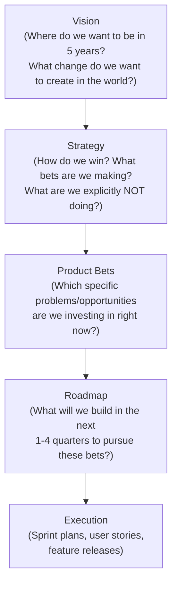

# Module 04: Product Strategy

[← Module 03: Problem Framing](../03_problem-framing/) | [Topic Home](../../README.md) | [Next → Module 05: Prioritization](../05_prioritization/)

---


---

## Table of Contents

1. [Overview](#overview)
2. [Prerequisites](#prerequisites)
3. [Objectives](#objectives)
4. [Theory](#theory)
5. [Key Concepts](#key-concepts)
6. [Examples](#examples)
7. [Common Pitfalls](#common-pitfalls)
8. [Cross-Links](#cross-links)
9. [Summary](#summary)

---

## Overview

Product strategy is the bridge between vision (where you want to go) and execution (what you build). Without strategy, teams make locally rational decisions that globally fail — shipping features that users like but that don't compound into a defensible position.

This module covers the hierarchy of vision → strategy → product bets, tools for competitive thinking (Porter's Five Forces and Blue Ocean Strategy applied to product decisions), and how to define and use a North Star metric as the compass for prioritization.

**Difficulty:** Intermediate &nbsp;|&nbsp; **Estimated time:** 4–5 hours

---

## Prerequisites

- Module 01: Introduction to Product Management
- Module 02: User Research and Discovery
- Module 03: Problem Framing — validated problems are the input to strategic bets

---

## Objectives

By the end of this module, you will be able to:

1. Explain the distinction between product vision, product strategy, and product roadmap
2. Write a product vision statement that is aspirational, specific enough to be useful, and time-bounded
3. Define a product strategy as a set of explicit choices about what you will and will not pursue
4. Apply Porter's Five Forces analysis to a product's competitive context
5. Use the Blue Ocean Strategy framework to identify uncontested market space
6. Define a North Star metric for a product and explain the difference between it and a revenue metric
7. Write a product strategy one-pager including vision, strategy, bets, and North Star metric

---

## Theory

### The Strategy Hierarchy

Product strategy sits within a hierarchy:



*Each level narrows the decision space. Vision narrows strategy. Strategy narrows bets. Bets narrow the roadmap. Execution is constrained by all of the above.*

Vision describes the desired future state — what the world looks like if the product succeeds over a 3–5 year horizon. A good vision is aspirational and directional without specifying a solution. Spotify's vision is "universal access to music and podcasts" — it describes an outcome for the world, not a feature.

Strategy is the set of explicit choices about how to win. The word "choices" is key: a strategy that includes everything is not a strategy. Porter's definition is apt: strategy is choosing what NOT to do. A product strategy says: given the competitive landscape, our capabilities, and our users' needs, these are the bets we're making — and here is what we are explicitly not pursuing.

### Porter's Five Forces Applied to Product

Michael Porter's Five Forces framework was designed for industry analysis but applies usefully to product strategy. The five forces:

1. **Threat of new entrants** — How hard is it for new competitors to build what you've built? What are your defensible moats (data, network effects, switching costs, brand)?
2. **Bargaining power of suppliers** — What dependencies does your product have? Third-party APIs, cloud providers, content licenses?
3. **Bargaining power of buyers (users/customers)** — How easily can users switch to an alternative? High switching costs favor incumbents; low switching costs favor challengers.
4. **Threat of substitute products** — What non-obvious alternatives serve the same job? (Remember the milkshake study — your competitor might not be another app in your category.)
5. **Competitive rivalry** — How intense is the current competition in your market?

Applying this to product decisions: if switching costs are low and substitutes are plentiful, your strategy must focus on building lock-in through value, not features. If network effects are your moat, your strategy must prioritize growth and connections over individual user features.

### Blue Ocean Strategy

Blue Ocean Strategy (W. Chan Kim and Renée Mauborgne) argues that competing in existing market space (red oceans) produces diminishing returns. Instead, create uncontested market space (blue oceans) by:

- **Eliminating** factors the industry competes on that customers don't actually value
- **Reducing** factors well below industry standards
- **Raising** factors well above industry standards
- **Creating** entirely new factors the industry has never offered

**Product application:** When Airbnb launched, the hotel industry competed on room amenities, loyalty programs, and central locations. Airbnb eliminated these (no amenities, no loyalty program, not centrally located) while raising location variety and local authenticity, and creating host-guest relationship and neighborhood immersion — factors hotels could not easily replicate.

### North Star Metric

The North Star metric is the single metric that best captures the core value your product delivers to users, such that if it improves, you are confident the product is succeeding in its mission.

**Key properties of a good North Star metric:**
- It measures user value, not business value (revenue is a lagging indicator of user value, not a driver)
- It is actionable — the team can influence it through product decisions
- It is understandable — every team member can explain what it means
- It is leading — changes in it predict future business health

```text
Product                    | North Star Metric
---------------------------|------------------------------------------
Spotify                    | Time spent listening (minutes per month)
Airbnb                     | Nights booked
Slack                      | Messages sent per active user per day
Duolingo                   | Days with at least one completed lesson (streak)
LinkedIn                   | Monthly active professionals (distinct from MAU)
```

The North Star metric is not the only metric a team tracks. Input metrics (things the team can directly influence) predict the North Star. Output metrics (like revenue) follow from it. The tree of metrics is discussed in depth in Module 09.

---

## Key Concepts

**Product vision:** An aspirational, time-bounded description of the desired future state the product aims to create. It answers "what changes in the world if we succeed?"

**Product strategy:** The explicit set of choices about how to win — what problems to pursue, which users to prioritize, and what the team will NOT do. Strategy is the context for prioritization.

**Product bet:** A specific investment in a problem space or opportunity area, grounded in the belief that solving it will significantly advance the vision. Bets are higher-level than features.

**North Star metric:** The single metric that best captures the core value delivered to users and predicts long-term business health. It measures user value, not business revenue.

**Porter's Five Forces:** A framework for analyzing competitive dynamics in a market across five dimensions: new entrants, suppliers, buyers, substitutes, and rivalry.

**Blue Ocean Strategy:** A framework for creating uncontested market space by eliminating, reducing, raising, and creating factors of competition rather than competing in existing space.

---

## Examples

### Example 1: Product Strategy One-Pager

```text
PRODUCT: [Fictional task management app]
DATE: Q3 2026

VISION (5 years):
A world where every knowledge worker starts their day knowing exactly
what matters most and ends it feeling genuinely accomplished — not just busy.

STRATEGY (how we win in 12 months):
We will win among solo professionals and small teams (1–10 people) by
being the fastest, most friction-free path from "chaos of inbound work"
to "clear daily focus." We will NOT compete on enterprise features,
integrations, or project management depth — those roads lead to Jira.

NORTH STAR METRIC:
% of weekly active users who complete a "daily planning" action
before 10am on at least 3 weekdays per week

Current: 18% → Target: 35%

TOP 3 BETS:
1. Reduce daily planning time from >5 min → <60 seconds (daily friction is killing the habit)
2. Build "morning digest" that surfaces the 3 most important items automatically
3. Make task capture from email/Slack frictionless (current: requires manual entry)

EXPLICITLY NOT PURSUING:
- Team collaboration features (Asana, ClickUp own this space)
- Calendar integrations beyond read-only (scope creep risk)
- Mobile app (web first; mobile is phase 2 after PMF is confirmed)
```

---

### Example 2: How Figma Found a Blue Ocean

Traditional design tools (Photoshop, Sketch) were desktop-installed, file-based, and single-user. Figma's blue ocean strategy:

- **Eliminated:** Desktop installation, file-based collaboration, version control complexity
- **Reduced:** Individual license complexity
- **Raised:** Real-time collaboration, accessibility for non-designers
- **Created:** Browser-based, multiplayer design; design as a team sport accessible to PMs and engineers

By doing this, Figma didn't just compete with Sketch — it created a new market for "design as a shared medium" that included PMs, engineers, and non-designer stakeholders as first-class participants. Dylan Field, Figma's co-founder and product-focused CEO, built strategy around a user need (collaborative design) that incumbents were structurally unable to address.

---

## Common Pitfalls

**Pitfall 1: Confusing vision with strategy**
Vision is "where are we going?" — aspirational, future-state, inspiring. Strategy is "how do we get there?" — choices, tradeoffs, what's excluded. A document titled "strategy" that only describes a desired future state is actually a vision document.

**Pitfall 2: A "strategy" that includes everything**
If your strategy says you will pursue all user segments, all use cases, and all product areas, it is not a strategy. A strategy that doesn't say no to anything provides no guidance for prioritization. Ask: "What would someone who read this strategy know NOT to build?"

**Pitfall 3: Using revenue as the North Star metric**
Revenue is a lagging indicator — it follows from user value, not the other way around. A team that optimizes for revenue often sacrifices user experience for short-term extraction, eroding the foundation of long-term growth.

**Pitfall 4: Ignoring the competitive context**
A strategy developed without understanding the competitive landscape is a strategy developed in a vacuum. Apply at least a basic Five Forces or competitive substitutes analysis before committing to strategic bets.

---

## Cross-Links

- [[product-management/modules/03_problem-framing]] — Validated problem framing provides the raw material for strategic bets
- [[product-management/modules/05_prioritization]] — Strategy provides the context within which prioritization frameworks are applied
- [[product-management/modules/06_product-roadmaps]] — The roadmap is the tactical expression of the strategy
- [[product-management/modules/09_metrics-and-analytics]] — North Star metric definition feeds into the full metrics tree covered in that module

---

## Summary

- Vision describes the desired future state (5-year horizon); strategy describes how you win (the explicit choices and exclusions); roadmap is the tactical expression
- Strategy is about choices — a strategy that excludes nothing is not a strategy; the question "what are we NOT doing?" is as important as "what are we doing?"
- Porter's Five Forces helps analyze competitive dynamics across five dimensions: new entrants, suppliers, buyers, substitutes, and rivalry
- Blue Ocean Strategy creates uncontested market space by eliminating, reducing, raising, and creating competitive factors rather than competing in existing space
- The North Star metric measures user value delivered, not business revenue; it is actionable, understandable, and leading — it predicts future business health
- A product strategy one-pager should include: vision, strategy, target users, North Star metric, top 3 bets, and explicitly what is NOT being pursued
