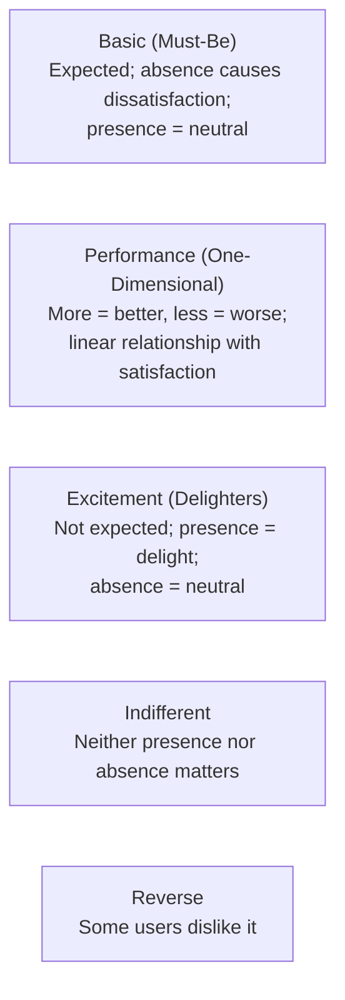

# Module 05: Prioritization

[← Module 04: Product Strategy](../04_product-strategy/) | [Topic Home](../../README.md) | [Next → Module 06: Product Roadmaps](../06_product-roadmaps/)

---


---

## Table of Contents

1. [Overview](#overview)
2. [Prerequisites](#prerequisites)
3. [Objectives](#objectives)
4. [Theory](#theory)
5. [Key Concepts](#key-concepts)
6. [Examples](#examples)
7. [Common Pitfalls](#common-pitfalls)
8. [Cross-Links](#cross-links)
9. [Summary](#summary)

---

## Overview

Every product team has more things it could build than it could ever actually build. Prioritization is the discipline of making defensible choices about which opportunities to pursue given constraints of time, engineering capacity, and strategic context.

This module covers the four most commonly used prioritization frameworks (RICE, ICE, MoSCoW, and Kano model), the value vs. effort matrix, and opportunity scoring. More importantly, it covers when to use each framework and how to avoid the common trap of treating prioritization as a mathematical exercise when it is fundamentally a judgment call.

**Difficulty:** Intermediate &nbsp;|&nbsp; **Estimated time:** 4–5 hours

---

## Prerequisites

- Module 04: Product Strategy — prioritization frameworks need a strategy to be useful; without strategy, RICE scores are just numbers

---

## Objectives

By the end of this module, you will be able to:

1. Apply RICE scoring to a set of candidate features and produce a ranked list with documented assumptions
2. Apply ICE scoring as a lightweight alternative when Reach data is unavailable
3. Use MoSCoW to facilitate stakeholder alignment on release scope
4. Apply the Kano model to identify basic requirements, performance features, and potential delighters
5. Map a set of features on a value vs. effort matrix and use it to drive a prioritization conversation
6. Select the appropriate prioritization framework for a given team size, data availability, and decision stakes
7. Defend a prioritization decision with explicit reasoning that goes beyond framework outputs

---

## Theory

### Why Prioritization Is Hard

Prioritization feels like it should be straightforward: rank by value, pick the top items, execute. In practice, prioritization is hard for several structural reasons:

- **Value is multidimensional:** A feature might have high user value, low business value, and moderate strategic value. Different stakeholders weight these dimensions differently.
- **Effort is uncertain:** Engineers are notoriously optimistic about estimates, and unknown unknowns routinely multiply initial estimates by 2–5x.
- **There is always pressure to do more:** Sales wants features to close deals. Support wants fixes to reduce tickets. Marketing wants content for campaigns. Every stakeholder believes their request is the most important.
- **Frameworks produce false precision:** A RICE score of 245 vs. 180 feels definitive. It is not. Both numbers rest on guesses about Impact and Confidence that could be off by a factor of 3.

The frameworks in this module are tools for *structured thinking*, not for replacing judgment. Use them to force explicit reasoning, not to delegate decisions to a spreadsheet.

### RICE: Reach, Impact, Confidence, Effort

Developed and published by Intercom, RICE is the most widely used quantitative prioritization framework in product management.

```text
RICE Score = (Reach × Impact × Confidence) / Effort
```

| Dimension | What It Measures | How to Score |
|-----------|-----------------|-------------|
| **Reach** | How many users will this affect per quarter? | Count of users who will encounter this feature in the next quarter |
| **Impact** | How much will this move the North Star metric per user? | 0.25 (minimal) / 0.5 (low) / 1 (medium) / 2 (high) / 3 (massive) |
| **Confidence** | How confident are you in your Reach and Impact estimates? | 100% (solid data) / 80% (some data) / 50% (gut feel) |
| **Effort** | How many person-months of work? | Include PM, design, and engineering |

**Example calculation:**

```text
Feature: Weekly summary email

Reach:      800 users will receive it per quarter (est.)
Impact:     0.5 (low — nice-to-have; unlikely to dramatically change behavior)
Confidence: 80% (we've seen some demand in surveys)
Effort:     1 person-month

RICE = (800 × 0.5 × 0.8) / 1 = 320
```

**When to use RICE:** Teams with 10+ active features in the backlog, when you have at least some data on user volume and engagement. Poor fit: very early-stage products where all estimates are guesses.

### ICE: Impact, Confidence, Ease

ICE is a simpler alternative to RICE, useful when Reach is hard to quantify or when the team needs a quick, gut-level ranking.

```text
ICE Score = Impact × Confidence × Ease
```

Each dimension is scored 1–10:
- **Impact:** How much will this move the metric?
- **Confidence:** How confident are you?
- **Ease:** How easy is this to implement? (10 = trivial, 1 = very hard)

ICE is less defensible than RICE but faster to apply and doesn't require Reach estimates. Good for early-stage teams or quick triage.

### MoSCoW

MoSCoW divides backlog items into four categories, typically applied to a specific release scope:

| Category | Meaning | PM Discipline Required |
|----------|---------|----------------------|
| **Must Have** | Without this, the release fails | Rigorous — this list must be minimal |
| **Should Have** | Important but won't block release | Moderate — include if time permits |
| **Could Have** | Nice to have; low impact if absent | Liberal — include for morale/optics |
| **Won't Have** | Out of scope for this release | Critical — explicitly say no, with a date if possible |

The "Won't Have" category is the hardest and most important. Explicitly naming what is NOT in scope prevents scope creep and manages stakeholder expectations.

**When to use MoSCoW:** Sprint planning, release scoping conversations, when aligning multiple stakeholders on what "done" means for a specific milestone.

### The Kano Model

Noriaki Kano's model categorizes features by how they affect user satisfaction:



**Practical application:**
- **Basic features:** Must be done well before anything else. A buggy core experience that you compensate for with delighters produces frustrated users who notice the bugs more than the delights.
- **Performance features:** Worth investing in — more is better. Search quality, load time, data accuracy.
- **Delighters:** High-risk, high-reward. Spotify Discover Weekly was a delighter. When successful, delighters create loyalty that performance features cannot.
- **Kano over time:** Delighters become performance features over time as users adapt. Mobile apps were delighters in 2008; they are basic expectations today.

### Value vs. Effort Matrix

The simplest and most intuitive prioritization tool: a 2×2 matrix plotting Value (high/low) against Effort (high/low).

```text
                    HIGH VALUE
                         │
        ┌────────────────┼────────────────┐
        │                │                │
        │   QUICK WINS   │  MAJOR BETS    │
  LOW   │   (Do first)   │  (Plan well,   │  HIGH
 EFFORT │                │   build slowly)│  EFFORT
        ├────────────────┼────────────────┤
        │                │                │
        │   FILL-INS     │   AVOID        │
        │ (Low priority) │  (Sink money)  │
        │                │                │
        └────────────────┼────────────────┘
                         │
                    LOW VALUE
```

This is a *conversation tool*, not a decision engine. The act of placing items on the matrix forces team members to align on their assumptions about value and effort.

---

## Key Concepts

**RICE:** A quantitative prioritization framework using Reach, Impact, Confidence, and Effort to score features. Most useful when you have data on user volume and engagement.

**ICE:** A simpler framework using Impact, Confidence, and Ease. Faster to apply than RICE; less defensible. Good for early-stage triage.

**MoSCoW:** A framework for categorizing release scope into Must Have, Should Have, Could Have, and Won't Have. Primarily a stakeholder alignment tool.

**Kano model:** A model categorizing features by their effect on satisfaction: Basic (expected), Performance (linear), Excitement (delighters), Indifferent, and Reverse.

**Value vs. effort matrix:** A 2×2 visual tool for mapping features by relative value and effort, producing four quadrants: Quick Wins, Major Bets, Fill-ins, and Avoid.

**Opportunity scoring:** A technique pairing user-stated importance and current satisfaction to identify gaps — high importance + low satisfaction = opportunity.

---

## Examples

### Example 1: RICE Scoring a Backlog

A team has four candidate features for next quarter. Here are their RICE scores:

| Feature | Reach | Impact | Confidence | Effort | RICE |
|---------|-------|--------|-----------|--------|------|
| Dark mode | 5,000 | 0.25 | 80% | 2 | **500** |
| SSO login | 200 | 3 | 90% | 3 | **180** |
| Mobile app | 3,000 | 2 | 50% | 8 | **375** |
| Bulk export | 150 | 2 | 60% | 1 | **180** |

RICE suggests Dark Mode ranks highest — but wait. Dark Mode has 0.25 Impact. That means the team believes dark mode will have a minimal effect on the North Star metric per user. The high RICE score is driven by Reach (5,000 users), not by the value of the feature. Whether this is the right call depends on whether the North Star metric is the right measure of value. If the product's strategic goal is enterprise sales, SSO at 180 might be more important strategically despite the lower RICE.

This is why RICE is a tool for conversation, not a decision oracle.

### Example 2: Kano Analysis — Slack's Evolution

When Slack launched (2013), several features were delighters:
- Threaded conversations
- Emoji reactions
- Channel organization
- Search

By 2020, these were Basic expectations — any team collaboration tool that lacks them is immediately rejected. Meanwhile, Slack added new potential delighters: workflow automation, Slack Connect (cross-company channels), and AI-powered summaries.

The Kano insight for product strategy: never stop finding new delighters, because today's delighters are tomorrow's basics.

---

## Common Pitfalls

**Pitfall 1: Treating the RICE score as a final answer**
RICE is a forcing function for explicit reasoning, not a decision. Two items with similar RICE scores require judgment. Two items where one has 5x better RICE but strategic misalignment should favor the strategic fit.

**Pitfall 2: Gaming ICE/RICE to justify a pre-decided preference**
When engineers inflate Ease scores for features they want to build, or PMs inflate Impact for their pet projects, the framework produces theater instead of reasoning. Calibrate scores publicly with the team.

**Pitfall 3: Missing the "Won't Have" category in MoSCoW**
Most teams use Must Have, Should Have, and Could Have — and then silently include everything in Could Have. The Won't Have list is where stakeholder alignment actually happens.

**Pitfall 4: Ignoring Basic features while building Delighters**
A buggy core experience with a stunning new feature is a worse product than a stable core with no new features. Kano's message: fix basics before building excitement.

---

## Cross-Links

- [[product-management/modules/04_product-strategy]] — Strategy provides the context within which prioritization scores mean something
- [[product-management/modules/06_product-roadmaps]] — Prioritized items become the roadmap
- [[product-management/modules/09_metrics-and-analytics]] — Measuring the outcomes of prioritization decisions closes the loop
- [[product-management/modules/11_stakeholder-management]] — Communicating and defending prioritization decisions to stakeholders

---

## Summary

- Prioritization is a judgment call aided by frameworks — no framework replaces judgment, and all frameworks rest on estimates that could be wrong by a factor of 2–3x
- RICE (Reach × Impact × Confidence / Effort) is the most defensible quantitative framework; best when you have data on user volume
- ICE (Impact × Confidence × Ease) is faster but less defensible; best for early-stage teams or quick triage
- MoSCoW is primarily a stakeholder alignment tool; the "Won't Have" category is the most important and most neglected
- The Kano model reveals that Basic features must be solid before Delighters can land; and today's Delighters become tomorrow's Basics
- The value vs. effort matrix is a conversation tool — the act of placing items forces alignment on assumptions about value and effort
- The most common prioritization mistake is optimizing for a framework score rather than for strategy fit
