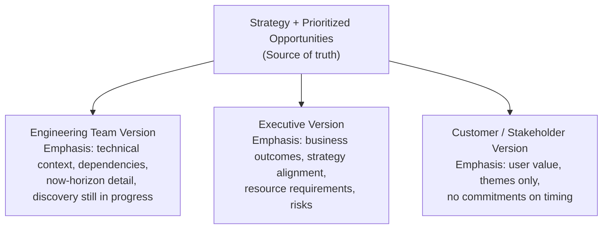

# Module 06: Product Roadmaps

[← Module 05: Prioritization](../05_prioritization/) | [Topic Home](../../README.md) | [Next → Module 07: UX Design Fundamentals](../07_ux-design-fundamentals/)

---


---

## Table of Contents

1. [Overview](#overview)
2. [Prerequisites](#prerequisites)
3. [Objectives](#objectives)
4. [Theory](#theory)
5. [Key Concepts](#key-concepts)
6. [Examples](#examples)
7. [Common Pitfalls](#common-pitfalls)
8. [Cross-Links](#cross-links)
9. [Summary](#summary)

---

## Overview

A roadmap is a communication artifact, not a project plan. This distinction — seemingly minor — changes everything about how you build one. A project plan is a commitment. A roadmap is a current best-hypothesis about what will create the most value, communicated appropriately to different audiences.

This module covers the major roadmap formats (feature-based, outcome-based, Now/Next/Later, and themes-based), how to communicate roadmaps differently to engineering, executives, and customers, and the concept of roadmap debt — what happens when teams treat roadmaps as immutable promises rather than living hypotheses.

**Difficulty:** Intermediate &nbsp;|&nbsp; **Estimated time:** 3–4 hours

---

## Prerequisites

- Module 04: Product Strategy — roadmaps express strategy; strategy must come first
- Module 05: Prioritization — roadmap items are drawn from prioritized opportunities

---

## Objectives

By the end of this module, you will be able to:

1. Distinguish between feature-based and outcome-based roadmaps and explain why the latter is generally preferable
2. Build a Now/Next/Later roadmap and explain what each time horizon communicates
3. Adapt a single roadmap to communicate appropriately for three different audiences: engineering team, executives, and customers
4. Identify the characteristics of "roadmap debt" and explain how it accumulates
5. Respond to common stakeholder demands ("Why isn't X on the roadmap?" and "Can you commit to this date?") using evidence-based framing
6. Evaluate a roadmap example and identify whether it communicates outcomes or outputs

---

## Theory

### Why Feature-Based Roadmaps Fail

The traditional feature roadmap looks like a timeline with features attached to quarters:

```text
Q1: Dark mode, CSV export, SSO
Q2: Mobile app, Zapier integration
Q3: Analytics dashboard, AI suggestions
```

This format creates several compounding problems:

1. **False commitment:** Stakeholders treat dates as promises. When Q1 items slip (and they always slip), trust erodes.
2. **Output measurement:** The team measures success by "did we ship it?" rather than "did it work?" Features ship into the dark — no one checks if they moved the needle.
3. **Locked-in solutions:** The roadmap commits to *how* before validating *whether*. If user research in Q1 reveals the underlying problem is different than assumed, the feature is already on the roadmap.
4. **Crowds out discovery:** A feature-packed roadmap leaves no slack for discovery, which means the next round of features is built with equally poor validation.

### Outcome-Based Roadmaps

An outcome-based roadmap replaces features with problems to solve and metrics to move:

```text
NOW (current focus):
- Reduce new user activation drop-off
  Metric: % completing core action in day 1 — target: 23% → 40%

NEXT (next 1–2 quarters):
- Unlock enterprise adoption
  Metric: Land 3 enterprise pilots with ≥ 80% admin satisfaction

LATER (future quarters):
- Deepen power user engagement
  Metric: D30 retention for users who complete advanced setup — target: 40% → 60%
```

This format communicates *why* work matters, lets engineering and design discover the best solution, and makes success measurable before launch. The specific features (redesigned onboarding, SSO, admin console) emerge from discovery rather than being prescribed upfront.

### Now/Next/Later Format

The Now/Next/Later format, popularized by Janna Bastow and ProdPad, divides the roadmap into three time horizons instead of specific dates:

| Horizon | Scope | Level of Detail | Confidence |
|---------|-------|----------------|------------|
| **Now** | Current sprint/cycle | High — specific problems, defined acceptance criteria | High — committed to these |
| **Next** | Next 1–3 months | Medium — problem areas defined, solutions still being discovered | Medium — directionally confident |
| **Later** | Beyond 3 months | Low — strategic bets and opportunity areas | Low — hypotheses subject to change |

Using "Now/Next/Later" instead of specific dates is honest: it communicates that later-horizon items are directional thinking, not commitments. This reduces the expectation mismatch that causes most roadmap-related stakeholder conflicts.

### Communicating Roadmaps to Different Audiences

The same underlying roadmap needs to be expressed differently for different audiences:



**Engineering version:** Includes enough context to make good technical decisions. Shows which items are in discovery vs. committed. Highlights dependencies (Item B can't start until Item A completes). Avoids over-specifying solutions. Respects that engineers will discover scope as they build.

**Executive version:** Connects roadmap items to business outcomes (revenue, retention, market position). Shows how the roadmap serves the strategy. Highlights resource implications. Identifies risks. Avoids feature-level detail that distracts from business conversation.

**Customer version:** Communicates themes and outcomes, not features or dates. "We're focused on making data import dramatically easier" is a customer-appropriate roadmap item. "We're building a background CSV importer with real-time progress indicators, expected in Q3" is not — it overcommits and invites "what about X?" questions.

### Roadmap Debt

Roadmap debt accumulates when a team treats the roadmap as a commitment rather than a hypothesis. Symptoms:

- Items that were deprioritized months ago are still on the roadmap because "we promised"
- The Now column is crowded because nothing ever leaves the roadmap
- Engineering is building things the PM knows are the wrong solution but "it's on the roadmap"
- Stakeholders believe roadmap items are guaranteed deliverables

**Managing roadmap debt:**
- Quarterly roadmap reviews: explicitly prune items that are no longer strategically relevant
- "Hypothesis" labeling: mark items in the Later column as hypotheses, not commitments
- OKR alignment: items that don't connect to current OKRs should be questioned every quarter

---

## Key Concepts

**Feature roadmap:** A roadmap organized by features or functionality with associated dates. Creates false commitment and measures output rather than outcomes.

**Outcome roadmap:** A roadmap organized by problems to solve and metrics to improve, with solutions discovered during delivery. Measures outcomes.

**Now/Next/Later:** A time-horizon framework for roadmaps that replaces specific dates with three buckets of decreasing commitment and increasing uncertainty.

**Roadmap debt:** The accumulation of outdated items, stale commitments, and misaligned expectations caused by treating a roadmap as a project plan rather than a hypothesis.

**Roadmap audience adaptation:** The practice of communicating the same underlying strategic roadmap in different formats for engineering, executives, and customers.

---

## Examples

### Example 1: Feature Roadmap vs. Outcome Roadmap

**Feature roadmap (problematic):**

```text
Q2 2026:
• Dark mode (Design: 2 weeks, Eng: 3 weeks)
• CSV bulk export (Eng: 4 weeks)
• SSO login (Eng: 6 weeks)
• Mobile notification redesign (Design: 1 week, Eng: 2 weeks)
```

**Outcome roadmap (same strategic intent, better framing):**

```text
NOW (Q2 2026):
• Unlock enterprise adoption
  Why: Current enterprise prospects blocked by missing security/compliance table stakes
  Metrics: SSO available → target 3 enterprise pilots active by end of Q2
  Solutions in discovery: SSO, audit log, admin console — scope TBD based on pilot feedback

• Reduce friction for data-heavy users
  Why: Power users abandon when their data is trapped; reducing this improves retention
  Metrics: Export completion rate 43% → 70%
  Solutions in discovery: Bulk export, format options, scheduled exports
```

The outcome version is harder to commit to specific dates, but that is the point — the team does not yet know exactly which solutions will address the problems until they've done some discovery with enterprise prospects.

---

### Example 2: The "Why Isn't X on the Roadmap?" Conversation

A common stakeholder situation: the Head of Sales asks "Why isn't Salesforce integration on the roadmap? I've had three customers ask for it."

**Feature roadmap PM response:** (defensive) "It's in Q4 probably."

**Outcome roadmap PM response:** "Our current focus is on reducing enterprise adoption friction — we're working with 3 pilot customers to identify exactly what's blocking them. Salesforce integration has come up in those conversations. If it emerges as a critical blocker, it would naturally be part of that work. Can you connect me with those three customers so I can understand what specific Salesforce workflow they're trying to support?"

The outcome-based PM turns the conversation into a discovery opportunity rather than a commitment negotiation.

---

## Common Pitfalls

**Pitfall 1: Roadmap as Gantt chart**
A roadmap with specific start dates, end dates, and dependencies is a project plan, not a roadmap. It communicates false certainty about work that hasn't started yet.

**Pitfall 2: Roadmap without audience**
A single roadmap that tries to serve engineering, executives, and customers simultaneously serves none of them well. Build different views for different audiences from the same underlying source of truth.

**Pitfall 3: Never removing items from the roadmap**
Items accumulate because removing them feels like breaking a promise. In practice, removing an outdated item is a sign of good judgment, not failure. Quarterly pruning is required hygiene.

**Pitfall 4: Outcome roadmap without discovery**
An outcome roadmap is only as good as the discovery behind the outcomes. "Increase retention" as a roadmap item is meaningless if the team doesn't know why retention is low.

---

## Cross-Links

- [[product-management/modules/04_product-strategy]] — Strategy is the source from which roadmap items derive
- [[product-management/modules/05_prioritization]] — Prioritization determines which opportunities make it onto the roadmap
- [[product-management/modules/08_agile-and-delivery]] — The sprint backlog is the near-term expression of the Now horizon
- [[product-management/modules/11_stakeholder-management]] — Roadmap defense and stakeholder communication are exercises in stakeholder management
- [[feature-flags-monitoring]] — Progressive delivery tools let teams release safely without requiring full roadmap commitment to dates

---

## Summary

- A roadmap is a communication artifact expressing a hypothesis about what will create value — not a project plan or a promise
- Feature roadmaps create false commitment, measure output rather than outcomes, and lock solutions in before discovery is complete
- Outcome roadmaps communicate problems to solve and metrics to move, leaving solutions open for discovery
- The Now/Next/Later format is honest about uncertainty: Now items are committed, Later items are hypotheses
- Different audiences need different roadmap views: engineering wants technical context, executives want business impact, customers want themes and value
- Roadmap debt accumulates when items are never pruned; quarterly reviews are required maintenance
