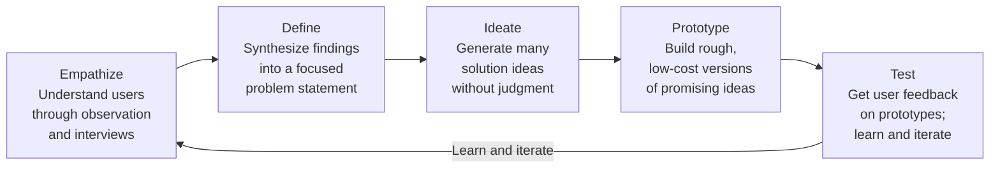
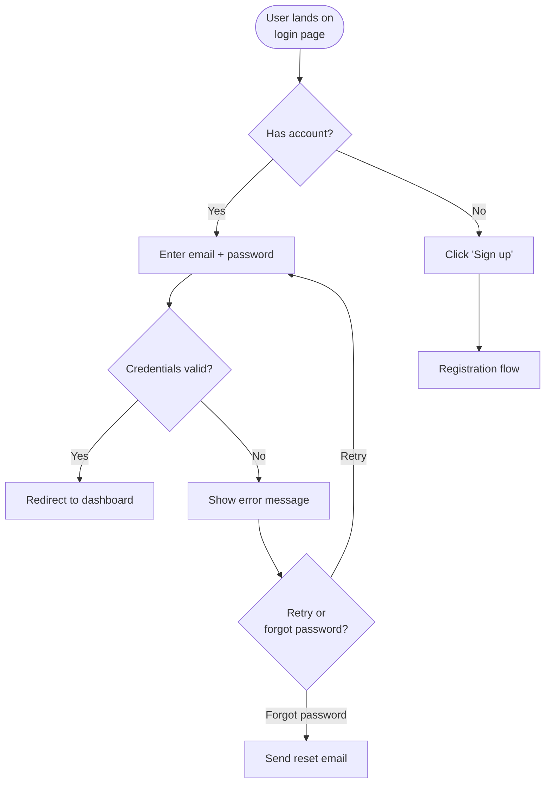

# Module 07: UX Design Fundamentals

[← Module 06: Product Roadmaps](../06_product-roadmaps/) | [Topic Home](../../README.md) | [Next → Module 08: Agile and Delivery](../08_agile-and-delivery/)

---


---

## Table of Contents

1. [Overview](#overview)
2. [Prerequisites](#prerequisites)
3. [Objectives](#objectives)
4. [Theory](#theory)
5. [Key Concepts](#key-concepts)
6. [Examples](#examples)
7. [Common Pitfalls](#common-pitfalls)
8. [Cross-Links](#cross-links)
9. [Summary](#summary)

---

## Overview

PMs don't design products — designers do. But PMs who can't read a wireframe, participate in a design critique, or recognize a good user flow are operating blind during the definition phase when the most important product decisions are made.

This module gives PMs the vocabulary and frameworks to be effective partners in design work: design thinking phases, wireframe literacy (lo-fi to hi-fi), user flow mapping, Figma basics for reviewing and annotating designs, and how to structure a prototype-based usability test.

**Difficulty:** Intermediate &nbsp;|&nbsp; **Estimated time:** 3–4 hours

---

## Prerequisites

- Module 02: User Research and Discovery — design thinking builds on the same user empathy foundations
- Module 03: Problem Framing — design sprints start from well-framed problems

---

## Objectives

By the end of this module, you will be able to:

1. Explain the five phases of Design Thinking and identify which type of work belongs in each phase
2. Read and critique a wireframe, distinguishing between lo-fi (structure) and hi-fi (visual) feedback
3. Map a user flow for a core product scenario, identifying all decision points and error states
4. Navigate a Figma file as a viewer: inspect component properties, leave comments, and understand the design/developer handoff workflow
5. Design a basic prototype-based usability test and interpret findings from 5 users
6. Partner effectively with a designer — know when to give input, when to step back, and how to frame feedback

---

## Theory

### Design Thinking Phases

Design Thinking, developed at IDEO and popularized through Stanford's d.school, is a human-centered problem-solving framework. Its five phases map closely to the product development lifecycle:



*Design thinking is iterative, not linear. Findings from the Test phase feed back into Empathize, and teams cycle through multiple times before converging on a solution.*

For PMs:
- **Empathize and Define** map to product discovery and problem framing (Modules 02 and 03)
- **Ideate** is where PMs and designers generate HMW questions and explore solution space
- **Prototype and Test** are the validation phase — cheaply testing solution hypotheses before committing to full development

### Wireframe Literacy

Wireframes are the lingua franca between PMs and designers. A wireframe shows *what* is on a screen and *how* it's organized — without visual styling.

**Lo-fi wireframes** (rough, often hand-drawn or boxes-only):
- Show layout and hierarchy
- Communicate structure without implying final visual design
- Used in early ideation to test many options quickly
- PMs should focus on: "Is the right information present? Is the hierarchy correct? Does this flow make sense?"

**Hi-fi wireframes / mockups** (detailed, near-production visual fidelity):
- Show visual design, typography, color, and spacing
- Used for usability testing and engineering handoff
- PMs should focus on: "Does this match the acceptance criteria? Are edge cases handled? Does the copy communicate the right thing?"

**Common PM mistake:** Giving hi-fi feedback on lo-fi wireframes ("can we change the button color?") or lo-fi feedback on hi-fi mockups ("the layout seems off") — each feedback type belongs in the right phase.

### User Flow Mapping

A user flow is a diagram showing the path a user takes through a product to accomplish a specific goal. It maps every screen, every decision point, and every error state.



*A user flow for login. Every decision point and error state is explicit — this is the level of detail required for a complete flow.*

User flows are valuable for:
- Identifying where edge cases and error states are unhandled (the most common source of post-launch bugs)
- Communicating scope to engineering (every box in the flow is scope)
- Validating with users before visual design begins

### Figma for PMs

Figma is the dominant design tool. PMs need to know:

- **Navigating frames:** Designs are organized into frames (screens). The left panel shows layers; each layer is a component.
- **Inspect mode:** Click on any element to see its properties (font size, color, spacing, margin). This is how you communicate exact requirements to engineering.
- **Commenting:** Use `C` to add a comment. Comments are the PM's primary communication channel with designers in Figma.
- **Prototype view:** Click the play button to walk through the interactive prototype. This is how you evaluate the flow before a pixel of code is written.
- **Dev handoff mode:** Engineers switch to "Dev mode" to inspect code-equivalent properties. As a PM, you're reviewing designs before this happens.

What PMs should NOT do in Figma: edit designs directly (unless explicitly invited by the designer), move components around, or delete content.

### Prototype-Based Usability Testing

A usability test is not a focus group. It is an observation of a real user attempting a real task with a prototype, with the observer watching — not explaining or guiding.

**Basic 5-user protocol:**

```text
Setup (before the session):
- Define 2–3 tasks the user will attempt
- Prepare an intro script that explains the session is testing the design, not the user
- Set up screen recording or a partner to take notes

During each session:
1. Intro: "We're testing a design prototype. There are no right answers. Think out loud."
2. Task 1: "Please [task description]. Start whenever you're ready."
   - Observe, don't assist. Note where they hesitate or make errors.
   - Ask "What are you thinking right now?" when they pause.
3. Task 2, Task 3: Repeat.
4. Debrief: "What was confusing? What felt obvious? Anything we missed?"

After all sessions:
- Note patterns across users (2/5 users failed to find X = significant signal)
- A finding that 1/5 users mentioned is weak; 4/5 users is strong
```

Jakob Nielsen's famous finding: **5 users is enough to find 85% of usability problems**. More users find diminishing returns on new issues found.

---

## Key Concepts

**Design thinking:** A human-centered, iterative problem-solving process with five phases: Empathize, Define, Ideate, Prototype, and Test.

**Wireframe:** A schematic representation of a screen showing layout, hierarchy, and content organization without visual styling. Lo-fi = rough structure; hi-fi = near-production detail.

**User flow:** A diagram mapping the path a user takes through a product to complete a goal, including all decision points and error states.

**Figma:** The dominant design tool for digital products. PMs use it in viewer/commenter mode to review designs, leave feedback, and inspect properties.

**Usability test:** An observational session in which a real user attempts a defined task with a prototype, with the observer watching rather than assisting. Used to identify usability problems before building.

**Prototype:** A low-cost, interactive representation of a design used to test assumptions before committing to full development. Prototypes range from paper sketches to nearly-functional Figma click-throughs.

---

## Examples

### Example 1: Feedback at the Wrong Fidelity Level

A designer presents a lo-fi wireframe for a new onboarding flow. The PM says: "I love it! Can we use our brand blue for the CTA button?"

Why this is wrong: Lo-fi wireframes are intentionally unstyled to focus feedback on structure and hierarchy. Commenting on visual design at this stage wastes the designer's time and derails the structural conversation.

Better PM feedback on a lo-fi wireframe: "The hierarchy makes sense. I'm wondering if users will understand what the 'skip' option means — it's visually equal to 'continue.' Should we reduce its prominence?"

### Example 2: A Day in the PM–Designer Partnership

In a well-functioning product team, the collaboration looks like:
- PM brings validated problem statements and user research findings
- Designer explores solution space through sketches and prototypes
- PM participates in critique: "Does this solve the problem? Does this match what we learned from users?"
- Designer runs usability tests; PM participates in synthesis
- PM writes acceptance criteria based on the final design
- PM and designer walk through the design together with engineering during definition

The PM does not design. The PM does not approve designs unilaterally. The PM is a thinking partner for the designer and a bridge between user needs, business goals, and the design process.

---

## Common Pitfalls

**Pitfall 1: PM designing the UI in the spec**
When PMs write specs that include wireframe-level descriptions ("there should be a modal with three fields and a cancel button in the top right"), they have taken over the designer's job and removed creative latitude. Specs should describe *behavior and requirements*, not visual implementation.

**Pitfall 2: Skipping usability testing**
"We don't have time to test it." Testing 5 users takes 1–2 days. Discovering a critical usability flaw post-launch requires weeks of rework plus user communication. The time investment always pays off.

**Pitfall 3: Confusing prototype feedback with user research**
Usability testing a prototype tells you if users can use the solution. It does not tell you if the solution is solving the right problem. Both are needed.

**Pitfall 4: Treating designer feedback as optional**
Designers have deep expertise in visual communication, accessibility, and interaction patterns. PMs who routinely override design judgment in favor of their own preferences produce worse products.

---

## Cross-Links

- [[product-management/modules/02_user-research-and-discovery]] — The Empathize phase of design thinking directly parallels the user interview practice from this module
- [[product-management/modules/03_problem-framing]] — The Define phase of design thinking produces problem statements covered in this module
- [[product-management/modules/08_agile-and-delivery]] — Designs produced in this phase become the input to agile delivery
- [[qa-testing]] — Usability testing shares methodological roots with user acceptance testing in QA

---

## Summary

- PMs need design literacy — not design skills — to be effective partners in the definition phase
- Design Thinking has five phases: Empathize, Define, Ideate, Prototype, Test; the PM's involvement is highest in Empathize, Define, and Test
- Wireframe feedback must match fidelity level: structure/hierarchy feedback on lo-fi, visual/copy/edge-case feedback on hi-fi
- User flow diagrams map every path, decision point, and error state — they are scope documents as much as design artifacts
- Figma is best used by PMs in review/comment mode; direct editing is typically the designer's domain
- 5-user usability tests find 85% of usability problems and should be treated as standard practice, not a luxury
- The PM–designer partnership works best when the PM owns the problem space and the designer owns the solution space; both inform each other through structured collaboration
