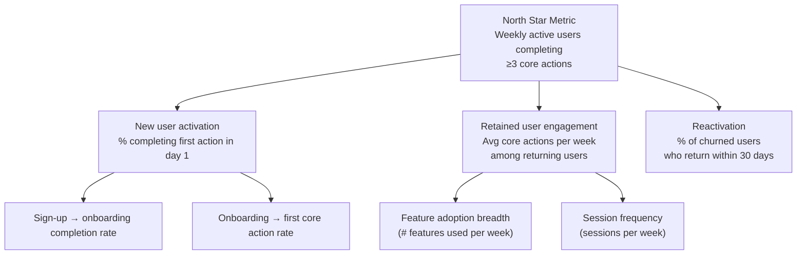

# Module 09: Metrics and Analytics

[← Module 08: Agile and Delivery](../08_agile-and-delivery/) | [Topic Home](../../README.md) | [Next → Module 10: Go-to-Market and Launch](../10_go-to-market-and-launch/)

---


---

## Table of Contents

1. [Overview](#overview)
2. [Prerequisites](#prerequisites)
3. [Objectives](#objectives)
4. [Theory](#theory)
5. [Key Concepts](#key-concepts)
6. [Examples](#examples)
7. [Common Pitfalls](#common-pitfalls)
8. [Cross-Links](#cross-links)
9. [Summary](#summary)

---

## Overview

Without measurement, product management is intuition and guesswork. With measurement, it is still mostly intuition and judgment — but disciplined intuition grounded in evidence. This module covers how to define success metrics before shipping, how to think about the relationship between North Star metrics and input metrics, funnel analysis, cohort analysis, and the basics of A/B test design.

**Difficulty:** Advanced &nbsp;|&nbsp; **Estimated time:** 4–5 hours

---

## Prerequisites

- Module 04: Product Strategy — North Star metric definition
- Module 08: Agile and Delivery — the delivery cycle that produces measurable outcomes

---

## Objectives

By the end of this module, you will be able to:

1. Define success metrics for a feature before it ships, distinguishing between primary, secondary, and guardrail metrics
2. Explain the metric tree structure connecting North Star metrics to input metrics
3. Identify the key stages of a conversion funnel and calculate conversion rates
4. Interpret a cohort retention curve and identify what it implies for product-market fit
5. Design a basic A/B test — hypothesis, control/treatment split, primary metric, minimum detectable effect, and required sample size
6. Avoid the most dangerous measurement pitfalls: survivorship bias, metric gaming, and confusing correlation with causation

---

## Theory

### Defining Success Metrics Before Shipping

The most important metric rule: **define your success metrics before the feature ships, not after results are known.** Defining metrics after launch is called "HARKing" (Hypothesizing After Results are Known) and produces rationalized narratives, not learning.

Before any feature ships, a PM should be able to answer:
1. What is the primary metric we expect to move? (One metric — choosing multiple primary metrics diffuses accountability)
2. What is our target for that metric? (Specific and time-bounded)
3. What secondary metrics will we track for context? (2–3 supporting signals)
4. What guardrail metrics must not worsen? (Metrics that protect user experience or business health)

```text
Feature: Redesigned onboarding checklist

Primary metric:   % of new users completing core action in day 1 (currently 23%, target 35%)
Secondary:        Time-to-first-value (currently 4 days, expect improvement)
                  Day 7 retention (if activation improves, expect uplift)
Guardrail:        Support tickets from new users must not increase
                  Trial conversion rate must not decrease
```

Defining guardrails is critical. A design that improves activation by pressuring users into unwanted actions might show short-term metric gains but erode long-term trust.

### The Metric Tree

The metric tree (also called an "input metric tree" or "metric hierarchy") connects the North Star metric to the intermediate metrics that drive it.



*A metric tree for a productivity app. The North Star is at the root; input metrics branch below it. Each input metric can be influenced directly by product decisions — the North Star is influenced indirectly through improving input metrics.*

Input metrics are the levers the product team can pull. The North Star moves when enough input metrics move in the right direction.

### Funnel Analysis

A conversion funnel maps the sequential steps users must complete to reach a goal, and measures the drop-off at each step.

```text
Example: SaaS signup funnel

Step                          | Users   | Conversion
------------------------------|---------|------------
Landing page visits           | 10,000  | —
Clicked "Sign up"             | 2,500   | 25%
Started registration          | 1,800   | 72%
Verified email                | 1,200   | 67%
Completed profile setup       | 600     | 50%
Completed first core action   | 230     | 38%
OVERALL: Visit → activation   | 230/10k | 2.3%
```

Funnel analysis identifies where the biggest drop-offs occur. The largest relative drop-off is the first place to investigate. This does NOT immediately tell you why users drop off — that requires qualitative follow-up (user interviews, session replay, surveys at the drop-off point).

### Cohort Analysis

A cohort is a group of users who all experienced the same event at the same time (e.g., users who signed up in January 2026). Cohort analysis tracks how a metric changes for that group over time.

```text
Cohort retention example:

Sign-up month | Day 1 | Day 7 | Day 30 | Day 90
--------------|-------|-------|--------|-------
Jan 2026      | 100%  | 45%   | 28%    | 18%
Feb 2026      | 100%  | 48%   | 30%    | 20%
Mar 2026      | 100%  | 52%   | 35%    | 24%

Interpretation: Retention is improving across cohorts — the product changes between
Jan and Mar are working. But absolute D90 retention of 24% means 76% of users are
gone by 3 months — still room for improvement.
```

A retention curve that flattens (rather than reaching zero) is a strong signal of product-market fit — some cohort of users is genuinely retaining. A curve that continues dropping to zero suggests the product has not found sustainable value for any user segment.

### A/B Test Design

An A/B test (randomized controlled experiment) is the highest-quality method for establishing causal relationships between product changes and user behavior.

**Core components of an A/B test:**

1. **Hypothesis:** "If we [change], then [metric] will [direction] by [magnitude] because [mechanism]."
2. **Control:** The existing experience (A)
3. **Treatment:** The new experience (B)
4. **Randomization unit:** Who is randomly assigned (user, session, device)?
5. **Primary metric:** One metric. Only one.
6. **Minimum Detectable Effect (MDE):** The smallest change you care about detecting (e.g., a 2% improvement in conversion)
7. **Statistical power:** Typically 80% — the probability of detecting a true effect if it exists
8. **Sample size:** Calculated from MDE, power, and baseline metric variance

```text
Sample size calculation (conceptual):

To detect a 2% absolute improvement in a metric with:
- Baseline rate: 23%
- MDE: 2% (detect 23% → 25% or better)
- Statistical power: 80%
- Significance level: 95%

Approximate sample needed per variant: ~3,500 users
Total: ~7,000 users
At 500 new users/day: ~14 days runtime minimum
```

**What to check before analyzing results:**
- Did the test run long enough? (Avoid "peeking" — stopping early when you see a good result)
- Are the groups balanced on key demographics?
- Is the Stable Unit Treatment Value Assumption (SUTVA) met? (Users in control and treatment don't interact)
- Did any other changes ship during the test period?

---

## Key Concepts

**Primary metric:** The one metric a feature or experiment is designed to move. Having multiple primary metrics diffuses accountability.

**Guardrail metric:** A metric that must not worsen when making changes. Guardrails protect user experience and business health from being traded away for primary metric gains.

**Metric tree:** A hierarchical structure connecting the North Star metric to the input metrics that drive it. Input metrics are the levers PMs can directly influence.

**Funnel analysis:** A sequential analysis of user drop-off across conversion steps. Identifies where the biggest losses occur.

**Cohort analysis:** Tracking a metric over time for a group of users who all started at the same point. Reveals retention patterns and the impact of product changes on successive cohorts.

**A/B test:** A randomized controlled experiment assigning users to control (A) or treatment (B) groups to measure the causal effect of a product change on a metric.

**Minimum Detectable Effect (MDE):** The smallest true improvement an A/B test is designed to detect. Setting MDE too small requires impractically large sample sizes.

---

## Examples

### Example 1: Metric Tree — Duolingo

Duolingo's North Star metric is Daily Active Users (DAU) — specifically users completing at least one lesson per day. Their metric tree includes:
- **New user activation:** % completing first lesson within 24 hours of signup
- **Streak maintenance:** % of users with active streaks of 7+ days
- **Re-engagement:** % of users who return after a lapse of 1–7 days
- **Push notification effectiveness:** % of users who tap a notification and complete a lesson

Duolingo famously A/B tested every aspect of their streak and notification system. The streaks feature — originally a delighter — became a Basic expectation, but their teams continuously discover new ways to make returning to the app feel compelling.

### Example 2: A/B Test Failure — Statistical Significance Without Practical Significance

A team tests a button color change. They run the test for 3 weeks, get 40,000 users, and find a statistically significant (p < 0.05) improvement of 0.15% in click-through rate.

They declare victory and ship the new color.

The problem: 0.15% improvement at 40,000 users/month means 60 additional clicks per month. If those clicks don't convert to meaningful outcomes (purchases, activations, retained users), the improvement is statistically real but practically irrelevant. **Statistical significance and practical significance are not the same thing.** Always define MDE before running a test — if a 0.15% improvement wouldn't change any decision you make, don't run a test to detect it.

---

## Common Pitfalls

**Pitfall 1: Defining metrics after launch (HARKing)**
If you define success after seeing results, you will always find a metric that shows "success." This is not learning — it is confirmation bias with extra steps.

**Pitfall 2: Vanity metrics**
Tracking metrics that look good but don't predict business health: total registered users (not active), total feature usage (not useful usage), total app downloads (not retained users). If a metric can improve while the product fails, it's a vanity metric.

**Pitfall 3: Peeking at A/B test results early**
Stopping an A/B test when it first shows statistical significance inflates false positive rate. The test needs to run for the pre-planned duration regardless of early results.

**Pitfall 4: Confusing correlation with causation**
"Users who use Feature X retain at 3x the rate of users who don't" does not mean Feature X causes retention. It might mean engaged users (who would retain regardless) are also the ones who discover Feature X. Establishing causation requires experimentation, not just correlation analysis.

---

## Cross-Links

- [[product-management/modules/04_product-strategy]] — North Star metric is defined at the strategy level
- [[product-management/modules/10_go-to-market-and-launch]] — Launch instrumentation ensures metrics are tracked from day one
- [[feature-flags-monitoring]] — Feature flags enable A/B testing at the infrastructure level; monitoring provides the data pipelines that feed product metrics
- [[qa-testing]] — Testing and data quality are deeply connected; bad instrumentation produces bad data that leads to wrong decisions

---

## Summary

- Define success metrics before shipping: primary metric (one), secondary metrics (2–3), and guardrail metrics that must not worsen
- The metric tree connects the North Star metric to input metrics that the team can directly influence — improving input metrics is how the North Star moves
- Funnel analysis identifies where users drop off; it reveals *what* is happening but requires qualitative follow-up to explain *why*
- Cohort retention analysis reveals long-term engagement patterns and product-market fit signals; a retention curve that flattens indicates PMF
- A/B tests require: a clear hypothesis, one primary metric, pre-defined MDE, minimum sample size, and full runtime (no early stopping)
- Statistical significance is not practical significance — always ask whether the measured effect size would actually change any decision you make
