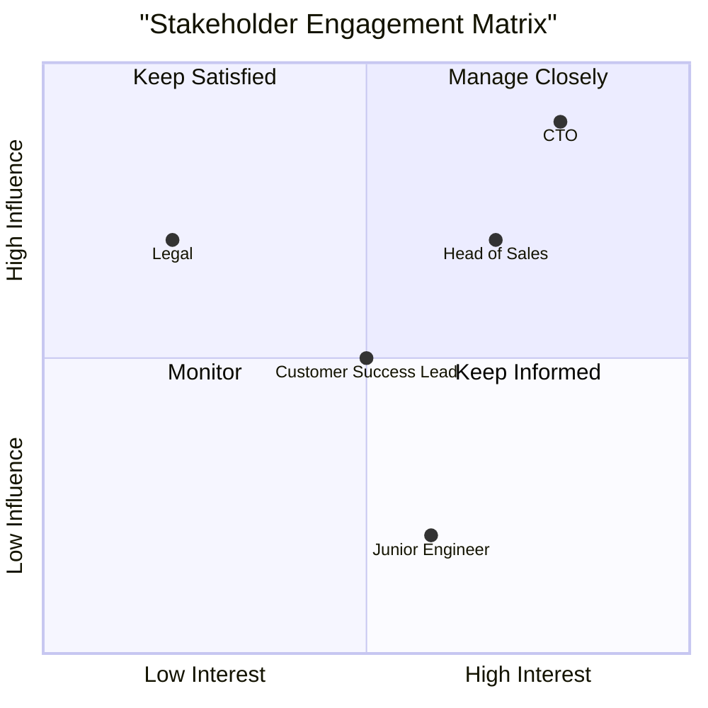

# Module 11: Stakeholder Management

[← Module 10: Go-to-Market and Launch](../10_go-to-market-and-launch/) | [Topic Home](../../README.md) | [Next → Module 12: Capstone Project](../12_capstone-project/)

---


---

## Table of Contents

1. [Overview](#overview)
2. [Prerequisites](#prerequisites)
3. [Objectives](#objectives)
4. [Theory](#theory)
5. [Key Concepts](#key-concepts)
6. [Examples](#examples)
7. [Common Pitfalls](#common-pitfalls)
8. [Cross-Links](#cross-links)
9. [Summary](#summary)

---

## Overview

A PM's ability to build, prioritize, and ship is bounded entirely by their ability to manage relationships with the people around them — engineers, designers, executives, sales teams, customers, and peers. The best product strategy fails without stakeholder alignment. The most technically impressive product withers without organizational support.

This module covers the core skills of stakeholder management: building trust with engineering and design partners, managing up to executives, saying no to stakeholders in ways that preserve the relationship, defending prioritization decisions under pressure, and achieving alignment without authority.

**Difficulty:** Advanced–Expert &nbsp;|&nbsp; **Estimated time:** 3–4 hours

---

## Prerequisites

- All prior modules — stakeholder management synthesizes the entire discipline; you need to know your product, your strategy, your metrics, and your roadmap before you can defend them

---

## Objectives

By the end of this module, you will be able to:

1. Categorize stakeholders by influence and interest and develop appropriate engagement strategies for each
2. Manage up effectively: communicate product strategy, surface risks early, and give executives what they need without creating false commitments
3. Say no to a stakeholder request in a way that preserves the relationship and keeps the door open for future collaboration
4. Defend a prioritization decision under pressure using evidence, strategy, and stakeholder framing
5. Run an alignment session that produces genuine agreement, not just apparent consensus
6. Identify and manage the most common sources of PM-stakeholder conflict (sales requests, executive mandates, engineering pushback)

---

## Theory

### The Stakeholder Map

Before managing stakeholders, map them. For any significant product decision, identify:

| Dimension | Question |
|-----------|---------|
| **Influence** | How much can this person affect whether my work succeeds or fails? |
| **Interest** | How much does this person care about this decision? |
| **Alignment** | Are they currently aligned with the direction, or resistant? |
| **Communication need** | What do they need from me to stay informed and supportive? |



*Map stakeholders by influence and interest. High influence + high interest = manage closely with frequent, proactive communication.*

### Managing Up: Working with Executives

Executives are busy, impatient, and worried about things the product team rarely considers (board dynamics, investor expectations, competitive threats, quarterly numbers). Managing up effectively means:

1. **Give them what they need to do their job, not what you want them to know.** Executives want: is the product on track? What are the risks? Do you need anything from me? They do not want to review wireframes or debate user story priorities.

2. **Surface bad news early.** The worst stakeholder management mistake is hiding problems until they become crises. An executive who finds out about a delay from someone other than the PM has lost trust in the PM.

3. **Frame everything in outcomes, not outputs.** "We shipped the redesign" lands poorly. "The redesign improved activation by 8%; we're revising the hypothesis for the next iteration" lands well.

4. **Never surprise executives in public.** Before a board meeting, review meeting, or all-hands, brief every executive sponsor on what you're sharing and what questions they should expect. Surprises in public become political incidents.

### Saying No Gracefully

The ability to say no without damaging relationships is one of the most valuable and rarest PM skills. Most PMs avoid no by saying "yes, but later" — a passive tactic that accumulates debt (the roadmap fills up with things you've nominally agreed to but will never build).

The anatomy of a graceful no:

```text
1. Acknowledge seriously: "I hear you — [restate the request] is clearly important to you/your team."
2. Show you've considered it: "I've thought about this and talked to [relevant people]."
3. Explain the tradeoff, not the rule: "If I added this now, it would push back [specific high-priority item] by [specific time], which would cost us [specific outcome]."
4. Offer an alternative: "What I can do is [alternative] / revisit this when [condition]."
5. Keep the door open: "Let me know if the context changes — I want to make sure we catch it if this becomes more urgent."
```

The key is the tradeoff framing. "No because we're too busy" is weak. "No because this would cost us X and I believe X is more important than Y, for these reasons" is a conversation starter, not an ending.

### Defending Prioritization Decisions

The most common stakeholder challenge: "Why isn't [feature] on the roadmap?"

A strong defense has three components:

1. **Strategy grounding:** "Our current focus is [outcome]. This connects to [strategy], which we believe is our highest-leverage area."

2. **Evidence base:** "Based on user research with [N] customers and funnel data showing [X], we believe [outcome] is the highest-value problem right now."

3. **Explicit tradeoff:** "Adding [requested feature] to the current quarter would require either reducing scope elsewhere or extending timeline. Here's what would have to give..." (Then be specific.)

What you're avoiding: defending with "the process said so" or "we scored it lower on RICE." Frameworks are tools; the PM must own the reasoning.

### Alignment Techniques

Achieving genuine alignment (not just apparent agreement) requires more than a meeting with a deck.

**Pre-wire:** Before any alignment meeting, talk individually to each key stakeholder and understand their position. Address concerns 1:1 before the group session. The group session is for confirming alignment, not creating it.

**DACI model:** For any significant decision, define:
- **Driver:** Who is driving this decision forward? (PM)
- **Approver:** Who has final say? (Executive or steering committee)
- **Contributors:** Whose input is required? (Engineering, design, legal)
- **Informed:** Who needs to be kept in the loop? (Sales, support, marketing)

Ambiguity about who approves a decision is the most common cause of "alignment" that falls apart later.

**Write it down:** After any alignment conversation, write a brief summary of what was agreed and circulate it. "Per our conversation, we agreed to X with Y as the rollback condition." This creates a record and surfaces any misalignment before it causes damage.

---

## Key Concepts

**Stakeholder map:** A classification of stakeholders by influence, interest, and alignment, used to determine appropriate engagement strategies.

**Managing up:** The practice of communicating with executives in a way that gives them what they need to make decisions and maintain confidence in the product direction.

**Graceful no:** Declining a stakeholder request while preserving the relationship, by acknowledging the request seriously, explaining the specific tradeoff, and offering an alternative.

**Pre-wiring:** The practice of building alignment 1:1 with key stakeholders before group meetings, so that group sessions confirm rather than create alignment.

**DACI:** A decision-making framework (Driver, Approver, Contributors, Informed) that clarifies roles and prevents alignment ambiguity.

---

## Examples

### Example 1: The Graceful No to a Sales Request

The Head of Sales sends a message: "We're about to lose a $400K deal because we don't have Salesforce integration. I need it on the roadmap for Q3."

**Poor response (avoidance):** "I'll put it in the backlog and we'll discuss in next quarter's planning."

**Strong response:**
"I understand — a $400K deal is significant and I take this seriously. I've talked to the sales team about this a few times now, and I want to be transparent with you about where it stands.

We've investigated what Salesforce integration would actually require: it's a 6–8 week engineering project with significant ongoing maintenance. Adding it to Q3 would mean either pushing our enterprise security work (SSO + audit logs) that's blocking 5 other pilots, or adding headcount we don't have.

Here's what I can offer: if this deal moves forward, I can arrange a 30-minute call between the prospect's technical team and our engineering lead to discuss API options they could use today as a stopgap. And I'll flag Salesforce integration for Q4 planning as a named candidate — if we see 2+ more deals citing this as a blocker, it changes the calculus and we revisit.

Would that work?"

This response respects the sales leader's business concern, shows the PM has done homework, explains the real tradeoff, and offers a concrete alternative.

### Example 2: Managing an Executive Mandate

The CEO returns from a competitor conference and sends an all-hands message: "Competitor X just launched an AI assistant. We need one by end of Q2."

**Poor PM response:** Immediately adding "AI assistant" to the roadmap, estimating 8 weeks, and starting engineering on an undefined scope.

**Strong PM response:**
1. Request a 30-minute meeting with the CEO.
2. In that meeting: "I want to make sure we build something users will actually value, not just something we can announce. Can I spend 2 weeks doing discovery on what our users actually need an AI to do? I'll come back with a specific hypothesis and an estimate."
3. Run discovery (5 user interviews, competitive analysis, feasibility check with engineering).
4. Return with: "Users use us for X. They struggle most with Y. An AI that does Z specifically (not 'an AI assistant') would address Y. We can ship a version of that in 6 weeks. Here's what it does and doesn't do, and here's how we'll measure success."

This converts an executive mandate into a discovery-informed feature with a clear scope and success metric.

---

## Common Pitfalls

**Pitfall 1: Avoiding conflict by saying yes to everything**
Agreeing to every request produces a roadmap full of things you'll never build, damaged trust when you don't deliver, and a team that can't focus. The short-term comfort of yes produces long-term organizational credibility loss.

**Pitfall 2: Escalating instead of aligning**
When a PM can't align with Sales on a feature request, going to the CEO to "settle it" is an escalation, not a solution. It damages the PM–Sales relationship, makes the PM look unable to manage cross-functionally, and rarely produces the right answer. Almost every conflict can be resolved earlier with better data and communication.

**Pitfall 3: Alignment theater**
A meeting where everyone nods but privately disagrees is not alignment — it's alignment theater. The test: can everyone in the room explain the decision to someone who wasn't there, using the same language and reasoning? If not, alignment hasn't happened.

**Pitfall 4: "Surprising" executives in public**
Sharing a significant product update, risk, or change in a group meeting before briefing the relevant executive is one of the most damaging stakeholder management mistakes. Always pre-brief.

---

## Cross-Links

- [[product-management/modules/04_product-strategy]] — You can only defend prioritization decisions if you can connect them to a clear strategy
- [[product-management/modules/05_prioritization]] — Prioritization frameworks provide the evidence base for defending roadmap decisions
- [[product-management/modules/06_product-roadmaps]] — Roadmap defense is a core stakeholder management exercise
- [[product-management/modules/10_go-to-market-and-launch]] — Launch communication is a specific stakeholder management exercise

---

## Summary

- Stakeholder maps clarify who needs what level of engagement; high influence + high interest stakeholders require proactive, frequent communication
- Managing up means giving executives what they need to do their job: outcome framing, early bad news, and no public surprises
- A graceful no acknowledges the request seriously, explains the specific tradeoff (not a rule), offers an alternative, and keeps the door open
- Defending prioritization decisions requires three components: strategy grounding, evidence base, and explicit tradeoff articulation
- Pre-wiring (building alignment 1:1 before group meetings) is the most reliable alignment technique; group sessions confirm alignment, they don't create it
- The DACI model prevents ambiguity about who approves decisions — ambiguity is the most common cause of apparent alignment that falls apart later
