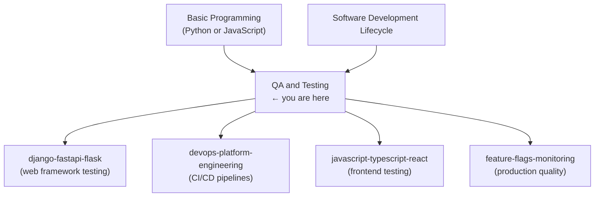

# QA and Testing — Roadmap

> How this topic fits into broader learning paths and what comes before and after.

---

## Where This Topic Sits

_QA and Testing sits at the intersection of development skills and operational quality. It requires basic programming ability and pays dividends in every downstream topic._

---

## Learning Path Options

### Path A: Backend Developer

Focus on unit testing, integration testing, and API testing. TDD is particularly valuable here.

1. Module 01 → 02 → 03 → 04 → 06 → 07 → 11

### Path B: Frontend Developer

Focus on unit testing, E2E testing with Playwright, and accessibility testing.

1. Module 01 → 02 → 03 → 05 → 10 → 11

### Path C: QA Engineer / SDET

Cover the full curriculum with extra emphasis on strategy, metrics, and tooling.

1. All 12 modules in order

### Path D: DevOps / Platform Engineer

Focus on test integration into pipelines, performance testing, and QA strategy.

1. Module 01 → 02 → 04 → 05 → 09 → 11 → 12

---

## Prerequisites From Other Topics

| Prerequisite | What You Need |
|---|---|
| Basic Python | Writing functions, using pip, running scripts |
| Basic JavaScript | Functions, async/await, using npm |
| Git basics | Committing code, branches (for CI integration context) |

---

## What This Topic Unlocks

After completing QA and Testing, the following topics become significantly more accessible:

| Topic | Why Testing Helps |
|---|---|
| [[django-fastapi-flask]] | Module 10 of that topic is dedicated to testing web applications; this topic provides all the prerequisites |
| [[devops-platform-engineering]] | CI/CD pipelines (Module 06 there) run test suites; understanding test structure is required |
| [[javascript-typescript-react]] | React Testing Library and Playwright are covered there; this topic provides the conceptual foundation |
| [[feature-flags-monitoring]] | A/B testing and feature flag testing patterns build directly on testing fundamentals |

---

## Suggested Study Schedule

| Week | Modules | Focus |
|------|---------|-------|
| 1–2 | 01, 02 | Foundations: the pyramid, unit testing with pytest and Jest |
| 3–4 | 03, 04 | Mocking, stubs, integration testing |
| 5–6 | 05, 06 | E2E with Playwright, API and contract testing |
| 7–8 | 07, 08 | TDD and BDD methodology |
| 9–10 | 09, 10 | Performance testing, accessibility testing |
| 11–12 | 11, 12 | QA strategy, capstone project |

---

## Milestones Towards Expert

| Level | What It Looks Like |
|---|---|
| **Beginner** | Can write basic pytest and Jest unit tests; understands the testing pyramid conceptually |
| **Intermediate** | Writes integration tests with real dependencies; uses mocks correctly; runs E2E tests with Playwright |
| **Advanced** | Practices TDD; writes Gherkin scenarios; implements contract tests; integrates all test tiers in CI |
| **Expert** | Designs QA strategies for teams; measures and improves test quality with mutation testing and coverage analysis; runs performance and chaos tests; defines quality metrics and SLAs |
