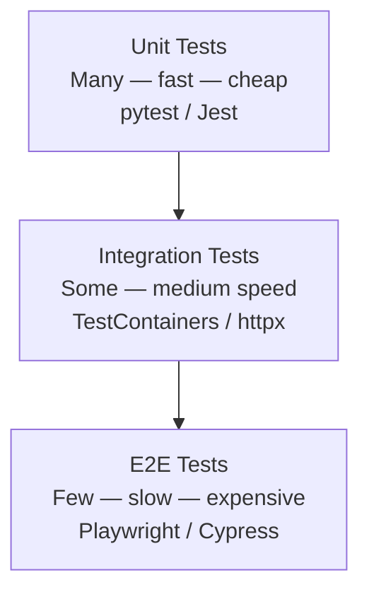

# Module 01: Introduction to QA and Testing

[← Topic Home](../../README.md) | [Next → Unit Testing](../02_unit-testing/)

---


---

## Table of Contents

1. [Overview](#overview)
2. [Prerequisites](#prerequisites)
3. [Objectives](#objectives)
4. [Theory](#theory)
5. [Key Concepts](#key-concepts)
6. [Examples](#examples)
7. [Common Pitfalls](#common-pitfalls)
8. [Cross-Links](#cross-links)
9. [Summary](#summary)

---

## Overview

This module establishes the foundation for everything that follows in this topic. Before writing a single test, you need to understand *why* testing exists, *what* the different types of tests are, and *how* to think about testing as a discipline rather than a chore.

Software development without testing is navigation without a map. You might reach your destination occasionally, but you will be perpetually surprised by wrong turns, and you will have no reliable way to know when you've gone off course. Testing is the map: it defines what the software is supposed to do, provides immediate feedback when the software stops doing it, and creates confidence that changes to one part of the system haven't broken another.

Quality assurance (QA) is the broader discipline that testing serves. Where testing is the act of verifying behavior, QA is the culture, process, and tooling that ensures quality is built into software from the beginning — not inspected in at the end. The shift from "we test before release" to "we test continuously throughout development" is the central transformation of modern software engineering, and it is the thread that runs through this entire topic.

**Why this module first?** Many developers learn testing in fragments — they learn to write a pytest fixture here, a Jest mock there — without ever understanding the underlying model. This creates confusion: "Should I use a unit test or an integration test here?" "Why does my test suite feel slow and unreliable?" "Am I really getting value from 100% coverage?" This module answers those questions by grounding you in the mental models and vocabulary that make every subsequent module easier to understand.

**Difficulty:** Beginner &nbsp;|&nbsp; **Estimated time:** 4–5 hours

---

## Prerequisites

- Basic programming in Python or JavaScript — you should be able to write a function and run it from the command line
- Some familiarity with the software development lifecycle — you should understand what "deploying to production" means
- No prior testing knowledge required

> [!TIP]
> If you have never written a test before, that is perfectly fine. This module assumes no prior testing experience. If you have some experience, use the Objectives section to identify gaps and focus your study.

---

## Objectives

By the end of this module, you will be able to:

1. Explain the testing pyramid and the rationale for the proportion of unit, integration, and E2E tests it recommends
2. Distinguish between the main types of tests: unit, integration, E2E, smoke, regression, performance, and accessibility
3. Apply the FIRST principles (Fast, Isolated, Repeatable, Self-validating, Timely) to evaluate whether a given test is well-written
4. Quantify the cost of bugs found at different stages of development and explain why early testing is economically justified
5. Set up a working Python testing environment with pytest and a JavaScript testing environment with Jest
6. Write your first unit tests for a simple function in both Python and JavaScript

---

## Theory

### The Testing Pyramid

The most important mental model in software testing is the **testing pyramid**, first described by Mike Cohn in *Succeeding with Agile* (2009) and popularized by Martin Fowler. The pyramid has three layers:



_The testing pyramid: many fast unit tests at the base, fewer integration tests in the middle, and a small number of E2E tests at the top._

The pyramid's shape is not aesthetic — it reflects the economic realities of software testing:

- **Unit tests** are cheap to write, run in milliseconds, and pinpoint failures to a specific function or module. They should be abundant: a mature codebase might have hundreds or thousands of unit tests.
- **Integration tests** verify that components work together correctly. They are slower (they involve databases, HTTP, or file I/O) and more complex to set up. They should be fewer in number — enough to cover the important boundaries in your system.
- **E2E tests** drive the application through its actual user interface, simulating real user behavior. They are the most confidence-inspiring but also the most expensive: they are slow (minutes per run), flaky (susceptible to timing issues and UI changes), and costly to maintain. They should be few — covering only the most critical user journeys.

The key insight: **if you invert the pyramid** — writing mostly E2E tests because "they test the real thing" — you get a slow, expensive, unreliable test suite that developers stop trusting. The pyramid shape is a prescription, not just a description.

The practical implication: when you face the question "what kind of test should I write for this behavior?", start at the bottom. Can a unit test cover it? Write a unit test. Does it require multiple components to work together? Write an integration test. Does it require a full browser? Write an E2E test.

#### The Cost vs. Confidence Trade-off

Each level of the pyramid makes a different trade between cost and confidence:

| Type | Speed | Cost per test | Scope | Confidence |
|------|-------|---------------|-------|------------|
| Unit | ~1ms | Very low | One function/class | Behavior of isolated code |
| Integration | ~100ms–10s | Medium | Multiple components | Cross-component behavior |
| E2E | ~10s–2min | High | Full user journey | End-user experience |

Notice that "confidence" is not monotonically increasing up the pyramid. An E2E test that passes tells you the feature works for one specific scenario on one specific browser. A well-designed unit test suite that covers all edge cases can give you *more* confidence in the correctness of a function than a single E2E test that only exercises the happy path.

---

### Types of Tests

Beyond the three layers of the pyramid, several other test types serve specific purposes:

| Test Type | Purpose | When to Use |
|-----------|---------|-------------|
| **Unit** | Verify isolated behavior | Every function/method with logic |
| **Integration** | Verify component interactions | Across system boundaries (DB, HTTP, file) |
| **E2E** | Verify user journeys | Critical paths; smoke tests in CI |
| **Smoke** | Verify basic functionality after deployment | After every deploy; before full test run |
| **Regression** | Prevent bugs from returning | After any bug fix |
| **Performance** | Verify response times and throughput | Before major releases; after scaling changes |
| **Accessibility** | Verify usability for all users | During development; in CI for UI changes |
| **Contract** | Verify service interface compatibility | In microservices between consumer and provider |

**Smoke tests** deserve special mention: they are the minimum viable test suite, designed to catch catastrophic failures quickly. A smoke test might check that the application starts, that the database is reachable, and that the login flow works. If smoke tests fail, you don't bother running the full test suite — you fix the fundamental problem first.

**Regression tests** are added whenever a bug is found in production. The workflow is: bug found → write a test that reproduces the bug → fix the bug → verify the test now passes → commit the test permanently. This ensures the bug cannot silently reappear in a future change.

---

### The Cost of Bugs

The economic case for testing is compelling and well-researched. Barry Boehm's 1981 work in *Software Engineering Economics* documented what practitioners had observed empirically: the cost to fix a defect grows dramatically the later in the development lifecycle it is discovered.

The "1x/10x/100x" rule (sometimes cited as the "rule of ten") captures this progression:

- A bug found during requirements analysis costs **1x** to fix — you clarify the requirement and move on
- A bug found during coding costs **10x** — you rework the code and any dependent code
- A bug found during integration testing costs **25–40x** — multiple components may need rework
- A bug found in production costs **100x or more** — emergency patches, communication overhead, potential data corruption, and reputational damage

The numbers vary by study and context, but the principle is robust: **detect early, fix cheaply**. This is the economic foundation of "shift-left testing" — the practice of moving testing earlier in the development process. Every dollar invested in unit testing saves ten dollars that would have been spent finding the same bug in production.

Concrete example: A bug in a financial calculation function. Found during code review and caught by a unit test: 15 minutes to fix, zero users affected. Found in production after a quarterly report is sent to 10,000 customers: legal review, public correction, customer service calls, potential regulatory inquiry, and an engineering incident post-mortem. The unit test cost $5 of developer time. The production bug might cost $500,000.

---

### What Makes a Good Test: The FIRST Principles

Robert C. Martin (and other contributors) articulated the **FIRST** principles for unit tests. A good test is:

**Fast** — Unit tests must run in milliseconds, not seconds. A suite of 500 tests that takes 30 minutes to run will not be run on every commit. Developers will skip it, and it will provide no feedback when it's most needed.

```python
# Slow test — makes a real HTTP call
def test_user_data_bad():
    import requests
    response = requests.get("https://api.example.com/users/1")
    assert response.json()["name"] == "Alice"

# Fast test — uses a mock instead of a real HTTP call
def test_user_data_good():
    mock_response = {"name": "Alice", "id": 1}
    with patch("mymodule.fetch_user", return_value=mock_response):
        result = get_user_name(1)
    assert result == "Alice"
```

**Isolated** — Each test must be completely independent. A test that passes or fails depending on whether another test ran first is lying to you. Isolation means no shared mutable state between tests.

```python
# Bad: shared mutable state
_global_cart = []

def test_add_item():
    _global_cart.append("apple")
    assert len(_global_cart) == 1

def test_cart_is_empty():
    assert len(_global_cart) == 0  # FAILS if test_add_item ran first!

# Good: each test creates its own state
def test_add_item():
    cart = []
    add_to_cart(cart, "apple")
    assert len(cart) == 1

def test_cart_starts_empty():
    cart = []
    assert len(cart) == 0
```

**Repeatable** — A test must produce the same result on every machine, in any environment, regardless of external conditions. Tests that depend on the current time, random numbers, network availability, or specific filesystem state are not repeatable.

```python
# Bad: depends on current time
def test_user_is_recent():
    user = User(created_at=datetime.now())
    assert user.is_recent()  # passes today, fails next year

# Good: controls time explicitly
def test_user_is_recent():
    fixed_time = datetime(2024, 1, 1, 12, 0, 0)
    user = User(created_at=fixed_time)
    with freeze_time(fixed_time):
        assert user.is_recent()
```

**Self-validating** — Tests must produce a clear pass or fail result, not output that requires human interpretation. A test that prints "result: 42" and expects you to compare it with the expected value manually is not a test — it's a print statement.

**Timely** — Tests should be written at the right time: ideally before the code they test (TDD), or at the very latest simultaneously with the code. Tests written after the fact tend to test what the code does rather than what it should do, missing the bugs that were already baked in.

---

### Setting Up a Testing Environment

#### Python: pytest

```bash
# Create a project directory
mkdir my-project && cd my-project

# Create a virtual environment
python -m venv venv
source venv/bin/activate  # on Windows: venv\Scripts\activate

# Install pytest
pip install pytest

# Create your first test file
# (pytest discovers files matching test_*.py or *_test.py)
touch test_calculator.py
```

```python
# test_calculator.py — your first test

def add(a, b):
    """A simple addition function."""
    return a + b

def test_add_returns_correct_sum():
    """Test that add() returns the correct sum of two positive numbers."""
    result = add(2, 3)
    assert result == 5

def test_add_with_negative_numbers():
    """Test that add() handles negative numbers correctly."""
    result = add(-2, 5)
    assert result == 3

def test_add_with_zero():
    """Test that add() is correct when one argument is zero."""
    result = add(0, 42)
    assert result == 42
```

```bash
# Run tests
pytest test_calculator.py -v
```

Expected output:
```
test_calculator.py::test_add_returns_correct_sum PASSED
test_calculator.py::test_add_with_negative_numbers PASSED
test_calculator.py::test_add_with_zero PASSED

3 passed in 0.03s
```

#### JavaScript: Jest

```bash
# Create a project directory
mkdir my-js-project && cd my-js-project
npm init -y

# Install Jest
npm install --save-dev jest

# Add test script to package.json
# "scripts": { "test": "jest" }
```

```javascript
// calculator.js
function add(a, b) {
  return a + b;
}

module.exports = { add };
```

```javascript
// calculator.test.js — your first Jest test
const { add } = require('./calculator');

describe('Calculator', () => {
  test('returns the correct sum of two positive numbers', () => {
    const result = add(2, 3);
    expect(result).toBe(5);
  });

  test('handles negative numbers correctly', () => {
    const result = add(-2, 5);
    expect(result).toBe(3);
  });

  test('is correct when one argument is zero', () => {
    const result = add(0, 42);
    expect(result).toBe(42);
  });
});
```

```bash
# Run tests
npx jest
```

Expected output:
```
 PASS  ./calculator.test.js
  Calculator
    ✓ returns the correct sum of two positive numbers (2ms)
    ✓ handles negative numbers correctly (1ms)
    ✓ is correct when one argument is zero (0ms)

Test Suites: 1 passed, 1 total
Tests:       3 passed, 3 total
```

---

## Key Concepts

**Testing Pyramid** — The conceptual model (unit → integration → E2E) that prescribes having many fast unit tests, fewer integration tests, and very few E2E tests. Inverting the pyramid leads to a slow, flaky, expensive test suite. See [[qa-testing/modules/05_e2e-testing]] for E2E depth and [[qa-testing/modules/04_integration-testing]] for integration testing.

**Shift-Left Testing** — The practice of moving testing to earlier stages of the development lifecycle. In a waterfall model, testing happens at the end. In a shift-left approach (Agile, DevOps), testing happens continuously from the first line of code. Shift-left dramatically reduces the cost of bugs found.

**FIRST Principles** — The five properties of a good unit test: Fast, Isolated, Repeatable, Self-validating, Timely. Any test that violates one of these principles is a liability, not an asset. A slow test suite won't be run; a non-isolated test gives misleading results; a non-repeatable test creates phantom failures.

**Regression Test** — A test added after a bug is discovered to ensure the bug cannot silently reappear. A good regression test suite is the institutional memory of bugs that have been seen in production. See [[shared/glossary#regression-test]] for the formal definition.

**AAA Pattern** — Arrange, Act, Assert. The standard structure for a unit test: arrange the preconditions, act on the code under test, assert the expected outcome. Following AAA makes tests easier to read and maintain. See [[qa-testing/modules/02_unit-testing]] for deeper coverage.

**Smoke Test** — A minimal test suite run immediately after deployment to verify that the most critical functionality is working. If smoke tests fail, the deployment is rolled back without wasting time on the full test suite. See [[qa-testing/glossary#smoke-test]].

---

## Examples

### Example 1: Writing Tests for a Calculator Function (Python)

**Scenario:** You have a `calculate_discount()` function that applies a percentage discount to a price, with rules: discount must be 0–100%, price must be positive.

**Goal:** Write a complete unit test suite that covers the function's behavior, including edge cases.

```python
# discount.py

def calculate_discount(price: float, discount_percent: float) -> float:
    """
    Apply a percentage discount to a price.

    Args:
        price: The original price (must be positive)
        discount_percent: The discount as a percentage (0–100)

    Returns:
        The price after discount is applied

    Raises:
        ValueError: If price <= 0 or discount_percent is not in [0, 100]
    """
    if price <= 0:
        raise ValueError(f"Price must be positive, got {price}")
    if not 0 <= discount_percent <= 100:
        raise ValueError(f"Discount must be 0–100%, got {discount_percent}")

    discount_amount = price * (discount_percent / 100)
    return round(price - discount_amount, 2)
```

```python
# test_discount.py

import pytest
from discount import calculate_discount

class TestCalculateDiscount:
    """Tests for the calculate_discount function."""

    # --- Happy path ---

    def test_ten_percent_discount(self):
        """A 10% discount on $100 should return $90."""
        result = calculate_discount(100.00, 10)
        assert result == 90.00

    def test_zero_percent_discount_returns_original_price(self):
        """A 0% discount should return the original price unchanged."""
        result = calculate_discount(50.00, 0)
        assert result == 50.00

    def test_hundred_percent_discount_returns_zero(self):
        """A 100% discount should make the price zero (free item)."""
        result = calculate_discount(99.99, 100)
        assert result == 0.00

    def test_partial_discount_rounds_to_two_decimal_places(self):
        """Discount calculations that produce sub-cent values are rounded."""
        result = calculate_discount(10.00, 33)  # 33% of $10 = $3.30, leaving $6.70
        assert result == 6.70

    # --- Edge cases ---

    def test_small_price_with_small_discount(self):
        """Tests precision with small values."""
        result = calculate_discount(1.00, 5)  # 5% of $1 = $0.05, leaving $0.95
        assert result == 0.95

    # --- Error cases ---

    def test_negative_price_raises_value_error(self):
        """A negative price is invalid and must raise ValueError."""
        with pytest.raises(ValueError, match="Price must be positive"):
            calculate_discount(-50.00, 10)

    def test_zero_price_raises_value_error(self):
        """A zero price is invalid (nothing to discount)."""
        with pytest.raises(ValueError, match="Price must be positive"):
            calculate_discount(0.00, 10)

    def test_discount_above_100_raises_value_error(self):
        """A discount greater than 100% is nonsensical."""
        with pytest.raises(ValueError, match="Discount must be 0–100%"):
            calculate_discount(100.00, 101)

    def test_negative_discount_raises_value_error(self):
        """A negative discount would increase the price — not allowed."""
        with pytest.raises(ValueError, match="Discount must be 0–100%"):
            calculate_discount(100.00, -5)
```

**What to notice:**
- Each test has a descriptive docstring explaining what it verifies and why
- Tests are grouped into happy path, edge cases, and error cases
- Error tests use `pytest.raises` to verify both the exception type and message
- No test depends on any other test's state

---

### Example 2: Writing Tests for a JavaScript Function (Jest)

**Scenario:** You have a `formatCurrency()` function that formats numbers as currency strings.

**Goal:** Write a Jest test suite covering locale formatting, edge cases, and error handling.

```javascript
// currency.js

/**
 * Format a number as a currency string.
 * @param {number} amount - The amount to format
 * @param {string} currency - ISO 4217 currency code (e.g., "USD", "EUR")
 * @param {string} locale - BCP 47 locale string (e.g., "en-US", "de-DE")
 * @returns {string} The formatted currency string
 * @throws {Error} If amount is not a finite number
 */
function formatCurrency(amount, currency = 'USD', locale = 'en-US') {
  if (!Number.isFinite(amount)) {
    throw new Error(`Amount must be a finite number, got: ${amount}`);
  }

  return new Intl.NumberFormat(locale, {
    style: 'currency',
    currency,
  }).format(amount);
}

module.exports = { formatCurrency };
```

```javascript
// currency.test.js
const { formatCurrency } = require('./currency');

describe('formatCurrency', () => {
  describe('USD formatting (en-US locale)', () => {
    test('formats a whole dollar amount', () => {
      expect(formatCurrency(100, 'USD', 'en-US')).toBe('$100.00');
    });

    test('formats cents correctly', () => {
      expect(formatCurrency(9.99, 'USD', 'en-US')).toBe('$9.99');
    });

    test('formats zero as $0.00', () => {
      expect(formatCurrency(0, 'USD', 'en-US')).toBe('$0.00');
    });

    test('formats negative amounts (e.g., refund)', () => {
      // Negative currency formatting is locale-dependent; just verify it contains the amount
      const result = formatCurrency(-50, 'USD', 'en-US');
      expect(result).toContain('50.00');
    });
  });

  describe('error handling', () => {
    test('throws when amount is NaN', () => {
      expect(() => formatCurrency(NaN)).toThrow(
        'Amount must be a finite number'
      );
    });

    test('throws when amount is Infinity', () => {
      expect(() => formatCurrency(Infinity)).toThrow(
        'Amount must be a finite number'
      );
    });
  });
});
```

---

## Common Pitfalls

### Pitfall 1: Testing Implementation Instead of Behavior

**The mistake:** Writing tests that are tightly coupled to how the code works internally, rather than what it does. When the implementation changes (even without changing the observable behavior), the tests break — even though the code is still correct.

```python
# Bad: tests internal implementation details
def test_discount_implementation():
    discount = Discount(10)
    # Tests that an internal field is set — this is fragile
    assert discount._percentage == 10
    assert discount._is_applied == False

# Good: tests the observable behavior
def test_discount_reduces_price_by_percentage():
    discount = Discount(10)
    original_price = 100.00
    discounted_price = discount.apply(original_price)
    assert discounted_price == 90.00
```

**Why it happens:** Developers naturally think about implementation first. Avoiding this pitfall requires deliberately shifting perspective to ask "what does this function promise to do?" rather than "how does this function work?"

---

### Pitfall 2: Inverting the Testing Pyramid

**The mistake:** Writing mostly E2E tests because "they test the real thing." This creates a slow, flaky, expensive test suite that takes 30+ minutes to run and fails intermittently for reasons unrelated to the code under test.

```
Bad: Inverted pyramid               Good: Normal pyramid
       ██████████  Unit              ░░░  E2E
      ████████████ Integration       ░░░░  Integration
 ████████████████  E2E               ██████████████████ Unit
```

**Why it happens:** E2E tests feel more "real" because they test the full system. But they pay a massive cost in speed and reliability. The fix is to ask: "Could a unit test or integration test give me the same confidence for this behavior?"

---

### Pitfall 3: False Confidence from 100% Code Coverage

**The mistake:** Treating 100% line coverage as a signal that the code is well-tested. Coverage measures which lines were *executed*, not whether the *behavior* was verified.

```python
# This achieves 100% line coverage but tests almost nothing
def divide(a, b):
    return a / b

def test_divide():
    result = divide(10, 2)
    # No assertion — the test "passes" even with 100% line coverage
    # but verifies nothing
```

**Why it happens:** Coverage is easy to measure and report. It looks like a quality metric. But a test without a meaningful assertion gives you false confidence — you see 100% coverage and believe the code is verified when it isn't. The fix: focus on *behavior coverage* (did I test every significant behavior?) not just line coverage.

---

### Pitfall 4: Brittle Selectors in E2E Tests

**The mistake:** Using CSS class names or XPath expressions to locate elements in E2E tests. These selectors break whenever a developer refactors the CSS — even when the user-facing functionality is unchanged.

```javascript
// Bad: fragile CSS selector — breaks if class names change
await page.locator('.btn-primary.submit-form').click();

// Good: role-based selector — stable as long as the button exists
await page.getByRole('button', { name: 'Submit' }).click();
```

**Why it happens:** CSS selectors are the most familiar tool for web developers, so they reach for them instinctively. The fix is to use semantic locators (by role, label, or test ID) that reflect what the user sees, not how the element is styled.

---

### Pitfall 5: Slow Test Suites Through Integration Leakage

**The mistake:** Unit tests that make real network calls, read from the filesystem, or connect to databases. These tests are slow, non-repeatable (they depend on external services being available), and violate the "Isolated" principle of FIRST.

```python
# Bad: makes a real database call in a "unit" test
def test_get_user():
    user = User.objects.get(id=1)  # hits the real database
    assert user.name == "Alice"

# Good: mocks the database layer
def test_get_user(mocker):
    mock_db = mocker.patch('myapp.models.User.objects')
    mock_db.get.return_value = User(id=1, name="Alice")
    user = get_user_by_id(1)
    assert user.name == "Alice"
```

---

## Cross-Links

- [[django-fastapi-flask]] — The testing patterns in this module apply directly to web framework testing; Module 10 of that topic covers testing Django, Flask, and FastAPI applications specifically
- [[javascript-typescript-react]] — Jest is the standard test runner for JavaScript projects; TypeScript's type system complements testing by catching type-related bugs at compile time
- [[devops-platform-engineering]] — CI/CD pipelines run test suites automatically on every commit; the quality gates in those pipelines depend on the test infrastructure established in this topic

---

## Summary

- The **testing pyramid** prescribes many fast unit tests, some integration tests, and few E2E tests. Inverting it creates slow, expensive, unreliable test suites.
- Tests serve three purposes: **verification** (does the code do what it claims?), **documentation** (what is the code supposed to do?), and **design feedback** (is the code easy to test? — if not, the design may need rethinking).
- The **cost of bugs** grows dramatically with each lifecycle stage. Bugs found in production cost 100x or more to fix compared to bugs found during development. Testing is an economic investment, not a tax.
- The **FIRST principles** (Fast, Isolated, Repeatable, Self-validating, Timely) are the standard for evaluating whether a unit test is well-written. A test that violates any of these is a liability.
- **pytest** and **Jest** are the standard test frameworks for Python and JavaScript respectively. Both support test discovery, fixtures/setup-teardown, parametrized tests, and assertion libraries.
- The **AAA pattern** (Arrange, Act, Assert) structures tests for readability and maintainability. Each test should clearly show what state it sets up, what action it takes, and what outcome it expects.
- **100% code coverage does not mean well-tested code.** Coverage measures execution, not correctness. Focus on testing behavior — especially edge cases and error paths — not just achieving a coverage percentage.
