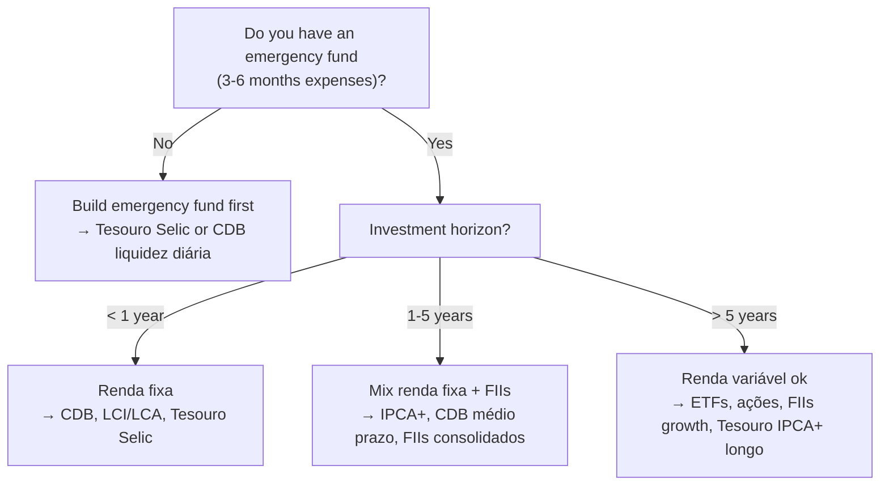

# Cheatsheet: Side Gigs, Passive Income and Investments

> Quick reference for key rates, tables, formulas, and decision frameworks used throughout this topic.

---

## Table of Contents

- [Tax Tables](#tax-tables)
- [Investment Comparison Table](#investment-comparison-table)
- [Key Formulas](#key-formulas)
- [Decision Frameworks](#decision-frameworks)
- [MEI Quick Reference](#mei-quick-reference)
- [Brazilian Investment Alphabet](#brazilian-investment-alphabet)

---

## Tax Tables

### IRPF 2024 — Tabela Progressiva (Salário/Renda)

| Base de Cálculo Mensal | Alíquota | Dedução |
|------------------------|---------|---------|
| Até R$ 2.259,20 | Isento | — |
| De R$ 2.259,21 a R$ 2.826,65 | 7,5% | R$ 169,44 |
| De R$ 2.826,66 a R$ 3.751,05 | 15% | R$ 381,44 |
| De R$ 3.751,06 a R$ 4.664,68 | 22,5% | R$ 662,77 |
| Acima de R$ 4.664,68 | 27,5% | R$ 896,00 |

### IR sobre Renda Fixa — Tabela Regressiva

| Prazo de Aplicação | Alíquota IR |
|--------------------|------------|
| Até 180 dias | 22,5% |
| De 181 a 360 dias | 20,0% |
| De 361 a 720 dias | 17,5% |
| Acima de 720 dias | 15,0% |

> [!TIP]
> Applies to CDB, Tesouro Direto, debentures não-incentivadas, and most other renda fixa. LCI and LCA are **exempt** from this table for individuals.

### IOF sobre Renda Fixa (resgate antes de 30 dias)

| Dias | IOF % sobre rendimento |
|------|----------------------|
| 1 | 96% |
| 7 | 70% |
| 15 | 46% |
| 29 | 3% |
| 30+ | 0% |

### GCAP — Imposto sobre Ganho de Capital

| Ativo | Alíquota | Isenção |
|-------|---------|---------|
| Ações (venda até R$20k/mês) | **Isento** | R$ 20.000/mês em vendas totais |
| Ações (venda acima R$20k/mês) | 15% | — |
| Day trade (ações) | 20% | Sem isenção |
| FIIs (qualquer venda) | 20% | Sem isenção de R$20k |
| Criptomoedas (até R$35k/mês vendas) | **Isento** | R$ 35.000/mês em vendas totais |
| Criptomoedas (acima R$35k/mês) | 15% a 22,5% (faixa) | — |
| Imóveis (valor ≤ R$440k, único imóvel) | **Isento** | Condições específicas |
| Imóveis (geral) | 15% | — |

> [!WARNING]
> The isenção de R$20k for ações applies to **total sales volume** in the month, not to gains. If you sell R$21.000 of ações in one month (even at a small gain), the ENTIRE gain — not just the gain above R$20k — is taxable.

---

## Investment Comparison Table

| Produto | Emissor | FGC? | IR? | Liquidez Típica | Benchmark |
|---------|---------|------|-----|-----------------|-----------|
| Tesouro Selic | Governo Federal | Não | Sim (regressiva) | D+1 | SELIC |
| Tesouro IPCA+ | Governo Federal | Não | Sim (regressiva) | D+1 (marcação a mercado) | IPCA + spread |
| Tesouro Prefixado | Governo Federal | Não | Sim (regressiva) | D+1 (marcação a mercado) | Taxa prefixada |
| CDB | Banco emissor | Sim (R$250k) | Sim (regressiva) | Varia (D+0 a vencimento) | % CDI ou prefixado |
| LCI | Banco emissor | Sim (R$250k) | **Isento** | Carência mínima (90 dias) | % CDI |
| LCA | Banco emissor | Sim (R$250k) | **Isento** | Carência mínima (90 dias) | % CDI |
| FII (dividendos) | Fundo | Não | **Isento*** | D+2 (mercado secundário) | DY % |
| Ações (dividendos) | Empresa | Não | **Isento** | D+2 (mercado secundário) | DY % |
| Debênture Incentivada | Empresa (infra) | Não | **Isento** | Mercado secundário (ilíquido) | % CDI ou IPCA+ |

_*FII dividend exemption applies to individuals holding <10% of quotas in a fund with ≥50 quotaholders_

---

## Key Formulas

### Retorno Real (Real Return)

```math
Retorno Real = ((1 + Retorno Nominal) / (1 + Inflação)) - 1
```

Example: CDB at 13% with IPCA at 5%: `(1.13 / 1.05) - 1 = 7.6% real`

### Equivalência CDB vs. LCI (Comparação Líquida)

```math
LCI equivalente = Rentabilidade CDB × (1 - alíquota IR)
```

Example: CDB at 12% CDI for 1 year (alíquota 17,5%): `12% × (1 - 0.175) = 9.9% líquido`
An LCI at 9.5% CDI is WORSE. An LCI at 10.5% CDI is BETTER.

### Dividend Yield (DY) de FII

```math
DY (mensal) = Dividendo por Cota / Preço da Cota
DY (anual) = DY mensal × 12
```

### Price-to-Book (P/VP) de FII

```math
P/VP = Preço de Mercado da Cota / Valor Patrimonial por Cota
```

P/VP < 1.0: cotas negociadas abaixo do valor patrimonial dos ativos (potencial oportunidade)
P/VP > 1.0: cotas negociadas acima do valor patrimonial

### Regra dos 4% (Safe Withdrawal Rate — SWR)

```math
Patrimônio necessário para FI = Despesas Anuais / 0,04
```

Example: R$5.000/mês × 12 = R$60.000/ano → Patrimônio alvo: R$1.500.000

> [!WARNING]
> The 4% rule was derived from US historical data. In Brazil's high-inflation environment, many practitioners use 3%–3.5% (more conservative) or adjust using real yields of Brazilian fixed income.

### Montante com Juros Compostos

```math
M = P × (1 + i)^n
```

Where P = principal, i = taxa por período, n = número de períodos

Example: R$10.000 at 1% per month for 12 months: `10.000 × (1.01)^12 = R$11.268`

---

## Decision Frameworks

### Choosing Where to Invest (Simplified)



### MEI vs. Pessoa Física vs. LTDA

| Situação | Melhor Opção |
|----------|-------------|
| Faturamento < R$81k/ano, atividade permitida | MEI |
| Faturamento R$81k–R$4,8M/ano | Simples Nacional (ME/EPP) |
| Múltiplos sócios ou atividade não permitida no MEI | LTDA ou SLU |
| Renda eventual, sem regularidade | Pessoa Física (CARNÊ-LEÃO) |

---

## MEI Quick Reference

| Item | Valor/Prazo 2024 |
|------|-----------------|
| Limite de faturamento anual | R$ 81.000 |
| DAS mensal — Comércio/Indústria | R$ 67,20 (INSS + ICMS) |
| DAS mensal — Serviços | R$ 71,20 (INSS + ISS) |
| DAS mensal — Comércio + Serviços | R$ 72,20 |
| DASN-SIMEI (declaração anual) | Até 31 de maio de cada ano |
| Empregados permitidos | 1 (com carteira assinada) |
| Número de atividades (CNAEs) permitidas | Múltiplas, desde que todas na lista MEI |

---

## Brazilian Investment Alphabet

| Sigla | Nome Completo |
|-------|--------------|
| B3 | Brasil, Bolsa, Balcão (a bolsa brasileira) |
| BCB | Banco Central do Brasil |
| CDI | Certificado de Depósito Interbancário |
| CDB | Certificado de Depósito Bancário |
| CRI | Certificado de Recebíveis Imobiliários |
| CRA | Certificado de Recebíveis do Agronegócio |
| CVM | Comissão de Valores Mobiliários (securities regulator) |
| DARF | Documento de Arrecadação de Receitas Federais |
| DY | Dividend Yield |
| FGC | Fundo Garantidor de Créditos (deposit insurance) |
| FII | Fundo de Investimento Imobiliário |
| GCAP | Ganho de Capital |
| INSS | Instituto Nacional do Seguro Social |
| IPCA | Índice de Preços ao Consumidor Amplo (official inflation index) |
| IRPF | Imposto de Renda Pessoa Física |
| LCA | Letra de Crédito do Agronegócio |
| LCI | Letra de Crédito Imobiliário |
| MEI | Microempreendedor Individual |
| P/VP | Preço sobre Valor Patrimonial |
| SELIC | Sistema Especial de Liquidação e Custódia (base interest rate) |
| TD | Tesouro Direto |
