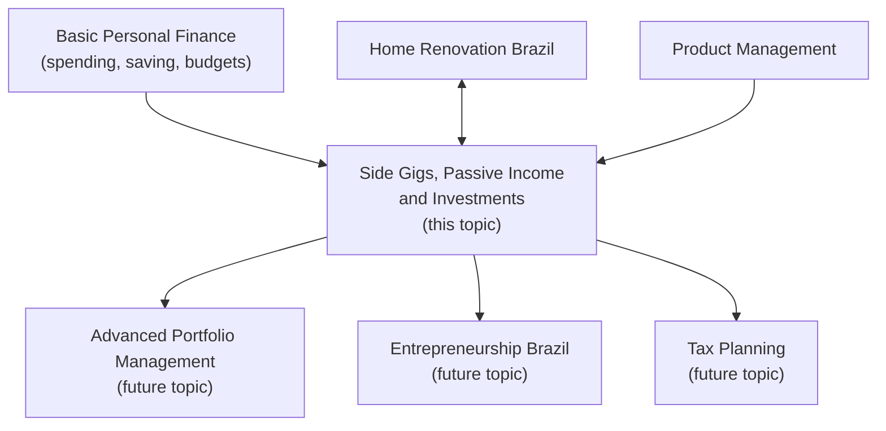
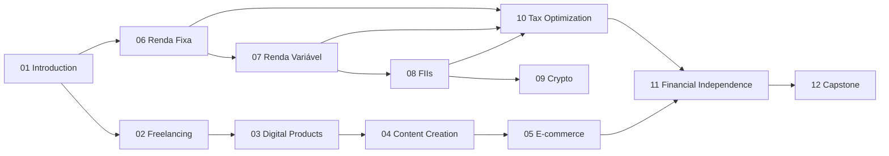

# Roadmap: Side Gigs, Passive Income and Investments

> This roadmap explains how this topic fits into your broader financial education journey and suggests learning paths based on your starting point and goals.

---

## Where This Topic Fits

_Learning path: this topic sits between basic personal finance literacy and advanced portfolio or entrepreneurship specializations._

---

## Recommended Learning Paths

### Path A: The Investor (no side business interest)

Focus on financial instruments and portfolio building.

1. Module 01 — Introduction (required)
2. Module 06 — Renda Fixa
3. Module 07 — Renda Variável
4. Module 08 — Fundos Imobiliários
5. Module 10 — Tax Optimization
6. Module 11 — Financial Independence in Brazil
7. Module 12 — Capstone

Skip or skim: Modules 02–05 (side business content), Module 09 (optional crypto context).

### Path B: The Entrepreneur (focus on side income)

Focus on building active and semi-passive income businesses.

1. Module 01 — Introduction (required)
2. Module 02 — Freelancing and Consulting
3. Module 03 — Digital Products
4. Module 04 — Content Creation
5. Module 05 — E-commerce
6. Module 10 — Tax Optimization (essential for business owners)
7. Module 12 — Capstone

Then layer in investment modules (06–09, 11) as income scales.

### Path C: Full Curriculum (recommended)

Work through all 12 modules in order. The full curriculum creates the most resilient financial picture — someone who earns from multiple sources AND invests intelligently has far more options than someone who only does one or the other.

---

## Time Estimates per Module

| Module | Estimated Hours |
|--------|----------------|
| 01 Introduction | 4–6 h |
| 02 Freelancing | 6–8 h |
| 03 Digital Products | 6–8 h |
| 04 Content Creation | 5–7 h |
| 05 E-commerce | 6–8 h |
| 06 Renda Fixa | 8–10 h |
| 07 Renda Variável | 8–10 h |
| 08 Fundos Imobiliários | 8–10 h |
| 09 Crypto and Alternatives | 5–7 h |
| 10 Tax Optimization | 8–10 h |
| 11 Financial Independence | 8–10 h |
| 12 Capstone Project | 10–15 h |
| **Total** | **82–109 h** |

---

## Prerequisites Map

_Prerequisite map: all arrows show "requires completion of" relationships._
