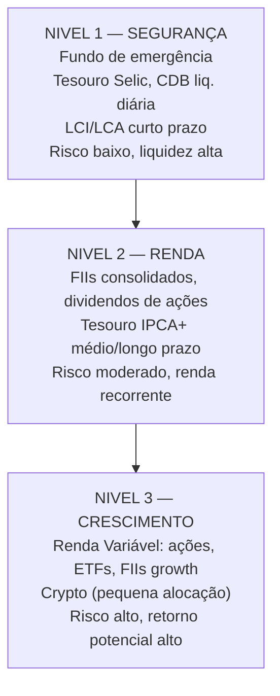

# Module 01: Introduction — Active vs. Passive Income

[← Topic Home](../../README.md) | [Next → Module 02: Freelancing and Consulting](../02_freelancing-and-consulting/)

---


---

## Table of Contents

1. [Overview](#overview)
2. [Prerequisites](#prerequisites)
3. [Objectives](#objectives)
4. [Theory](#theory)
   - [Active vs. Passive Income](#active-vs-passive-income)
   - [The Brazilian Financial Reality](#the-brazilian-financial-reality)
   - [The Emergency Fund: Your First Priority](#the-emergency-fund-your-first-priority)
   - [The Investment Pyramid](#the-investment-pyramid)
   - [Tax Basics for Brazilian Investors](#tax-basics-for-brazilian-investors)
   - [The Power of Compound Interest: Worked Examples](#the-power-of-compound-interest-worked-examples)
5. [Key Concepts](#key-concepts)
6. [Examples](#examples)
7. [Common Pitfalls](#common-pitfalls)
8. [Cross-Links](#cross-links)
9. [Summary](#summary)

---

## Overview

This module is the foundation for everything that follows. Before you invest a single real or sign up for a single freelancing platform, you need a clear mental model of how money works, why the standard single-salary model is fragile in the Brazilian context, and what the correct sequence of financial decisions looks like.

The central idea of this module is deceptively simple: there are two kinds of income — active and passive — and most people have only one of them. Active income requires continuous effort; passive income does not. Building passive income streams alongside active income is how financial freedom is achieved. But there is a correct order of operations: emergency fund first, then debt elimination, then investment, then diversification. Skipping steps is how people end up both poor AND stressed.

This module covers the psychological and mathematical foundations. You will understand why compound interest is so powerful (and why starting at 25 beats starting at 35 by a factor most people cannot intuitively grasp), why the Brazilian economic environment makes diversification especially important, and how the Brazilian tax and investment system is structured at its highest level. Every subsequent module builds on what you learn here.

---

## Prerequisites

- None. This module assumes no prior investment knowledge.
- Basic arithmetic: you should be comfortable with percentages and simple multiplication.

---

## Objectives

By the end of this module, you will be able to:

1. Clearly define active income, passive income, and the time-money trade-off between them
2. Articulate the Brazilian economic context — inflation history, Plano Real, SELIC cycles — and explain why it shapes investment behavior differently from, say, the US
3. Calculate how much emergency fund you need and where to keep it
4. Describe the investment pyramid and correctly place key Brazilian investments at each level
5. Identify which Brazilian investment products are taxed, which are exempt, and at what rates (at a high level, with detail in Module 10)
6. Calculate the future value of a regular monthly investment using compound interest, and understand why time is the most powerful variable

---

## Theory

### Active vs. Passive Income

**Active income** is money you earn by exchanging time for money. Your salary from a CLT job is active income. Hourly consulting fees are active income. Teaching a class is active income. The fundamental characteristic of active income is that it stops when you stop: if you cannot work — due to illness, layoff, burnout, or choice — the income disappears.

**Passive income** is money that continues to arrive after the initial effort or investment is made, without requiring your ongoing time. Dividends from shares you own, interest on a CDB, rent from a property, or royalties from a course you created five years ago are all passive income. The key phrase is "without requiring your ongoing time" — true passive income has a cost (the initial capital, the initial creative effort) but not an ongoing time cost.

The **time-money trade-off** is the core insight that separates financially free people from those who are not. Active income creates a ceiling: there are only 24 hours in a day, and you can only sell a fraction of them at any given rate. Passive income removes that ceiling. A portfolio of R$ 2.000.000 in investments yielding 0,8%/mês generates R$ 16.000/mês whether you are sleeping, traveling, or working. That portfolio is doing work that your time cannot.

Most people are taught to maximize active income (study → get a good job → get promoted → earn more). This is not wrong — a higher salary gives you more capital to invest — but it is incomplete. The full picture is:

1. Earn active income
2. Spend less than you earn (the first and most important step)
3. Invest the difference systematically
4. Over time, shift the income-generation burden from your time to your capital

The goal is not to stop working. The goal is to reach the point where working is a choice rather than a necessity. That point is called **financial independence (independência financeira)**.

---

### The Brazilian Financial Reality

Understanding Brazil's specific economic context is not background noise — it directly determines which financial strategies work and which fail here.

**The inflation legacy.** Brazil endured hyperinflation for roughly fifteen years before the Plano Real in 1994. At the peak, monthly inflation exceeded 80%. This had a profound effect on financial behavior: a generation of Brazilians learned that saving was irrational. If your savings lost 80% of their purchasing power every month, the only rational response was to spend immediately. This legacy — the cultural association of savings with futility — is one reason many Brazilians today have no investment habit even though the macroeconomic situation has stabilized.

**The Plano Real and what changed.** The Real (R$) launched in July 1994 and stabilized inflation. Since then, IPCA (the official inflation index) has typically run between 3% and 12% annually, with periods of both stability and stress. This is much higher than the ~2% target of developed economies, which means Brazilians who keep money in low-yield accounts lose purchasing power every year in real terms. This makes the choice of investment vehicle much more consequential in Brazil than in, say, Germany.

**SELIC cycles and their implications.** The SELIC rate — Brazil's base interest rate — has historically been among the highest in the world in real (inflation-adjusted) terms. As of 2024, SELIC at 10.5% against IPCA of ~4% gives a real interest rate of ~6% — extremely high by global standards. This has a counterintuitive implication: **Brazilian renda fixa (fixed income) can generate real returns that would require significant equity risk in other countries.** A Tesouro IPCA+ bond paying IPCA + 6% is a remarkable instrument when you understand that this is a government-guaranteed real return. The downside: it also means the cost of debt in Brazil (personal loans, credit cards) is devastating.

**Salary reality.** The median formal-sector monthly salary in Brazil is approximately R$ 2.800 (IBGE, 2024). In São Paulo or Rio, basic household costs for a family of three can easily reach R$ 5.000–7.000/mês. This gap between median wages and cost of living in major cities is precisely why multiple income streams are not a luxury in Brazil — they are often a survival strategy.

**The access revolution.** For most of the 20th century, investing was for the rich. A Bovespa brokerage account required substantial minimum balances and paid advisors. Tesouro Direto, launched in 2002, changed this completely: anyone with R$ 30 and a CPF can buy a government bond. The fintech wave of 2015–2020 brought zero-fee brokerage accounts (XP, Rico, Clear, Nubank), fractional share buying, and financial education content accessible to anyone with a smartphone. The barriers to entry for investing are now essentially zero.

---

### The Emergency Fund: Your First Priority

Before investing a single real in anything beyond a savings account, you need an emergency fund. This is not optional, and the reasoning is not just psychological — it is mathematical.

An emergency fund is **3 to 6 months of your total monthly expenses** held in a highly liquid, low-risk investment. The exact multiplier depends on your job security (CLT with stable employer → 3 months; autonomous/MEI/volatile income → 6 months).

**Why 3–6 months?** Because life happens. A layoff, a hospital bill, a car repair, a plumbing emergency — any of these can destroy an investment strategy if you have no reserve. Without an emergency fund, you will be forced to liquidate investments at the worst possible time (often when markets are down) or take on high-interest debt (cartão de crédito at 350%+ annual rate). Both outcomes erase years of investment gains instantly.

**Where to keep the emergency fund:**
The emergency fund must be:
- Immediately accessible (D+0 or D+1 liquidity)
- Safe (no credit risk, or FGC-protected)
- Earning at least above inflation

In Brazil, the correct instruments are:

| Option | Pros | Cons |
|--------|------|------|
| Tesouro Selic (D+1) | Government guaranteed, yields ~SELIC, no minimum hold | D+1, not D+0 |
| CDB liquidez diária | Instant redemption, FGC protected | Lower rate (usually 100–102% CDI) |
| Conta remunerada (nubank, inter, etc.) | D+0, automatic, convenient | Usually 100% CDI or less |

> [!WARNING]
> The poupança (savings account) yields only 70% of SELIC when SELIC > 8,5%, or a fixed 0.5%/mês when SELIC ≤ 8,5%. As of 2024, poupança yields significantly less than Tesouro Selic or a good CDB. Keeping your emergency fund in poupança means losing real purchasing power every year. This is one of the most common and costly mistakes in Brazilian personal finance.

**Calculation example:**

If your monthly expenses are R$ 4.000:
- Minimum emergency fund: R$ 4.000 × 3 = R$ 12.000
- Conservative emergency fund: R$ 4.000 × 6 = R$ 24.000

This R$ 12.000–24.000 is your financial safety net. Keep it liquid. Do not invest it in anything that has lock-up periods, market risk, or illiquidity.

---

### The Investment Pyramid

Once your emergency fund is established, the investment pyramid gives you the correct sequence for deploying additional capital. The pyramid has three levels:



_The investment pyramid: build from base to apex. Do not invest in level 3 before levels 1 and 2 are established._

**Level 1 — Safety (Segurança):**
This is your emergency fund plus any capital needed within 12 months. Instruments: Tesouro Selic, CDB with daily liquidity, LCI/LCA with short maturities. Yield matters, but security and liquidity are the primary criteria.

**Level 2 — Income (Renda):**
Once Level 1 is solid (6 months of expenses), deploy excess savings here. The goal is regular, predictable income generation. Instruments: FIIs with strong track records, Tesouro IPCA+ for medium-term goals (3–7 years), high-grade CDB/LCI/LCA with good rates for known future expenses (house purchase, car, education). This level builds your "money working for you" base.

**Level 3 — Growth (Crescimento):**
Only once Levels 1 and 2 are established should you invest in higher-risk, higher-potential-return assets. Instruments: individual ações, small-cap companies, growth FIIs, ETFs, and potentially a small allocation to crypto. These can generate outsized returns over long horizons but carry significant volatility.

The most common mistake is building the pyramid from the top: people invest in ações before they have an emergency fund, then have to sell at a loss when an emergency hits. Building correctly ensures that market volatility never forces you into bad decisions.

---

### Tax Basics for Brazilian Investors

Understanding the tax treatment of different investments is essential before choosing where to put your money. A CDB at 13% sounds better than an LCI at 11% — but after the 17.5% IR on the CDB, the net yield is 10.7%, making the LCI superior. You cannot make good investment decisions without knowing the tax rules. Module 10 covers this in full detail; here is the high-level picture:

**Tabela Regressiva (Fixed Income):** Most renda fixa investments (CDB, Tesouro Direto, debentures without incentive) are taxed on gains via a declining table based on how long the money is held:

| Prazo | IR Rate |
|-------|---------|
| Up to 180 days | 22,5% |
| 181–360 days | 20,0% |
| 361–720 days | 17,5% |
| 720+ days | 15,0% |

**Exempt investments (Isentos):** LCI, LCA, and incentivized debentures (debêntures de infraestrutura) are exempt from IR for individual investors. FII dividends are exempt under the rules described in Module 08. Dividends paid by Brazilian companies on ações are also currently exempt.

**GCAP (Ganho de Capital):** Profits from selling ações are exempt if your total sales in a given month are under R$ 20.000. Above that threshold, the gain is taxed at 15% (or 20% for day trade). This tax must be paid via DARF by the last business day of the following month — not in the annual declaration.

**IOF:** If you redeem a renda fixa investment within 30 days of buying it, IOF (Imposto sobre Operações Financeiras) is charged on the income on a sliding scale. After 30 days, IOF is zero.

The key takeaway from this overview: **investment returns that seem similar can have dramatically different after-tax outcomes depending on which product you choose.** Comparing investments accurately requires comparing net returns, not gross rates.

---

### The Power of Compound Interest: Worked Examples

"Compound interest is the eighth wonder of the world. He who understands it, earns it; he who doesn't, pays it." — this quote, often attributed to Einstein (though the attribution is disputed), captures the most important mathematical truth in personal finance.

**What is compounding?** When your investment earns interest, and then that interest itself earns interest in the next period, you are compounding. Over long periods, compounding produces results that feel counterintuitive.

**Worked Example 1 — The effect of starting age:**

Ana and Bruno both invest R$ 500/mês at an average return of 0.8%/mês (~10% per year). Ana starts at age 25 and invests for 35 years until age 60. Bruno starts at age 35 and invests for 25 years until age 60.

```math
Formula: M = PMT × [((1+i)^n - 1) / i]
Where PMT = monthly contribution, i = monthly rate, n = months
```

Ana: PMT = 500, i = 0.008, n = 420 months (35 years)
`M = 500 × [((1.008)^420 - 1) / 0.008]`
`M = 500 × [(28.17 - 1) / 0.008]`
`M = 500 × 3.396 = approximately R$ 1.698.000`

Bruno: PMT = 500, i = 0.008, n = 300 months (25 years)
`M = 500 × [((1.008)^300 - 1) / 0.008]`
`M = 500 × [(11.13 - 1) / 0.008]`
`M = 500 × 1.266 = approximately R$ 633.000`

Ana invested R$ 500 × 420 = R$ 210.000 in total contributions.
Bruno invested R$ 500 × 300 = R$ 150.000 in total contributions.

Ana's extra 10 years of contributions (R$ 60.000 more) produced an additional R$ 1.065.000 in final wealth. The 10 extra years of compounding did 94% of the work.

**Worked Example 2 — The importance of the rate:**

Carlos and Daniela both invest R$ 1.000/mês for 20 years. Carlos keeps everything in poupança (yield: 70% of SELIC, estimated at ~7% per year or ~0.57%/mês). Daniela invests in Tesouro Selic + FIIs averaging 11% per year (~0.87%/mês).

Carlos: PMT = 1000, i = 0.0057, n = 240
`M = 1000 × [((1.0057)^240 - 1) / 0.0057] ≈ R$ 509.000`

Daniela: PMT = 1000, i = 0.0087, n = 240
`M = 1000 × [((1.0087)^240 - 1) / 0.0087] ≈ R$ 797.000`

Both contributed R$ 240.000. The difference in returns — roughly 4 percentage points per year — produced R$ 288.000 more for Daniela. Over 20 years, investment choice matters enormously.

**Worked Example 3 — Monthly passive income calculation:**

Eduardo has accumulated R$ 500.000 in a mix of Tesouro IPCA+, FIIs, and ações. His blended annual yield is 12% (1,0% per month on average).

Monthly passive income: `R$ 500.000 × 0.01 = R$ 5.000/mês`

If Eduardo's monthly expenses are R$ 4.000, he has achieved financial independence — his passive income exceeds his needs. His capital continues to grow.

---

## Key Concepts

**Active income** — Income requiring continuous direct effort. A salary, hourly consulting, teaching. Stops when you stop working. The time-money ceiling limits total active income.

**Passive income (renda passiva)** — Income that continues without continuous direct effort after the initial investment or creation. Dividends, interest, royalties, rental income. See [[side-gigs-passive-income-investments/modules/08_fundos-imobiliarios]] for the most accessible passive income vehicle in Brazil.

**Emergency fund (reserva de emergência)** — 3–6 months of total monthly expenses in a liquid, safe investment. Prerequisites to all other investing. Should be in Tesouro Selic or CDB with daily liquidity, never in poupança.

**The investment pyramid** — A framework for deploying capital in the correct risk sequence: safety (Level 1), income (Level 2), growth (Level 3). Building Level 3 before Level 1 is a structural error.

**Compound interest (juros compostos)** — Interest calculated on both principal and accumulated interest from prior periods. The foundation of wealth accumulation over time. Even small improvements in rate or contributions, compounded over decades, produce dramatically different outcomes.

**SELIC** — Brazil's base interest rate set by COPOM. Directly determines Tesouro Selic yields and sets the floor for all Brazilian interest rates. Understanding SELIC cycles is fundamental for investment timing.

**Tabela Regressiva** — The declining IR (income tax) rate applied to renda fixa gains based on holding duration. The longer you hold, the less tax you pay (from 22.5% at under 180 days to 15% after 720 days).

**Isenção** — Tax exemption. Certain Brazilian investments are IR-exempt for individuals: LCI, LCA, debêntures incentivadas, FII dividends (under the rules), and stock dividends. Comparing investments requires comparing net (after-tax) yields.

---

## Examples

### Example 1: Comparing two job offers with the same nominal salary

**Scenario:** Fernanda receives two job offers. Offer A: R$ 6.000/mês CLT with benefits. Offer B: R$ 8.000/mês as PJ (pessoa jurídica, via CNPJ/MEI). Which pays more?

**Analysis:**

Offer A (CLT):
- Net take-home after INSS (9%) and IRPF (~15% effective): approximately R$ 4.700/mês
- But includes: FGTS (8% deposited by employer = R$ 480/mês accumulation), 13th salary (R$ 500/mês effective), férias (R$ 250/mês effective), VR/VT (assume R$ 600/mês)
- Total effective value: ~R$ 4.700 + 480 + 500 + 250 + 600 = **R$ 6.530/mês equivalent**

Offer B (MEI, if under R$ 81k/year):
- Gross: R$ 8.000/mês
- DAS (MEI tax): ~R$ 71,20/mês
- IR on service income as PJ: depends on expense deductions, but roughly 7.5% on profit
- No FGTS, no 13th, no paid vacation, no VR/VT
- Net take-home: approximately R$ 7.300/mês
- But: no labor protections, no unemployment insurance, must save for vacation/13th/sick days yourself

**Conclusion:** Offer B pays more cash in hand, but Offer A has hidden benefits and protections worth approximately R$ 1.800/mês. The real comparison is R$ 6.530 vs. R$ 7.300 — only R$ 770 in favor of PJ, before accounting for risk.

**What to notice:** This example shows why gross salary comparisons are misleading. CLT benefits have real monetary value. A PJ premium below ~25–30% above CLT salary may not be worth the loss of protections.

---

### Example 2: Building the emergency fund on a tight budget

**Scenario:** Gabriel earns R$ 3.500/mês (CLT) and spends R$ 3.000/mês. He has R$ 500/mês to invest. His emergency fund target is R$ 3.000 × 3 = R$ 9.000.

**Step 1:** Open a conta remunerada or CDB liquidez diária (Nubank, Inter, PicPay, or similar) paying 100–102% CDI.

**Step 2:** Set up automatic monthly transfer of R$ 500 on payday.

**Timeline to full emergency fund:**
- R$ 9.000 / R$ 500 per month = 18 months

After 18 months, Gabriel redirects his R$ 500/mês to actual investments (Level 2 of the pyramid). His emergency fund continues earning ~CDI in the background.

**What to notice:** This is unglamorous but essential. There are no shortcuts. Starting to invest before the emergency fund is built means the first investment setback (which WILL happen) could force a distress sale.

---

## Common Pitfalls

### Pitfall 1: Investing before building the emergency fund

**The mistake:** Excited about returns, a new investor puts their R$ 5.000 savings into FII quotas instead of a liquid reserve.

**Wrong approach:**
```pseudocode
savings = R$ 5.000
emergency_fund = R$ 0
invest_all_in_FIIs(savings)  # No emergency reserve!
# Three months later: car breaks down, needs R$ 3.000
# FII market is down 15% — forced to sell at a loss
# Final result: R$ 5.000 → R$ 2.250 after loss + car repair
```

**Correct approach:**
```pseudocode
savings = R$ 5.000
target_emergency_fund = monthly_expenses × 3  # e.g., R$ 9.000
emergency_fund = min(savings, target_emergency_fund)
invest = max(0, savings - target_emergency_fund)
# Put emergency_fund in CDB liquidez diária
# Invest only after fund is complete
```

**Why this happens:** The opportunity cost of keeping money in a "boring" CDB feels real. The future emergency feels hypothetical. Humans systematically underweight future risks. The math is unambiguous: one forced distress sale can erase a year or more of investment gains.

---

### Pitfall 2: Keeping the emergency fund in poupança

**The mistake:** Treating the poupança as the correct default for safe savings.

**Wrong:**
```pseudocode
# Poupança yield: 70% × SELIC = 70% × 10.5% = 7.35% per year
# IPCA (inflation): ~4.8% per year
# Real return: (1.0735 / 1.048) - 1 = 2.4% real per year
```

**Right:**
```pseudocode
# Tesouro Selic yield: ~SELIC = ~10.5% per year
# IPCA: ~4.8% per year
# Real return: (1.105 / 1.048) - 1 = 5.4% real per year
# Difference over 5 years on R$ 15.000:
# Poupança: R$ 15.000 × (1.0735)^5 = R$ 21.375
# Tesouro Selic: R$ 15.000 × (1.105)^5 = R$ 24.719
# Cost of using poupança: R$ 3.344 over 5 years
```

**Why this matters:** The poupança was explicitly designed as a popular savings vehicle with a regulatory yield cap. In the current rate environment, keeping money there has a quantifiable cost. For R$ 20.000 over 10 years, the cost is approximately R$ 15.000–20.000 in foregone returns.

---

### Pitfall 3: Confusing gross and net yields

**The mistake:** Choosing a CDB at 13% CDI over an LCI at 11% CDI because "13 > 11."

**Wrong reasoning:**
```pseudocode
CDB_rate = 0.13  # 13% CDI
LCI_rate = 0.11  # 11% CDI
# "CDB is better because 13 > 11"  ← WRONG for 1-year horizon
```

**Correct calculation for a 1-year investment:**
```pseudocode
# CDB for 361–720 days: IR = 17.5%
CDB_net = 0.13 × (1 - 0.175)  # = 10.73% net

# LCI: IR exempt
LCI_net = 0.11 × 1.0  # = 11% net

# LCI at 11% CDI is BETTER than CDB at 13% CDI for 1-year horizon
```

**Why this happens:** Gross rates are the ones advertised. Net rates require knowing the tax rules. This is a structural information asymmetry that banks profit from.

---

### Pitfall 4: Neglecting inflation in projections

**The mistake:** Projecting future wealth in nominal terms without accounting for inflation.

**Wrong:**
```pseudocode
# "I'll have R$ 1.500.000 in 20 years — I'm set!"
future_value_nominal = 1_500_000  # in 20 years
# At 5% annual inflation, purchasing power in today's reais:
real_value = 1_500_000 / (1.05)^20  # = R$ 565.000 in today's reais
```

Always express financial independence targets in today's reais, then add inflation to your projections. A R$ 1.500.000 target today becomes approximately R$ 3.970.000 nominal in 20 years at 5% inflation.

---

## Cross-Links

- [[home-renovation-brazil]] — Property investment is a form of passive income covered in the home renovation topic; FIIs (Module 08) are the accessible alternative to direct property ownership
- [[side-gigs-passive-income-investments/modules/06_renda-fixa]] — Level 1 and 2 of the investment pyramid are built primarily with renda fixa instruments covered in Module 06
- [[side-gigs-passive-income-investments/modules/10_tax-optimization-and-compliance]] — The tax overview introduced here is covered in full detail in Module 10; the net yield comparison concepts from the Common Pitfalls section are expanded there
- [[shared/glossary#renda-passiva]] — Glossary entry for renda passiva

---

## Summary

- **Active income** requires continuous effort; **passive income** continues without it. Building passive income alongside active income is the path to financial independence.
- Brazil's history of hyperinflation before 1994, high SELIC rates, and the fintech revolution of 2015–2020 create a unique investment environment where renda fixa can generate strong real returns and where keeping money in poupança has a real, quantifiable cost.
- The **emergency fund** (3–6 months expenses in a liquid instrument like Tesouro Selic or CDB liquidez diária) must be built before any other investing. Skipping this step creates forced distress selling risk.
- The **investment pyramid** prescribes the correct sequence: safety (Level 1) → income (Level 2) → growth (Level 3). Most investment mistakes come from trying to build the apex before the base.
- Key **tax distinctions**: CDB/Tesouro Direto are taxed via tabela regressiva (22.5% down to 15%); LCI/LCA are IR-exempt; stock/FII dividends are IR-exempt; capital gains on ações under R$20k/mês in sales are exempt. Always compare net yields, not gross rates.
- **Compound interest** is the fundamental force behind wealth accumulation. Starting 10 years earlier, in our worked example, produced nearly 3× the final wealth from similar total contributions. Time is the most powerful variable — and it cannot be recovered once lost.
