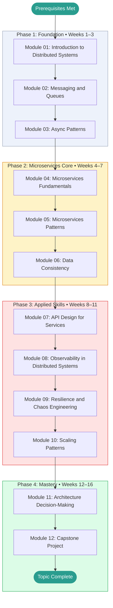

# Systems Architecture — Learning Roadmap

> This roadmap is your study plan. Work through the phases in order.
> Each phase builds directly on the previous one.
> Mark your current position with **← You Are Here** and update it as you progress.

---

## Prerequisites Map

Confirm you have working knowledge of these before entering Phase 1:

```
[[networks]]                    ──┐
[[postgresql]]                  ──┼──► Systems Architecture  (start here)
[[devops-platform-engineering]] ──┘
```

If any prerequisite is missing, complete it first and return here.

---

## Learning Path Visualization



---

## Phase Breakdown

### Phase 1: Foundation

**Goal:** Understand why distributed systems are hard, build a vocabulary for the rest of the topic, and get comfortable with the fundamental patterns of async communication.

| Module | Name | Est. Hours | Key Skill Gained |
|--------|------|-----------|-----------------|
| 01 | Introduction to Distributed Systems | 6h | CAP theorem, monolith vs microservices trade-off analysis |
| 02 | Messaging and Queues | 8h | Design pub/sub topologies; choose delivery semantics |
| 03 | Async Patterns | 8h | Implement Saga, Outbox, CQRS in Python/pseudocode |

**Phase 1 Exit Criteria:**

- [ ] Can explain the 8 Fallacies of Distributed Computing from memory
- [ ] Can place PostgreSQL, Cassandra, and MongoDB correctly on the CAP triangle and justify each
- [ ] Can design a simple Saga for a 3-step distributed transaction
- [ ] Scored ≥ 70% on all Phase 1 module tests
- [ ] GLOSSARY.md has at least 10 entries filled in

**Milestone unlocked:** Foundation Built

---

### Phase 2: Microservices Core

**Goal:** Develop genuine fluency in service decomposition, resilience patterns, and distributed data management.

| Module | Name | Est. Hours | Key Skill Gained |
|--------|------|-----------|-----------------|
| 04 | Microservices Fundamentals | 8h | Decompose a monolith using DDD bounded contexts |
| 05 | Microservices Patterns | 8h | Implement circuit breaker, bulkhead, sidecar patterns |
| 06 | Data Consistency | 8h | Solve the dual-write problem; choose between Saga and 2PC |

**Phase 2 Exit Criteria:**

- [ ] Can decompose a given monolith into services with justified boundaries
- [ ] Can implement a circuit breaker from scratch (or configure one correctly)
- [ ] Can explain the dual-write problem and at least two solutions
- [ ] Scored ≥ 75% on all Phase 2 module tests
- [ ] Completed at least one architecture design exercise from PROJECTS.md

**Milestone unlocked:** Microservices Practitioner

---

### Phase 3: Applied Skills

**Goal:** Apply knowledge to realistic, cross-cutting concerns. Build systems that are observable, resilient, and scalable.

| Module | Name | Est. Hours | Key Skill Gained |
|--------|------|-----------|-----------------|
| 07 | API Design for Services | 7h | Design BFF patterns and internal gRPC APIs |
| 08 | Observability in Distributed Systems | 8h | Instrument a system with OpenTelemetry; design a tracing strategy |
| 09 | Resilience and Chaos Engineering | 7h | Design chaos experiments; write SLO documentation |
| 10 | Scaling Patterns | 8h | Design sharding strategies and rate limiting architectures |

**Phase 3 Exit Criteria:**

- [ ] Can instrument a multi-service system with distributed tracing
- [ ] Can design a chaos engineering experiment with a clear hypothesis
- [ ] Can explain three database sharding strategies with trade-offs
- [ ] Scored ≥ 80% on all Phase 3 module tests

**Milestone unlocked:** Applied Architect

---

### Phase 4: Mastery

**Goal:** Synthesize everything. Make real architectural decisions. Build and document a complete system design.

| Activity | Est. Hours | Description |
|----------|-----------|-------------|
| Module 11: Architecture Decision-Making | 7h | Write ADRs; apply trade-off analysis frameworks |
| Module 12: Capstone Project | 15h | Design a complete distributed system with documented trade-offs |
| Topic Review | 5h | Revisit modules where test scores were below 80% |
| Final Self-Assessment | 3h | Retake weakest module tests; verify overall score ≥ 80% |

**Phase 4 Exit Criteria:**

- [ ] Capstone system design complete with ADRs, service decomposition diagram, and failure mode analysis
- [ ] Overall topic score ≥ 80%
- [ ] CHEATSHEET.md is complete and usable as a real reference
- [ ] GLOSSARY.md has definitions for every term encountered throughout the topic

**Milestone unlocked:** Systems Architect

---

## Time Estimates Summary

| Phase | Weeks | Est. Hours | Cumulative |
|-------|-------|-----------|------------|
| Phase 1: Foundation | 1–3 | 22h | 22h |
| Phase 2: Microservices Core | 4–7 | 24h | 46h |
| Phase 3: Applied Skills | 8–11 | 30h | 76h |
| Phase 4: Mastery | 12–16 | 30h | 106h |
| **Total** | **16** | **~90–100h** | |

> [!NOTE]
> These estimates assume roughly **6–8 focused hours per week**.
> If you're studying part-time, the calendar weeks will stretch accordingly.
> Adjust the schedule to fit your life — consistency matters more than pace.

---

## Milestone Definitions

| Milestone | Earned When | Point Threshold |
|-----------|------------|----------------|
| First Step | Module 01 complete | Any score |
| Foundation Built | Phase 1 complete, all tests ≥ 70% | ~60 pts |
| Microservices Practitioner | Phase 2 complete, all tests ≥ 75% | ~120 pts |
| Applied Architect | Phase 3 complete, all tests ≥ 80% | ~240 pts |
| Systems Architect | Phase 4 complete, capstone done, overall ≥ 80% | ~400 pts |

---

## Alternative Paths

### Fast Track (If You Have Prior Distributed Systems Experience)

If you already understand CAP theorem and have worked with message queues:

```
Skim Module 01 → Test Module 01 (if ≥ 85%, skip) → Start at Module 03 → Continue normally
```

Take the Module 01 test first. If you score ≥ 85%, skip to Module 03.

### Deep Dive Path (Maximum Understanding)

For maximum depth, add these supplementary activities between phases:

- **After Phase 1:** Read Chapters 1–5 of "Designing Data-Intensive Applications" by Martin Kleppmann
- **After Phase 2:** Read "Building Microservices" by Sam Newman (2nd edition), Parts I and II
- **After Phase 3:** Read the Amazon Dynamo paper and the Google Spanner paper (see RESOURCES.md)

### Project-First Path (Learn by Building)

If you learn best by doing rather than reading:

```
Module 01 → Design a simple 2-service system → Module 02 → Build a producer/consumer → ...
```

Alternate one module of theory with one hands-on architecture design or implementation project.

---

## You Are Here

> **Current Phase:** _Not started_
>
> **Current Module:** _None — begin at [Module 01](./modules/01_introduction/README.md)_
>
> **Last Completed Module:** _None_
>
> **Next Action:** Open Module 01 and read the Overview section.
>
> _Update this section each time you advance to a new module or phase._
