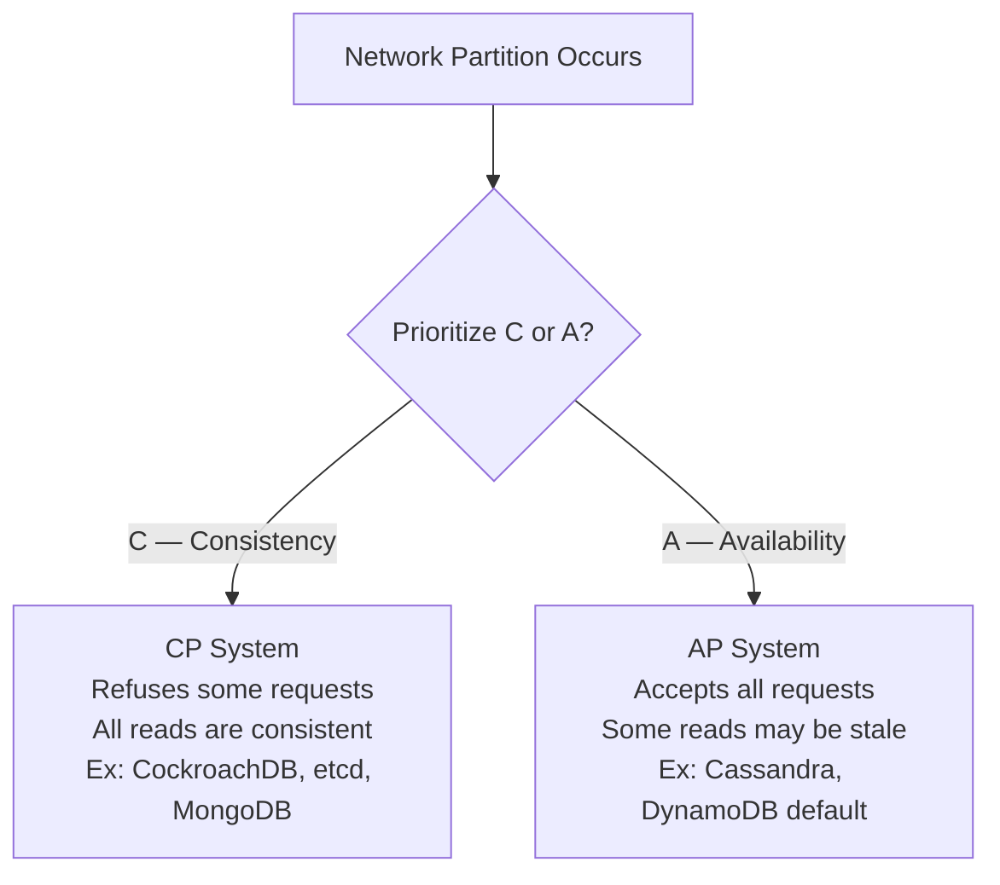
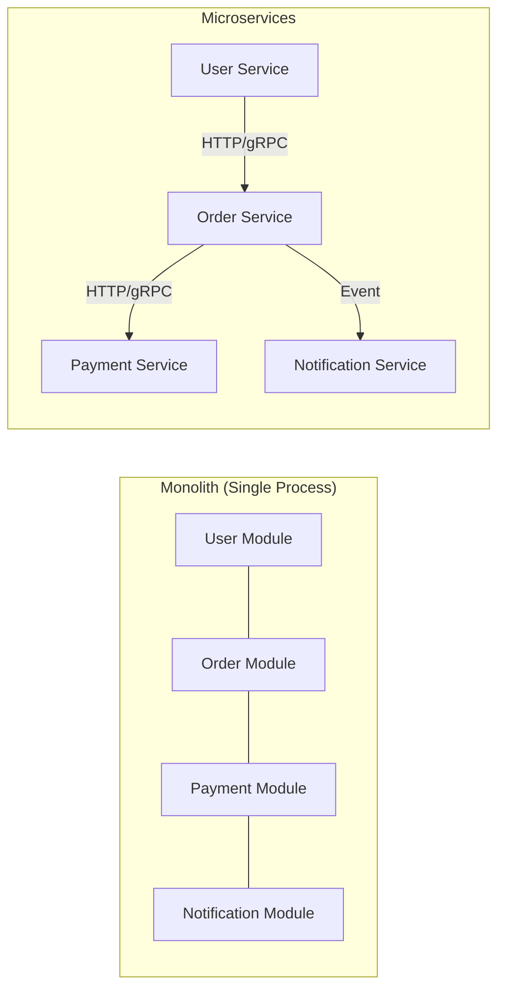
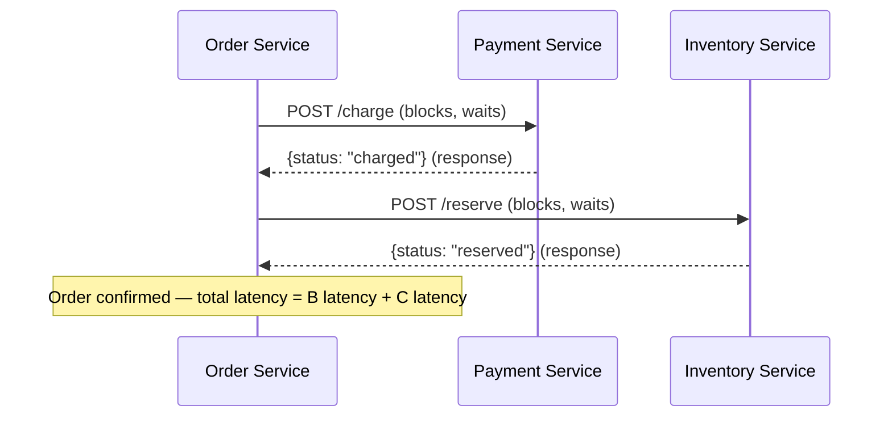
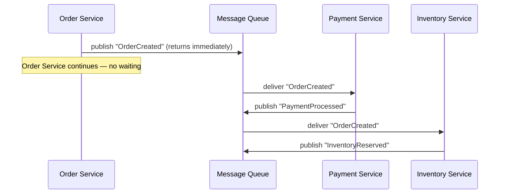
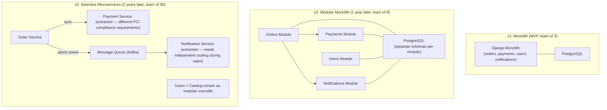

# Module 01: Introduction to Distributed Systems

[← Topic Home](../../README.md) | [Next → Module 02: Messaging and Queues](../02_messaging-and-queues/README.md)

---


> What makes a system "distributed", why that makes everything harder, and the foundational mental models every architect needs before writing a single line of distributed code.

---

## Table of Contents

1. [Overview](#overview)
2. [Prerequisites](#prerequisites)
3. [Objectives](#objectives)
4. [Theory](#theory)
5. [Key Concepts](#key-concepts)
6. [Examples](#examples)
7. [Common Pitfalls](#common-pitfalls)
8. [Cross-Links](#cross-links)
9. [Summary](#summary)

---

## Overview

A distributed system is any system in which components located on networked computers communicate and coordinate their actions by passing messages. By this definition, nearly every modern production application is distributed: a web server talking to a database is distributed. Add a cache, a job queue, and a third-party payment API, and you have a multi-component distributed system with all the associated failure modes.

The challenge is not that distributed systems are difficult to understand in principle — the challenge is that the *failure modes are non-obvious*, and programmers who build distributed systems without understanding those failure modes will build fragile, unpredictable systems. Code that works flawlessly in development (where everything is on localhost) can fail in subtle ways in production where networks are unreliable, clocks drift, and processes crash without warning.

This module establishes the foundational mental models that underpin every other module in this topic. The 8 Fallacies of Distributed Computing will shape your intuition about what can go wrong. The CAP theorem will give you the vocabulary to reason about consistency vs. availability trade-offs. The monolith vs. microservices comparison will help you understand when distribution is a solution and when it is the problem. And the distinction between synchronous and asynchronous communication will be a recurring theme throughout the remaining 11 modules.

This module is intentionally theoretical. The goal is not to write code yet — it is to build the lens through which all subsequent material will be understood.

---

## Prerequisites

- Basic programming experience in any language (Python examples used throughout)
- Understanding of HTTP request/response: what a client is, what a server is — see [[networks]]
- Basic database knowledge: what a transaction is, what ACID means — see [[postgresql]]
- No prior distributed systems knowledge required

---

## Objectives

By the end of this module, you will be able to:

1. Recite and explain each of the 8 Fallacies of Distributed Computing and give a real-world consequence for each
2. State the CAP theorem correctly and explain why the choice between C and A is only relevant during a network partition
3. Place common databases (PostgreSQL, Cassandra, MongoDB, DynamoDB) correctly in CAP space and justify the placement
4. Compare monolith and microservices architectures with a nuanced trade-off analysis — including the modular monolith middle ground
5. Distinguish synchronous (REST, gRPC) from asynchronous (events, queues) communication patterns and explain when each is appropriate
6. Describe the "complexity tax" of distributed systems: what you gain and what you lose when you go distributed

---

## Theory

### The 8 Fallacies of Distributed Computing

The 8 Fallacies of Distributed Computing were compiled by Peter Deutsch and colleagues at Sun Microsystems in the 1990s. They describe the false assumptions that programmers new to distributed systems make — and the consequences of each. Two decades later, these fallacies remain the most concise summary of why distributed systems are hard.

**Fallacy 1: The network is reliable.**

Every network call can fail. The server might not respond. The response might not arrive. The connection might drop mid-transfer. In local development, localhost never drops packets. In production, the network is a hostile environment: cables fail, switches reboot, AWS availability zones have outages, DNS entries get stale, and TCP connections idle-timeout.

The consequence: code that does not handle network failures will fail silently or crash catastrophically in production. Every remote call needs timeout handling, retry logic, and failure behavior.

```python
import requests

# BAD: assumes the network is reliable
def get_user(user_id: int) -> dict:
    response = requests.get(f"http://user-service/users/{user_id}")
    return response.json()

# GOOD: treats the network as unreliable
def get_user(user_id: int) -> dict | None:
    try:
        response = requests.get(
            f"http://user-service/users/{user_id}",
            timeout=2.0  # do not wait forever
        )
        response.raise_for_status()
        return response.json()
    except requests.exceptions.Timeout:
        # network took too long — log and return a safe default
        print(f"[WARN] user-service timeout for user_id={user_id}")
        return None
    except requests.exceptions.RequestException as e:
        print(f"[ERROR] user-service call failed: {e}")
        return None
```

**Fallacy 2: Latency is zero.**

A local function call takes nanoseconds. A call to a service on the same machine takes microseconds. A call to a service in the same data center takes ~1 millisecond. A call across continents takes 100–300ms. Multiply a single user request by 10 service calls, and you have added 10ms–3 seconds of latency from network hops alone.

The consequence: code that makes many sequential remote calls will be slow. Architects who ignore latency produce systems where a user clicking a button triggers a chain of 15 synchronous service calls, each 50ms, adding 750ms of latency before any business logic runs.

**Fallacy 3: Bandwidth is infinite.**

Sending large payloads over a network costs time and money. Sending a 100KB JSON response versus a 1KB response is a 100x difference. At scale, this matters enormously — Netflix serves hundreds of petabytes per day, and bandwidth costs are a significant budget item.

The consequence: APIs that return unbounded data sets, services that log entire request/response bodies, and designs that replicate entire database tables across services will become performance and cost bottlenecks.

**Fallacy 4: The network is secure.**

Networks can be intercepted, spoofed, and man-in-the-middled. In a microservices architecture with dozens of services communicating over an internal network, any compromised service can potentially impersonate any other. This is why modern service meshes enforce mutual TLS (mTLS) for all service-to-service calls.

The consequence: services that trust all internal traffic without authentication or encryption are one compromised node away from a complete internal breach.

**Fallacy 5: Topology doesn't change.**

IP addresses change. Services get scaled up and down. Containers get rescheduled on different nodes. Kubernetes reschedules pods to new IPs at any time. A service that hardcodes the IP address of a dependency will break without warning.

The consequence: distributed systems need service discovery (DNS, Kubernetes Services, Consul) rather than hardcoded addresses.

**Fallacy 6: There is one administrator.**

Large distributed systems are operated by multiple teams, each responsible for different services. The team running Service A cannot unilaterally change the behavior of Service B. Coordination across teams takes time. Deployment schedules differ. This makes schema changes, API versioning, and shared database access fundamentally harder than in a monolith.

The consequence: services must be designed for independent deployability. A change to Service A must not require a simultaneous change to Service B.

**Fallacy 7: Transport cost is zero.**

Serializing data to JSON, sending it over the network, and deserializing it on the other side consumes CPU and memory on both sides. At 10,000 requests per second, the serialization overhead of a verbose JSON format is measurable. This is one reason gRPC (binary Protobuf) is preferred over REST JSON for high-throughput internal services.

The consequence: high-throughput internal services should consider binary protocols. External APIs can afford JSON's readability because external traffic is generally lower volume.

**Fallacy 8: The network is homogeneous.**

A real production network uses a mix of switches, routers, load balancers, NAT gateways, firewalls, CDNs, and VPNs from many different vendors. Each has different behavior for packet loss, MTU, timeout, and TLS support. What works with one configuration may silently fail with another.

The consequence: distributed systems must be tested under realistic network conditions, including network partitions, packet loss simulation, and high latency. This is one motivation for chaos engineering (see Module 09).

---

### The CAP Theorem

The CAP theorem, proposed by Eric Brewer in 2000 and formally proven by Gilbert and Lynch in 2002, states that a distributed data store can guarantee at most **two** of the following three properties:

- **C — Consistency:** Every read receives the most recent write, or an error. No stale reads.
- **A — Availability:** Every request receives a (non-error) response. The system never refuses to answer.
- **P — Partition Tolerance:** The system continues to operate even when network messages between nodes are delayed or lost (a "network partition").

The key insight that is often misunderstood: **P is not optional in a real distributed system.** Network partitions happen. Network links go down. If your system spans multiple machines, you must tolerate partitions. Therefore, the real choice is: **when a partition occurs, do you sacrifice Consistency (give AP) or Availability (give CP)?**



*When a partition happens, a distributed system must choose: refuse some requests to stay consistent (CP), or accept all requests at the cost of potentially stale reads (AP).*

**Real database examples:**

| Database | CAP Class | Behavior During a Partition |
|----------|-----------|----------------------------|
| Single-node PostgreSQL | CA | Not partition-tolerant (single machine); trivially consistent and available |
| MongoDB (default write concern) | CP | Primary stops accepting writes if it can't reach a quorum; replica reads may be stale |
| Cassandra | AP | Accepts writes even if some replicas are unreachable; reconciles conflicts later via last-write-wins |
| DynamoDB (eventually consistent) | AP | Always available; eventual consistency across replicas |
| etcd | CP | Requires a quorum for reads and writes; refuses requests during a partition |
| CockroachDB | CP | Serializable transactions; rejects writes that cannot achieve quorum |

> [!WARNING]
> The CAP theorem applies during a **partition event** — which is a failure condition, not normal operation. During normal operation, most databases appear to offer all three. The CAP trade-off only becomes visible when something is broken. This is why you must understand it *before* your system is under pressure.

**The PACELC extension** (Daniel Abadi, 2012) extends CAP to also quantify the latency/consistency trade-off during *normal operation* (no partition):

```
If Partition:  →  choose C or A
Else (normal): →  choose Latency or Consistency
```

DynamoDB is classified as PA/EL: during a Partition it favors Availability; during normal operation it favors low Latency over strong Consistency. CockroachDB is PC/EC: it favors Consistency in both cases, at the cost of higher latency.

---

### Monolith vs. Microservices Trade-offs

The microservices vs. monolith debate is one of the most heated in software engineering — and most of the heat is generated by oversimplification. Neither architecture is universally better. The right answer depends on team size, domain complexity, operational maturity, and the stage of the product.

**The Monolith:**

A monolithic application runs as a single deployable unit. All modules — user management, orders, payments, notifications — compile together and run in the same process. This has real advantages:

- **Simple deployment:** one artifact to build, test, and deploy
- **No network overhead:** function calls are in-process; no serialization, no latency
- **Easy debugging:** a single stack trace spans the entire request path
- **Atomic transactions:** a database transaction can span multiple "services" trivially

The problems emerge at scale, specifically at *organizational* scale (too many engineers working in the same codebase) and *technical* scale (the entire application must be scaled as a unit, even if only one component is under load):

- **Deployment coupling:** a change to the notification module requires deploying the entire application
- **Technology lock-in:** all modules must use the same language, runtime, and dependency versions
- **Scalability ceiling:** you can only scale the whole process, not individual hot spots

**Microservices:**

Microservices decompose the application into independently deployable services, each owning its data and communicating over the network. This solves the monolith's scaling and deployment problems but introduces a new class of complexity:

- **Network latency:** every inter-service call is a network hop with the associated fallacies
- **Distributed transactions:** operations spanning multiple services cannot use a single database transaction (see Module 06)
- **Operational overhead:** 50 services means 50 deployment pipelines, 50 sets of logs, 50 places to look when something breaks
- **Testing complexity:** end-to-end testing requires running many services simultaneously



*Left: monolith — all modules in one process, communicating by function call. Right: microservices — each module is an independent service, communicating over the network.*

**The Modular Monolith — the middle ground:**

The "modular monolith" (sometimes called a "majestic monolith") is an architecture that applies good software engineering boundaries within a single deployable unit. Modules have clear interfaces, do not directly access each other's database tables, and are organized so they *could* be extracted into separate services if needed — but currently are not.

Shopify runs one of the largest e-commerce platforms in the world as a modular monolith. Stack Overflow runs on a relatively small number of servers with a traditional monolith. These are deliberate choices made by engineering organizations that evaluated the trade-offs honestly.

| Concern | Monolith | Modular Monolith | Microservices |
|---------|---------|-----------------|--------------|
| Deployment complexity | Low | Low | High |
| Network latency | None | None | Unavoidable |
| Distributed transactions | Not needed | Not needed | Hard — needs Saga/2PC |
| Debugging complexity | Low | Low | High |
| Independent scaling | Not possible | Not possible | Possible |
| Team autonomy | Low (shared codebase) | Medium (enforced boundaries) | High |
| Organizational fit | Small team, simple domain | Medium team, clear domains | Large team, mature DevOps |

> [!TIP]
> A useful heuristic from Sam Newman: microservices should be a solution to a problem you have, not a goal in itself. If you don't have deployment coupling problems or scaling problems that a monolith can't solve, you don't yet need microservices.

---

### Synchronous vs. Asynchronous Communication

In a distributed system, services must communicate. There are two fundamental communication styles, and the choice between them has profound implications for reliability, scalability, and coupling.

**Synchronous communication** (REST, gRPC, direct HTTP): Service A sends a request and waits for Service B to respond before continuing. The caller blocks during the call.



*Synchronous chain: Order Service must wait for each response before proceeding. Total latency adds up. If Payment Service is slow, Order Service is slow.*

**Asynchronous communication** (message queues, event buses): Service A publishes a message and continues immediately. Service B processes the message independently, in its own time.



*Asynchronous: Order Service publishes one event and is done. Payment and Inventory services process independently and in parallel. Total end-to-end time is max(B, C) rather than B + C.*

**When to choose synchronous:**
- The caller needs the result to continue (e.g., a user waiting for a login response)
- Simple request-response operations with predictable latency
- Operations where the caller needs immediate confirmation of success or failure

**When to choose asynchronous:**
- The caller does not need the result immediately (e.g., sending a welcome email after registration)
- Multiple services need to react to the same event
- Load buffering: the producer generates events faster than the consumer can process them
- Long-running operations (video encoding, report generation, bulk data imports)

---

### The Complexity Tax

Going distributed is not free. Every benefit of distribution comes with a corresponding cost. This section quantifies what you give up.

**Atomic transactions become coordination problems.** In a monolith with one database, you can wrap multiple operations in a single SQL transaction: either everything commits or nothing does. In a distributed system, a "transaction" spanning multiple services requires either two-phase commit (slow, blocking) or sagas (eventually consistent, requires compensating transactions). The simplicity of `BEGIN; UPDATE orders; UPDATE inventory; COMMIT;` disappears entirely.

**Local function calls become failure scenarios.** In a monolith, `userService.getUser(id)` either returns a user or throws a local exception. In microservices, the equivalent call can fail with: timeout, connection refused, DNS failure, 500 Internal Server Error, partial response, or a response that arrives after the caller has moved on. Each failure mode needs a handler.

**Debugging goes from hard to very hard.** In a monolith, a bug produces a single stack trace. In microservices, a user-facing bug might be caused by an interaction between 5 services — and the relevant logs are spread across 5 separate log streams, possibly with clock skew between them. This is why distributed tracing (Module 08) exists as a discipline.

**Testing becomes combinatorially complex.** Unit-testing a monolith is straightforward. Integration-testing a distributed system requires either running all services locally (expensive, slow) or mocking them (which doesn't test the actual integration). Contract testing (Pact) is one mitigation, but it adds tooling overhead.

```python
# The complexity tax in code: handling a single service call
import httpx
from tenacity import retry, stop_after_attempt, wait_exponential

@retry(
    stop=stop_after_attempt(3),
    wait=wait_exponential(multiplier=1, min=1, max=10)
)
def get_user_with_retry(user_id: int) -> dict | None:
    """
    A "simple" service call now needs:
    - HTTP client with connection pooling
    - Timeout to prevent indefinite blocking
    - Retry logic with exponential backoff
    - Error handling for each failure type
    - Logging for observability
    """
    try:
        response = httpx.get(
            f"http://user-service/users/{user_id}",
            timeout=httpx.Timeout(connect=1.0, read=2.0)
        )
        if response.status_code == 404:
            return None  # user not found — not a transient error, don't retry
        response.raise_for_status()
        return response.json()
    except httpx.TimeoutException:
        raise  # let tenacity retry on timeout
    except httpx.HTTPStatusError as e:
        if e.response.status_code >= 500:
            raise  # retry on 5xx
        return None  # 4xx: not retryable
```

The code above — for a "get user" call that would be a 1-line function in a monolith — is 20 lines in a distributed system that properly handles the fallacies. This is the complexity tax.

---

## Key Concepts

**Distributed system:** A system in which components run on networked computers and communicate by passing messages. The defining characteristic is that components can fail independently of each other.

**Network partition:** A state in which two (or more) groups of nodes in a distributed system cannot communicate with each other due to a network failure. The split groups may still communicate internally. The CAP theorem's "P" specifically refers to tolerance of this condition.

**Consistency (in CAP):** Every read returns the most recent write, or an error. This is *not* the "C" in ACID; ACID consistency is about invariant preservation within one database, while CAP consistency is about cross-node read/write ordering. See [[shared/glossary#eventual-consistency]].

**Availability (in CAP):** Every request receives a non-error response. The response might not contain the most recent data, but the system does not refuse the request.

**Eventual consistency:** A weaker consistency model where all replicas will *eventually* converge to the same value, but there is no guarantee about when. During the convergence window, different nodes may return different values for the same key. See [[shared/glossary#eventual-consistency]].

**Synchronous coupling:** A relationship between services where one must wait for another to respond before continuing. Creates latency dependencies and availability dependencies — if B is down, A is also effectively down.

**Bounded context:** A boundary within which a domain model applies consistently. A key concept from Domain-Driven Design used to define microservice boundaries. See [[shared/glossary#bounded-context]] and Module 04.

**Latency vs. throughput:** Latency is the time for one request to complete (milliseconds). Throughput is the number of requests that complete per unit time (requests/second). These are often in tension: batching increases throughput but also increases individual request latency.

---

## Examples

### Example 1: CAP in Practice — What Happens During a Partition

**Scenario:** A Cassandra cluster has 3 nodes. A network partition splits it into: Node 1 (isolated) | Nodes 2, 3 (connected). A user writes their address to Node 1. Another user reads the same address from Node 2.

```python
# Simulating Cassandra's AP behavior (pseudocode)
# Cassandra uses a "quorum" concept — write to W nodes, read from R nodes
# For consistency: W + R > total_nodes

# With 3 nodes and consistency_level=ONE:
# - Write goes to Node 1 (partitioned)
# - Read comes from Node 2 (has old data)
# - Result: READ RETURNS STALE DATA — AP behavior, system is available

# With consistency_level=QUORUM (W=2, R=2):
# - Write must reach 2 nodes — during partition, Node 1 can only reach itself
# - Write FAILS — now we're CP, sacrificed availability for consistency

NODES = ["node1", "node2", "node3"]
PARTITION = {"node1"}  # node1 is isolated

def write(key: str, value: str, quorum: int = 1) -> bool:
    """
    Returns True if write succeeded (reached quorum nodes).
    Returns False if partition prevented quorum.
    """
    reachable = [n for n in NODES if n not in PARTITION]
    reached = min(len(reachable), len(NODES))
    
    if reached >= quorum:
        print(f"Write succeeded: {key}={value} on {reached} nodes")
        return True
    else:
        print(f"Write failed: only {reached} nodes reachable, need {quorum}")
        return False

# AP behavior (quorum=1): accepts all writes, may return stale reads
write("user:123:address", "new address", quorum=1)
# Output: Write succeeded: user:123:address=new address on 2 nodes
# Node1 still has old address — reads from node1 return stale data

# CP behavior (quorum=2): refuses writes that can't reach quorum
write("user:123:address", "new address", quorum=2)
# Output: Write succeeded: user:123:address=new address on 2 nodes
# But: write from partition side would fail: only 1 node reachable, need 2
```

### Example 2: The Hidden Cost of Synchronous Chains

**Scenario:** An e-commerce checkout flow calls 4 services synchronously. Each has p50 latency of 20ms and p99 latency of 200ms.

```python
# Synchronous chain: total latency = sum of all service latencies
# At p50: 20ms * 4 services = 80ms checkout latency
# At p99: if ANY service hits p99, the whole chain feels it

import statistics

def simulate_checkout_latency(samples: int = 10000) -> None:
    import random
    
    # Each service: 20ms average, occasional 200ms spike
    def service_latency() -> float:
        if random.random() < 0.01:  # 1% chance of p99
            return 200.0
        return random.gauss(20.0, 5.0)  # normal distribution around 20ms
    
    total_latencies = []
    for _ in range(samples):
        # Total checkout = sum of all 4 services
        checkout = sum(service_latency() for _ in range(4))
        total_latencies.append(checkout)
    
    total_latencies.sort()
    p50 = total_latencies[int(samples * 0.50)]
    p95 = total_latencies[int(samples * 0.95)]
    p99 = total_latencies[int(samples * 0.99)]
    
    print(f"p50 checkout latency: {p50:.1f}ms")
    print(f"p95 checkout latency: {p95:.1f}ms")
    print(f"p99 checkout latency: {p99:.1f}ms")
    # Expected output:
    # p50 checkout latency: ~80ms
    # p95 checkout latency: ~130ms
    # p99 checkout latency: ~380ms  <-- 4 services * 200ms worst case is 800ms

simulate_checkout_latency()
```

The "independent p99 is 200ms" statement for each service sounds reasonable. But chaining 4 services means your *combined* p99 approaches 800ms — because the user experiences the worst case from ALL services, not any single service. This is the "tail latency amplification" problem in synchronous chains.

### Example 3: Designing a Simple Distributed System

**Scenario:** A startup is building an order processing system. They start with a monolith and must decide when (and whether) to split.



*The evolution of a real system: start with a monolith, add module boundaries (not service boundaries), extract services only when there's a specific, justified reason (compliance, independent scaling). Note that even at v3, not everything is a microservice.*

---

## Common Pitfalls

### Pitfall 1: Premature Decomposition

**The mistake:** Breaking a new application into microservices before the domain boundaries are well-understood.

**Wrong approach:**
```python
# Week 1 of a new product: already split into 12 services
# The "user" concept isn't stable yet — teams are still discovering requirements

# Service A's user model:
class User:
    id: int
    name: str
    email: str
    created_at: datetime

# Service B's user model (evolved independently):
class User:
    user_id: str  # changed to string UUID
    full_name: str  # renamed
    email_address: str  # renamed
    registration_date: datetime  # renamed
    # Worse: Service B has 5 more fields Service A doesn't know about
```

**Right approach:**
```python
# Start with a monolith or modular monolith.
# Let the domain model stabilize over several months.
# Extract services only when you have:
# 1. A clear, stable bounded context boundary
# 2. A specific scaling or deployment need that justifies the operational overhead
# 3. Team structure that maps to service ownership

# The Strangler Fig pattern: incrementally extract services from a running monolith
# as boundaries become clear, rather than predicting them upfront
```

**Why it's made:** Microservices sound modern and scalable. Engineering teams often want to "do it right" from the start. But the real cost is building the wrong boundaries, which are then very hard to change once services are deployed and own separate databases.

---

### Pitfall 2: The Distributed Monolith

**The mistake:** Splitting an application into separate processes but keeping tight coupling — shared databases, synchronous chains, or deployment dependencies. This is the worst of both worlds: the operational complexity of microservices with none of the benefits.

**Wrong approach:**
```python
# "Microservices" that share a database directly
# Order Service and Payment Service both write to the same PostgreSQL database

# Order Service:
import psycopg2
conn = psycopg2.connect("postgres://prod-db/main")
cursor = conn.cursor()
cursor.execute("INSERT INTO orders (user_id, total) VALUES (%s, %s)", (user_id, total))
cursor.execute("UPDATE payments SET order_id = %s WHERE id = %s", (order_id, payment_id))
# ORDER SERVICE IS DIRECTLY MODIFYING PAYMENT TABLE — tight coupling via shared DB
```

**Right approach:**
```python
# Each service owns its own database schema
# Services communicate only through APIs or events — never through shared DB tables

# Order Service: only reads/writes to its own schema
cursor.execute("INSERT INTO orders_schema.orders (user_id, total) VALUES (%s, %s)", ...)

# To interact with payments, Order Service calls Payment Service API:
import httpx
payment_response = httpx.post(
    "http://payment-service/payments",
    json={"order_id": order_id, "amount": total}
)
# Payment Service owns the payment data — Order Service only communicates through the API
```

**Why it's made:** The shared database is simpler to build initially. Teams reach across service boundaries for convenience. Over time, every service ends up depending on every other service's database schema, making independent deployment impossible.

---

### Pitfall 3: Ignoring Partial Failure

**The mistake:** Assuming that when a service call fails, the failure is total and clean. In practice, failures are often partial: the request may have succeeded on the server but the response was lost; the server may have crashed after doing half the work; the network may have timed out before the server completed.

**Wrong approach:**
```python
# Assuming a timeout means the operation did NOT complete
def charge_payment(order_id: str, amount: float) -> bool:
    try:
        response = httpx.post(
            "http://payment-service/charge",
            json={"order_id": order_id, "amount": amount},
            timeout=5.0
        )
        return response.status_code == 200
    except httpx.TimeoutException:
        # BAD: assume operation failed because we didn't get a response
        # The payment service may have charged the card but the response was lost
        return False  # ← This could lead to double-charging on retry
```

**Right approach:**
```python
import uuid

def charge_payment(order_id: str, amount: float) -> bool:
    # Generate an idempotency key — if we retry, the server recognizes the duplicate
    idempotency_key = f"order-{order_id}-charge"
    
    try:
        response = httpx.post(
            "http://payment-service/charge",
            json={"order_id": order_id, "amount": amount},
            headers={"Idempotency-Key": idempotency_key},
            timeout=5.0
        )
        return response.status_code == 200
    except httpx.TimeoutException:
        # GOOD: retry with the same idempotency key
        # If the server already processed this, it returns the original result
        # If it didn't, it processes it now
        return charge_payment_retry(order_id, amount, idempotency_key)
```

**Why it's made:** Network timeouts feel like clean failures. The mental model imported from local development — where exceptions map cleanly to failures — doesn't hold in distributed systems. This is directly related to Fallacy 1 (the network is reliable).

---

## Cross-Links

- [[networks]] — The network fundamentals underlying all distributed system behavior (TCP/IP, latency, packet loss)
- [[postgresql#transactions]] — ACID transactions, the comparison point for understanding what distributed systems sacrifice
- [[devops-platform-engineering]] — Container orchestration and service discovery solve Fallacy 5 (topology doesn't change)
- [[systems-architecture/modules/02_messaging-and-queues]] — Asynchronous communication, introduced in this module, explored in full depth in Module 02
- [[systems-architecture/modules/04_microservices-fundamentals]] — Bounded context decomposition, introduced here, implemented in Module 04
- [[systems-architecture/modules/06_data-consistency]] — The distributed transaction problem, introduced here as the Complexity Tax, solved in Module 06

---

## Summary

- **Distributed systems are any systems where components run on separate machines and communicate by message passing.** This includes most production applications.
- **The 8 Fallacies** (Deutsch): the network is reliable; latency is zero; bandwidth is infinite; the network is secure; topology doesn't change; there is one administrator; transport cost is zero; the network is homogeneous. Each fallacy, if believed, leads to brittle systems.
- **The CAP theorem** states you can guarantee at most 2 of: Consistency, Availability, Partition Tolerance. Since P is mandatory in real distributed systems, the real choice is C or A during a partition. CP systems (MongoDB, etcd) prefer consistency; AP systems (Cassandra, DynamoDB default) prefer availability.
- **Monolith vs. microservices is a false dichotomy.** The modular monolith is often the right choice for small-to-medium teams. Microservices should be extracted when there's a specific, justified reason (compliance boundaries, independent scaling, team autonomy). Premature decomposition creates distributed monoliths — the worst of both worlds.
- **Synchronous communication** (REST, gRPC) is right when the caller needs an immediate result. **Asynchronous communication** (message queues, events) decouples services temporally and is right for workloads that don't need an immediate response, high-throughput scenarios, or fan-out (one event, multiple consumers).
- **The Complexity Tax:** going distributed turns atomic transactions into coordination problems, turns function calls into failure scenarios, makes debugging significantly harder, and requires explicit handling of partial failures (idempotency keys, retries with backoff).
- **The three most dangerous pitfalls** are premature decomposition (wrong service boundaries that can't be changed), the distributed monolith (microservice topology with monolith coupling), and ignoring partial failure (timeouts are not clean failures).
