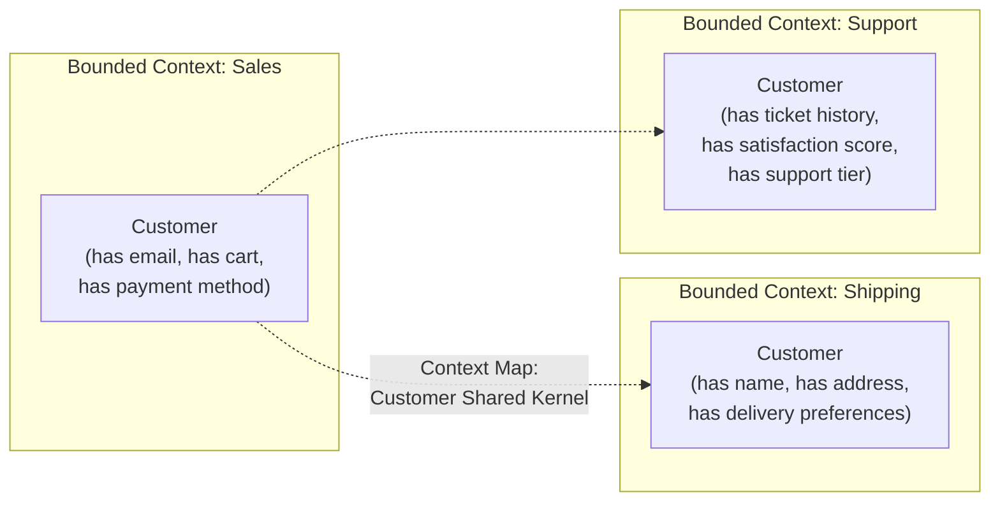

# Module 04: Microservices Fundamentals

[← Module 03: Async Patterns](../03_async-patterns/README.md) | [Topic Home](../../README.md) | [Next → Module 05: Microservices Patterns](../05_microservices-patterns/README.md)

---


> Bounded contexts from Domain-Driven Design, service decomposition strategies, data ownership, and the communication trade-offs between synchronous REST and asynchronous events.

---

## Table of Contents

1. [Overview](#overview)
2. [Prerequisites](#prerequisites)
3. [Objectives](#objectives)
4. [Theory](#theory)
5. [Key Concepts](#key-concepts)
6. [Examples](#examples)
7. [Common Pitfalls](#common-pitfalls)
8. [Cross-Links](#cross-links)
9. [Summary](#summary)

---

## Overview

Module 01 established that microservices are not always the right choice and that premature decomposition creates distributed monoliths. This module assumes you've decided that microservices are appropriate for your situation, and teaches you how to decompose a domain correctly.

The central tool is **bounded contexts** from Domain-Driven Design (DDD), introduced by Eric Evans in his 2003 book. A bounded context is an explicit boundary within which a domain model applies consistently — within it, every term has one meaning. The bounded context is the natural service boundary: if "order" means something different to the billing team than to the shipping team, those are two different bounded contexts and potentially two different services.

This module also covers the concrete mechanics of microservice design: how to identify service boundaries from domain analysis, how to decide between synchronous and asynchronous communication for a given interaction, and how to enforce data ownership (each service owns its own database — a rule that is harder to maintain in practice than it sounds).

---

## Prerequisites

- Module 01: Introduction — monolith vs. microservices trade-offs, the distributed monolith anti-pattern
- Module 02: Messaging and Queues — async communication infrastructure
- Module 03: Async Patterns — Saga and event-driven patterns used in inter-service communication

---

## Objectives

By the end of this module, you will be able to:

1. Apply bounded context analysis to identify natural service boundaries in a given domain
2. Use the Strangler Fig pattern to extract a service from an existing monolith
3. Enforce data ownership — design a system where each service owns its own database schema
4. Choose between synchronous (REST/gRPC) and asynchronous (events) communication for a given inter-service interaction, with explicit justification
5. Identify the organizational implications of service boundaries (Conway's Law)
6. Evaluate a proposed decomposition and identify shared database or distributed monolith anti-patterns

---

## Theory

> [!NOTE]
> This module is a stub. Full theory content will be written in a subsequent pass.

### Core Concepts to Cover

**Bounded Contexts (DDD):**
Eric Evans's concept from Domain-Driven Design. A bounded context is a semantic boundary within which a particular domain model is valid. Outside the boundary, the same terms may have different meanings. Service boundaries should align with bounded context boundaries.



*The same word "customer" has different meaning in each bounded context. Each context maintains its own model — not a shared universal Customer object.*

**Context Maps:**
DDD's tool for describing relationships between bounded contexts. Key patterns:
- **Shared Kernel:** Two contexts share a subset of the domain model
- **Customer/Supplier:** One context depends on another; the supplier team maintains the API
- **Anti-Corruption Layer:** A translation layer that prevents a foreign model from leaking into your context

**Data Ownership:**
Each microservice owns its data exclusively. Other services access that data only through the service's API — never by querying the database directly. This is the rule that most frequently gets violated in distributed monoliths.

```python
# WRONG: Order Service directly queries Inventory Service's database
def check_stock(product_id: int) -> int:
    # DO NOT DO THIS — crosses service boundary via shared DB
    cursor.execute("SELECT stock FROM inventory.products WHERE id = %s", (product_id,))
    return cursor.fetchone()["stock"]

# RIGHT: Order Service calls Inventory Service API
def check_stock(product_id: int) -> int:
    response = httpx.get(f"http://inventory-service/products/{product_id}/stock")
    return response.json()["available_quantity"]
```

**Decomposition Strategies:**
- By business capability (DDD bounded context — preferred)
- By subdomain (core, supporting, generic subdomains)
- By data volatility (high-change data vs. stable reference data)
- By team ownership (Conway's Law: system design mirrors communication structure)

**Conway's Law:**
"Organizations which design systems are constrained to produce designs which are copies of the communication structures of those organizations." — Mel Conway, 1967.

Practical implication: if two teams own adjacent services, those services will be loosely coupled where the teams are loosely coupled and tightly coupled where the teams are tightly coupled. Microservice decomposition should align with team structure.

**The Strangler Fig Pattern:**
A migration pattern for gradually extracting services from a monolith. Named for the strangler fig tree that grows around a host and eventually replaces it. A routing layer directs traffic to either the monolith or the new service based on request type. Functionality is incrementally moved to the new service until the monolith is replaced.

---

## Key Concepts

**Bounded context:** A boundary within which a domain model applies consistently. Each term has one meaning. See [[shared/glossary#bounded-context]].

**Ubiquitous language:** The shared vocabulary within a bounded context — used consistently by engineers and domain experts. Prevents the Tower of Babel problem where the same concept has different names in code vs. in business requirements.

**Context map:** A DDD artifact that documents the relationships and translation mechanisms between bounded contexts.

**Data ownership:** The principle that each service owns its data exclusively and exposes it only through APIs. Violating this creates shared-database anti-patterns.

**Strangler Fig pattern:** A migration strategy for incrementally extracting functionality from a monolith into separate services.

**Conway's Law:** The principle that system architecture tends to mirror the communication structure of the organization that built it. Service boundaries should align with team boundaries.

**Decomposition by capability:** The primary recommended decomposition strategy — each service corresponds to one business capability (user management, order processing, payment processing, etc.).

---

## Examples

> Full worked examples to be written. Planned examples:
> 1. Bounded context analysis for an e-commerce domain (identifying 6–8 bounded contexts)
> 2. Context map showing Customer/Supplier and Anti-Corruption Layer relationships
> 3. Strangler Fig migration plan: extracting a Notification Service from a Django monolith
> 4. Data ownership audit: identifying all places a monolith's database is accessed by "foreign" code

---

## Common Pitfalls

**Pitfall 1: Decomposing by layer instead of capability.**
Creating "microservices" that are the frontend service, the backend service, and the database service — rather than services aligned with business capabilities — creates a distributed monolith where a single user request requires coordinating all three services.

**Pitfall 2: Sharing a database between services.**
The most common distributed monolith symptom. Once two services share a database schema, their deployment and change cycles become coupled. This is the rule that is most frequently violated and most damaging.

**Pitfall 3: Too fine-grained decomposition ("nanoservices").**
Decomposing to the level of individual functions or classes creates services with no meaningful business boundary, extremely high network overhead for every operation, and impossible-to-test integration scenarios. A service should correspond to a meaningful business capability, not a technical layer.

---

## Cross-Links

- [[systems-architecture/modules/01_introduction]] — Monolith vs. microservices trade-offs; the distributed monolith anti-pattern
- [[systems-architecture/modules/05_microservices-patterns]] — Resilience patterns (circuit breaker, bulkhead) applied within this service topology
- [[systems-architecture/modules/06_data-consistency]] — Data ownership leads to the distributed transaction problem; solved in Module 06
- [[systems-architecture/modules/11_architecture-decision-making]] — ADR format for documenting service decomposition decisions

---

## Summary

- Bounded contexts from DDD are the natural unit of service decomposition — each service corresponds to one bounded context where all terms have one meaning.
- The ubiquitous language within a bounded context should be used consistently in code, conversation, and documentation.
- Data ownership is the critical rule: each service owns its data, accessible to other services only through the service's API.
- Decomposition strategies: prefer business capability alignment over technical layer alignment.
- Conway's Law: service decomposition should align with team structure or the architecture will drift back toward team structure.
- The Strangler Fig pattern enables incremental migration from a monolith without a big-bang rewrite.
- Three anti-patterns to avoid: decomposing by layer, sharing databases, nanoservice decomposition.
