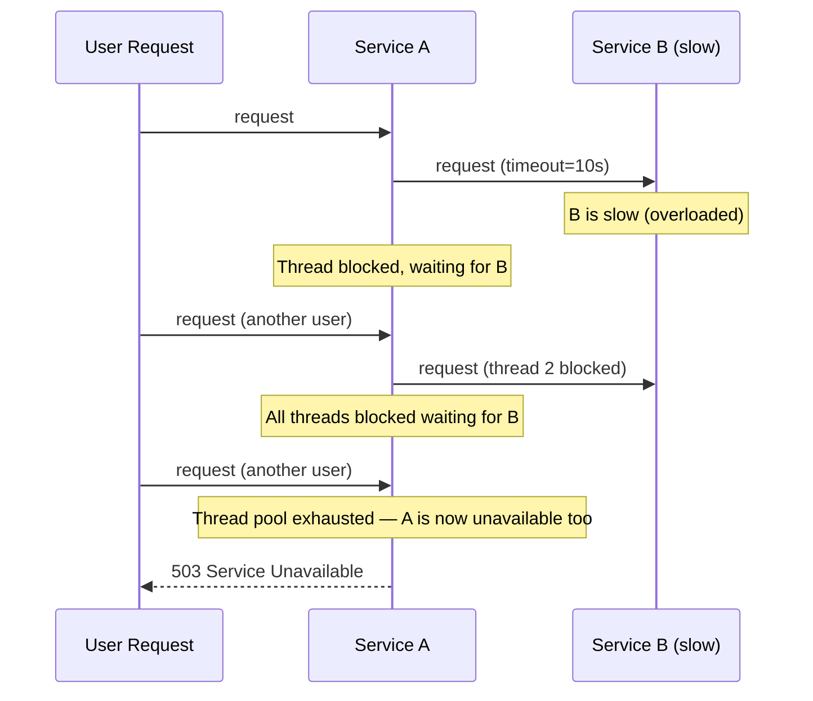

# Module 05: Microservices Patterns

[← Module 04: Microservices Fundamentals](../04_microservices-fundamentals/README.md) | [Topic Home](../../README.md) | [Next → Module 06: Data Consistency](../06_data-consistency/README.md)

---


> Circuit breaker, bulkhead, retry with exponential backoff, the sidecar pattern, and service mesh — the resilience and operational patterns that make microservice topologies survivable in production.

---

## Table of Contents

1. [Overview](#overview)
2. [Prerequisites](#prerequisites)
3. [Objectives](#objectives)
4. [Theory](#theory)
5. [Key Concepts](#key-concepts)
6. [Examples](#examples)
7. [Common Pitfalls](#common-pitfalls)
8. [Cross-Links](#cross-links)
9. [Summary](#summary)

---

## Overview

In Module 04, you learned how to decompose a system into well-bounded services. But a service topology without resilience patterns is a fragile house of cards: one slow service causes every service that calls it to slow down, which causes their callers to slow down, cascading into a system-wide outage from one dependency's degraded performance. This is called a cascading failure, and it is one of the most common causes of microservice outages in production.

This module covers the patterns that prevent cascading failures and make individual service failures contained rather than catastrophic. The **circuit breaker** pattern is the most important: it detects when a dependency is failing and stops sending requests to it, allowing the dependency to recover and preventing the caller from accumulating slow in-flight requests. The **bulkhead** pattern applies the ship hull principle: isolate resource pools so that exhaustion in one path cannot affect other paths. **Retry with exponential backoff and jitter** handles transient failures without creating thundering herd problems.

The module also covers infrastructure-level patterns: the **sidecar pattern** externalizes cross-cutting concerns (auth, tracing, retries) to a co-located proxy, and the **service mesh** applies this at scale using a control plane that manages all sidecars uniformly.

---

## Prerequisites

- Module 01: Introduction — the 8 Fallacies, network unreliability, partial failures
- Module 04: Microservices Fundamentals — service topology, data ownership
- Basic Python (implementing pattern classes)

---

## Objectives

By the end of this module, you will be able to:

1. Implement a circuit breaker from scratch with Closed, Open, and Half-Open states
2. Apply the bulkhead pattern to isolate thread pools or connection pools per downstream service
3. Implement retry logic with exponential backoff and jitter, correctly distinguishing transient (retryable) from permanent (non-retryable) failures
4. Explain the sidecar pattern and describe how Envoy proxy implements it
5. Compare Istio and Linkerd service meshes at a conceptual level, including control plane vs. data plane responsibilities
6. Design a resilience strategy for a given service topology, selecting appropriate patterns for each dependency

---

## Theory

> [!NOTE]
> This module is a stub. Full theory content will be written in a subsequent pass.

### Core Concepts to Cover

**The Cascading Failure Problem:**



*Cascading failure: B's slowness causes A to exhaust its thread pool. A becomes unavailable even though it's "healthy". Every service that calls A is now also affected.*

**Circuit Breaker Pattern:**
Three states: Closed (normal operation, requests flow), Open (circuit tripped, requests fail immediately), Half-Open (probe state, one request sent to test recovery).

```python
from enum import Enum
from datetime import datetime, timedelta
from dataclasses import dataclass, field
from typing import Callable, Any

class CircuitState(Enum):
    CLOSED = "closed"
    OPEN = "open"
    HALF_OPEN = "half_open"

@dataclass
class CircuitBreaker:
    failure_threshold: int = 5        # failures in window to open circuit
    success_threshold: int = 2         # successes in half-open to close
    cooldown_seconds: int = 30         # time before trying half-open
    
    state: CircuitState = field(default=CircuitState.CLOSED, init=False)
    failure_count: int = field(default=0, init=False)
    success_count: int = field(default=0, init=False)
    opened_at: datetime | None = field(default=None, init=False)

    def call(self, fn: Callable, *args, **kwargs) -> Any:
        if self.state == CircuitState.OPEN:
            if datetime.now() - self.opened_at > timedelta(seconds=self.cooldown_seconds):
                self.state = CircuitState.HALF_OPEN
                self.success_count = 0
            else:
                raise CircuitOpenError("Circuit is open — fast failing")
        
        try:
            result = fn(*args, **kwargs)
            self._on_success()
            return result
        except Exception as e:
            self._on_failure()
            raise

    def _on_success(self) -> None:
        if self.state == CircuitState.HALF_OPEN:
            self.success_count += 1
            if self.success_count >= self.success_threshold:
                self.state = CircuitState.CLOSED
                self.failure_count = 0
        elif self.state == CircuitState.CLOSED:
            self.failure_count = 0  # reset on success

    def _on_failure(self) -> None:
        self.failure_count += 1
        if self.failure_count >= self.failure_threshold:
            self.state = CircuitState.OPEN
            self.opened_at = datetime.now()
```

**Bulkhead Pattern:**
Named after watertight compartments in a ship hull. Isolate resource pools so a failure in one cannot exhaust resources for another.

```python
import threading
from concurrent.futures import ThreadPoolExecutor

class BulkheadService:
    """Each downstream service gets its own thread pool."""
    def __init__(self):
        # Separate pools — payment slowness cannot exhaust inventory pool
        self._payment_pool = ThreadPoolExecutor(max_workers=10, thread_name_prefix="payment")
        self._inventory_pool = ThreadPoolExecutor(max_workers=10, thread_name_prefix="inventory")
        self._notification_pool = ThreadPoolExecutor(max_workers=5, thread_name_prefix="notification")
    
    def call_payment(self, fn, *args):
        future = self._payment_pool.submit(fn, *args)
        return future.result(timeout=5.0)
    
    def call_inventory(self, fn, *args):
        future = self._inventory_pool.submit(fn, *args)
        return future.result(timeout=2.0)
```

**Sidecar Pattern:**
Co-locate a proxy process alongside each service instance. The proxy intercepts all inbound/outbound traffic and handles cross-cutting concerns: mTLS, circuit breaking, retries, distributed tracing. The service code needs no knowledge of these concerns.

```yaml
# Kubernetes pod with Envoy sidecar (injected by Istio automatically)
apiVersion: v1
kind: Pod
spec:
  containers:
  - name: order-service          # main application
    image: order-service:v2.1
    ports:
    - containerPort: 8080
  - name: envoy-proxy            # sidecar proxy (injected by Istio)
    image: envoy:v1.28
    ports:
    - containerPort: 15001       # traffic interception port
    # Envoy handles: mTLS, circuit breaking, retries, tracing headers
    # Order Service code is unaware of any of this
```

**Service Mesh:**
A layer of sidecar proxies managed by a control plane. The control plane (Istio's istiod, Linkerd's controller) distributes policy (circuit breaker thresholds, retry config, TLS certificates) to all data plane proxies. Engineers configure policy once in the control plane; all services get it without code changes.

---

## Key Concepts

**Circuit breaker:** A stateful wrapper around service calls that detects failure rates and stops sending requests when a threshold is exceeded. See [[shared/glossary#circuit-breaker]].

**Bulkhead:** Resource isolation pattern — separate pools for separate purposes prevent one failing path from exhausting shared resources. See [[shared/glossary#bulkhead]].

**Exponential backoff:** A retry strategy where the wait time between retries grows exponentially (1s, 2s, 4s, 8s...) to reduce load on a recovering service.

**Jitter:** Random variation added to backoff delays to prevent "thundering herd" — multiple clients retrying at the exact same millisecond.

**Sidecar pattern:** A co-located proxy that handles cross-cutting concerns on behalf of the main service, transparent to application code.

**Service mesh:** Infrastructure that manages all service-to-service communication via a network of sidecar proxies controlled by a central control plane.

**Data plane / control plane:** In a service mesh, the data plane is the sidecar proxies that carry traffic; the control plane is the management layer that configures the proxies.

**Timeout:** A maximum wait duration for a service call. Required for all service calls — without timeouts, slow dependencies cause indefinite thread blocking.

---

## Examples

> Full worked examples to be written. Planned examples:
> 1. Complete circuit breaker implementation with all three states and tests
> 2. Bulkhead with thread pool isolation and rejection behavior
> 3. Retry with exponential backoff + jitter using `tenacity`
> 4. Istio VirtualService YAML for circuit breaking and retry configuration

---

## Common Pitfalls

**Pitfall 1: Circuit breaker with no monitoring.**
A circuit breaker that opens silently is worse than no circuit breaker — you have no idea that your system is degraded. Every circuit breaker state change must emit a metric and trigger an alert.

**Pitfall 2: Retrying non-idempotent operations.**
Retrying a `POST /payments` request that creates a payment will create duplicate payments. Retry logic must only be applied to idempotent operations, or must use idempotency keys.

**Pitfall 3: Setting timeouts too high.**
A 30-second timeout on a service that should respond in 200ms means that during an outage, your thread pool will fill up with 30-second-long blocked threads before the circuit breaker opens. Timeouts should be tight — typically 2–5x the p99 latency under normal conditions.

---

## Cross-Links

- [[systems-architecture/modules/01_introduction]] — The 8 Fallacies and the motivation for resilience patterns
- [[systems-architecture/modules/04_microservices-fundamentals]] — The service topology these patterns are applied to
- [[systems-architecture/modules/08_observability-distributed]] — Circuit breaker state changes must be instrumented; observability is required to operate these patterns
- [[systems-architecture/modules/09_resilience-and-chaos]] — Chaos engineering validates that these resilience patterns actually work

---

## Summary

- Cascading failures occur when slow dependencies exhaust caller thread pools, propagating failure upward through the call chain.
- The circuit breaker prevents cascading failures by detecting failure rates and fast-failing rather than queuing slow requests.
- Three circuit breaker states: Closed (normal), Open (fast-fail), Half-Open (probe recovery).
- Bulkhead isolates resource pools so one failing dependency cannot exhaust resources for unrelated paths.
- Retry with exponential backoff handles transient failures; add jitter to prevent thundering herd.
- The sidecar pattern externalizes cross-cutting concerns (auth, tracing, retries) to a proxy — transparent to application code.
- A service mesh manages sidecar proxies at scale via a control plane; Istio and Linkerd are the dominant implementations.
- All resilience patterns require instrumentation — a circuit breaker that opens without triggering an alert is invisible.
