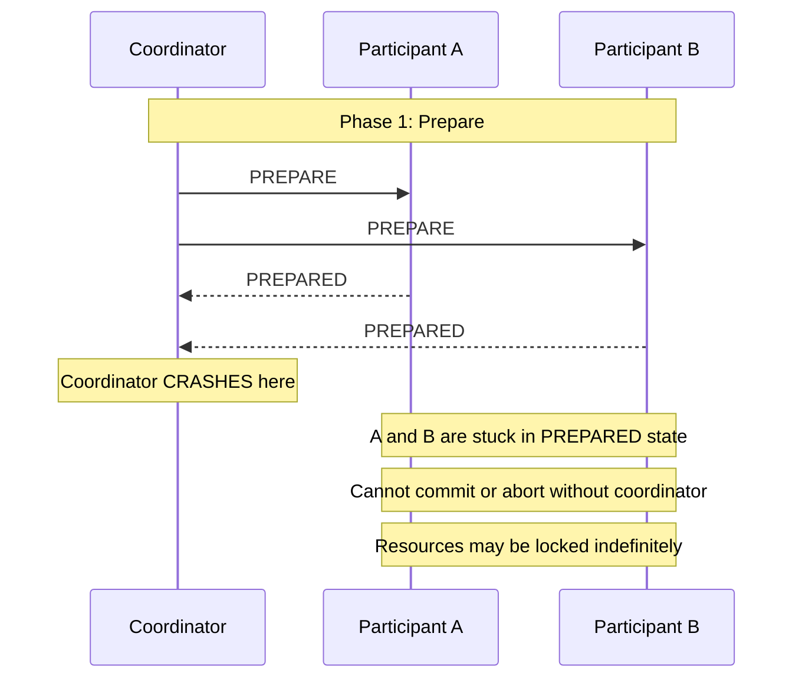

# Module 06: Data Consistency

[← Module 05: Microservices Patterns](../05_microservices-patterns/README.md) | [Topic Home](../../README.md) | [Next → Module 07: API Design for Services](../07_api-design-for-services/README.md)

---


> Distributed transactions (and why they're hard), Saga vs. Two-Phase Commit, the dual-write problem, Change Data Capture, and the patterns that let distributed systems maintain consistent data without a global lock.

---

## Table of Contents

1. [Overview](#overview)
2. [Prerequisites](#prerequisites)
3. [Objectives](#objectives)
4. [Theory](#theory)
5. [Key Concepts](#key-concepts)
6. [Examples](#examples)
7. [Common Pitfalls](#common-pitfalls)
8. [Cross-Links](#cross-links)
9. [Summary](#summary)

---

## Overview

Data consistency is arguably the hardest problem in distributed systems. On a single machine with a single database, consistency is handled by ACID transactions — the database guarantees that either all operations in a transaction succeed or none do. In a distributed system, where each service owns its own database, there is no shared transaction boundary. "Consistency" becomes an emergent property that you must design for explicitly.

This module covers the full landscape of distributed data consistency. It starts with why distributed transactions are fundamentally different from local transactions, then covers the two primary mechanisms for managing distributed "transactions": Two-Phase Commit (2PC, the traditional approach, with its significant limitations) and the Saga pattern (introduced in Module 03, here treated in depth with implementation guidance). It then covers the dual-write problem in detail, including Change Data Capture as a solution that doesn't require application-level changes.

This is a module where the devil is in the details. The patterns look simple on paper but have subtle failure modes. The goal is not just to know the pattern names but to understand the failure modes and how each pattern handles them.

---

## Prerequisites

- Module 03: Async Patterns — Saga pattern introduction, Outbox pattern
- Module 04: Microservices Fundamentals — data ownership, service boundaries
- [[postgresql#transactions]] — ACID transactions, what we're trying to replicate across services

---

## Objectives

By the end of this module, you will be able to:

1. Explain why ACID transactions don't extend across service boundaries and what that means practically
2. Describe Two-Phase Commit (2PC), including its blocking failure mode and performance characteristics
3. Compare 2PC and Saga for a given use case, selecting the appropriate approach with justification
4. Implement the dual-write problem scenario and explain the two failure modes it creates
5. Implement Change Data Capture conceptually and explain how it differs from the Outbox pattern
6. Design an eventually consistent data ownership strategy for a 3-service system

---

## Theory

> [!NOTE]
> This module is a stub. Full theory content will be written in a subsequent pass.

### Core Concepts to Cover

**Why ACID Doesn't Distribute:**
ACID (Atomicity, Consistency, Isolation, Durability) is a property of a single database's transaction engine. Atomicity in particular — all-or-nothing — requires that the database can roll back any partial work. Across two separate databases, there is no shared rollback mechanism. A transfer of money from one bank (Service A, database A) to another (Service B, database B) cannot be atomic without coordination — and coordination at this level introduces its own failure modes.

```python
# WHAT YOU WISH YOU COULD DO (doesn't work across services):
with db_a.transaction(), db_b.transaction():
    db_a.execute("UPDATE accounts SET balance = balance - 100 WHERE id = 1")
    db_b.execute("UPDATE accounts SET balance = balance + 100 WHERE id = 2")
# If db_b.commit() fails after db_a.commit() succeeds: MONEY LOST

# REALITY: you need 2PC or Saga
```

**Two-Phase Commit (2PC):**
Protocol for achieving atomicity across multiple databases:
1. **Prepare phase:** Coordinator asks all participants "are you ready to commit?" Each participant durably records the prepared state and responds "yes" or "no".
2. **Commit phase:** If all said yes, coordinator sends "commit" to all. If any said no, coordinator sends "abort" to all.

The problem: if the coordinator crashes after the Prepare phase but before the Commit phase, all participants are stuck in a "prepared" state — they cannot unilaterally commit or abort. They're waiting for a coordinator that may never return. This is the **blocking problem** of 2PC.



*The 2PC blocking problem: if the coordinator crashes between phases, participants are stuck until the coordinator recovers. Resources (database locks) may be held indefinitely.*

**Saga vs. 2PC Trade-off:**

| Property | 2PC | Saga |
|----------|-----|------|
| Atomicity | Strong (all-or-nothing) | Weak (steps visible between start and completion) |
| Blocking on coordinator failure | Yes — participants stuck in prepared | No — each step is already committed |
| Latency | High (two network round trips + persistent prepare records) | Lower (each step is a local transaction) |
| Requires RDBMS XA support | Yes | No |
| Compensations required | No | Yes — must design for every step |
| Intermediate state visible | No | Yes — partial saga completion is observable |

**The Dual-Write Problem:**
When an application needs to update a database AND publish an event/message, doing both in a single code block (but not a single transaction) creates two failure modes:
1. Database write succeeds, then application crashes before publishing → event never published → downstream services not notified
2. Event published successfully, then database write fails → event describes a state that doesn't exist

```python
# DUAL-WRITE BUG: two operations, no atomicity
def create_order(order_data):
    order = Order(**order_data)
    db.save(order)          # Step 1: Write to database
    # CRASH HERE → event never published
    kafka.publish("OrderCreated", order.to_json())  # Step 2: Publish event
    # CRASH HERE → event published for order that may have failed to save
```

Solutions:
1. **Outbox Pattern** (Module 03): write to DB + outbox table in one transaction; relay publishes
2. **Change Data Capture (CDC)**: read the database's write-ahead log (WAL) to detect changes and publish them as events — no application code changes required

**Change Data Capture:**
CDC tools (e.g., Debezium) listen to a database's replication log (PostgreSQL WAL, MySQL binlog) and publish every data change as an event to a message broker. The application writes only to the database; events are generated automatically from the log.

```yaml
# Debezium connector configuration for PostgreSQL CDC
connector:
  name: "orders-cdc"
  connector.class: "io.debezium.connector.postgresql.PostgresConnector"
  database.hostname: "postgres"
  database.port: "5432"
  database.dbname: "orders_db"
  table.include.list: "public.orders"
  topic.prefix: "cdc"
  # Debezium will publish to: cdc.public.orders
  # Each INSERT, UPDATE, DELETE becomes an event
```

---

## Key Concepts

**Two-phase commit (2PC):** A distributed transaction protocol requiring a prepare phase and a commit phase. Guarantees atomicity but has a blocking failure mode. See [[shared/glossary#two-phase-commit]].

**Saga:** Distributed transaction pattern using a sequence of local transactions with compensating transactions for rollback. Eventually consistent; no blocking. See [[shared/glossary#saga-pattern]].

**Dual-write problem:** The impossibility of atomically writing to a database and publishing to a message broker in the same operation without a distributed transaction. See [[shared/glossary#outbox-pattern]].

**Change Data Capture (CDC):** A technique for capturing database changes (from the replication log) and publishing them as events without requiring application code changes.

**XA transactions:** A standard protocol for 2PC across heterogeneous databases. Requires database and driver support. High overhead; rarely used in modern microservice architectures.

**Eventual consistency:** The consistency model used by Saga — the system will reach a consistent state eventually, but intermediate states are observable. See [[shared/glossary#eventual-consistency]].

**Compensating transaction:** A semantic undo for a committed Saga step. See [[shared/glossary#compensating-transaction]].

---

## Examples

> Full worked examples to be written. Planned examples:
> 1. Demonstrating both dual-write failure modes with a simulated crash
> 2. Outbox pattern implementation with PostgreSQL (full working code)
> 3. CDC with Debezium — configuration and event schema
> 4. Saga with choreography showing intermediate state observability

---

## Common Pitfalls

**Pitfall 1: Using 2PC at scale.**
2PC's latency and blocking failure mode make it unsuitable for most microservice architectures. It should only be used when the two databases support XA transactions and when strong consistency is genuinely required (e.g., financial ledgers with regulatory requirements).

**Pitfall 2: Treating eventual consistency as a bug to fix.**
Eventual consistency is not a bug — it is a design choice. Systems designed around eventual consistency with appropriate UI feedback (e.g., "Your order is being processed") are better user experiences than systems that block the user waiting for a distributed transaction to complete.

**Pitfall 3: CDC without schema evolution strategy.**
When you use CDC, every change to a database schema immediately changes the event schema. Consumers must handle schema evolution gracefully. Schema registry (Confluent Schema Registry, Apicurio) should be used to manage this.

---

## Cross-Links

- [[systems-architecture/modules/03_async-patterns]] — Saga and Outbox pattern implementation details
- [[systems-architecture/modules/04_microservices-fundamentals]] — Data ownership that leads to the distributed transaction problem
- [[systems-architecture/modules/10_scaling-patterns]] — CQRS read replicas as an application of eventual consistency
- [[postgresql#transactions]] — The ACID properties that we lose across service boundaries
- [[postgresql#replication]] — PostgreSQL WAL, the replication log that CDC reads

---

## Summary

- ACID transactions cannot span service boundaries — each service's database is an independent transaction boundary.
- Two-Phase Commit achieves atomicity across databases but introduces blocking failure modes and high latency.
- The Saga pattern achieves distributed "transactions" without blocking: each step is a local transaction; failures are compensated, not rolled back.
- The dual-write problem: you cannot atomically write to a database AND publish a message; solve with the Outbox Pattern or CDC.
- Change Data Capture reads the database's replication log to generate events without application code changes.
- Eventual consistency is a design choice, not a bug — design UX and downstream consumers to handle it gracefully.
