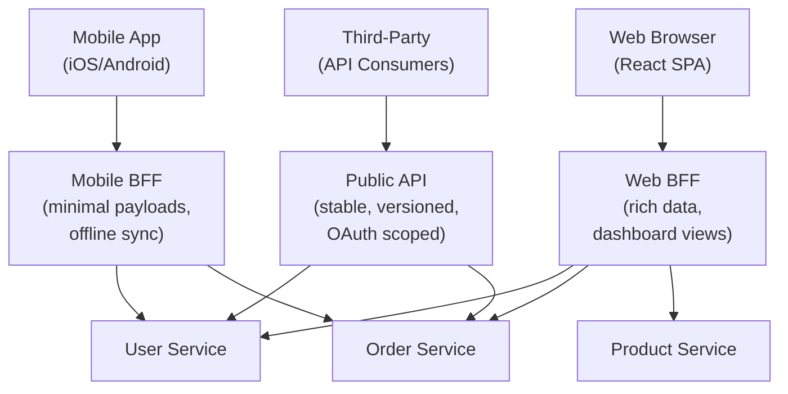

# Module 07: API Design for Services

[← Module 06: Data Consistency](../06_data-consistency/README.md) | [Topic Home](../../README.md) | [Next → Module 08: Observability in Distributed Systems](../08_observability-distributed/README.md)

---


> The Backend for Frontend (BFF) pattern, API composition, gRPC vs. REST for internal services, versioning in microservices, and the patterns for designing APIs that are stable, evolvable, and fit for purpose.

---

## Table of Contents

1. [Overview](#overview)
2. [Prerequisites](#prerequisites)
3. [Objectives](#objectives)
4. [Theory](#theory)
5. [Key Concepts](#key-concepts)
6. [Examples](#examples)
7. [Common Pitfalls](#common-pitfalls)
8. [Cross-Links](#cross-links)
9. [Summary](#summary)

---

## Overview

A microservice architecture has two distinct API layers: the public APIs facing clients (mobile apps, browsers, third-party developers) and the internal APIs between services. These two layers have different requirements, different consumers, and should be designed differently.

Public APIs need to be stable — breaking changes affect external consumers who cannot update immediately. Internal APIs can evolve faster but must support the independent deployability guarantee: Service A must be deployable without requiring simultaneous deployment of Service B.

This module covers the patterns that make both layers manageable. The **Backend for Frontend (BFF)** pattern recognizes that different clients (mobile vs. web vs. third-party) need different API shapes and should have dedicated API layers rather than sharing a single generic API. **API composition** addresses the challenge of fetching data that spans multiple services — a common pattern in microservice architectures. **gRPC** offers a high-performance alternative to REST JSON for internal service calls, with typed contracts and bidirectional streaming. And **API versioning** in a distributed system requires strategies that differ from single-application versioning.

---

## Prerequisites

- Module 04: Microservices Fundamentals — service boundaries, data ownership
- [[graphql-rest]] — REST principles, HTTP methods, status codes, JSON APIs
- Basic understanding of protocol buffers is helpful but not required

---

## Objectives

By the end of this module, you will be able to:

1. Design a Backend for Frontend (BFF) layer for a multi-client application, justifying the client-specific API shapes
2. Implement API composition to aggregate data from multiple services in a single client response
3. Define a gRPC service in Protocol Buffers and explain its advantages over REST JSON for internal services
4. Choose between gRPC and REST for a given inter-service communication scenario
5. Design an API versioning strategy for a microservice that maintains backward compatibility
6. Identify the "chatty API" anti-pattern and redesign the API to reduce round trips

---

## Theory

> [!NOTE]
> This module is a stub. Full theory content will be written in a subsequent pass.

### Core Concepts to Cover

**The BFF Pattern:**
Different clients have different data needs. A mobile app on a slow connection wants minimal payloads. A web dashboard wants rich data in a single call. A third-party integration wants a stable, versioned API. One generic API tries to serve all of these and ends up serving none of them well.

The BFF (Backend for Frontend) pattern creates one API layer per client type. Each BFF is owned by the team responsible for that client.



*BFF pattern: each client type gets a dedicated API layer optimized for its needs. The BFF aggregates calls to internal services.*

**API Composition:**
A common challenge in microservices: to render a user's profile page, you need data from User Service, Order Service, and Product Service (recent purchases). API composition fetches from multiple services and assembles the response.

```python
import asyncio
import httpx

async def get_user_dashboard(user_id: int) -> dict:
    """Compose data from three services concurrently."""
    async with httpx.AsyncClient() as client:
        # Fetch all three in parallel — not sequential
        user_task = client.get(f"http://user-service/users/{user_id}")
        orders_task = client.get(f"http://order-service/users/{user_id}/orders?limit=5")
        recommendations_task = client.get(f"http://recommendation-service/users/{user_id}")

        user_resp, orders_resp, recs_resp = await asyncio.gather(
            user_task, orders_task, recommendations_task,
            return_exceptions=True  # don't fail all if one fails
        )

        return {
            "user": user_resp.json() if not isinstance(user_resp, Exception) else None,
            "recent_orders": orders_resp.json() if not isinstance(orders_resp, Exception) else [],
            "recommendations": recs_resp.json() if not isinstance(recs_resp, Exception) else [],
        }
```

**gRPC vs REST:**
- REST+JSON: text protocol, human-readable, browser-native, flexible, but verbose and untyped
- gRPC+Protobuf: binary protocol, 5–10x smaller payloads, strongly typed, code-generated clients, HTTP/2 multiplexing, bidirectional streaming

```protobuf
// order_service.proto — gRPC service definition
syntax = "proto3";

service OrderService {
  rpc GetOrder (GetOrderRequest) returns (Order);
  rpc CreateOrder (CreateOrderRequest) returns (Order);
  rpc StreamOrderUpdates (GetOrderRequest) returns (stream OrderUpdate);  // server streaming
}

message Order {
  string id = 1;
  string user_id = 2;
  double total = 3;
  OrderStatus status = 4;
  repeated OrderItem items = 5;
}

enum OrderStatus {
  PENDING = 0;
  CONFIRMED = 1;
  SHIPPED = 2;
  DELIVERED = 3;
}
```

**API Versioning Strategies:**
- URI versioning: `/v1/orders`, `/v2/orders` — simple, visible, breaks bookmarks
- Header versioning: `Accept: application/vnd.myapi.v2+json` — cleaner URLs, less discoverable
- Backward-compatible evolution: add fields (never remove), use optional fields (never make optional fields required)
- Semantic versioning for internal contracts: `Breaking.Feature.Patch`

---

## Key Concepts

**BFF (Backend for Frontend):** A pattern where each client type gets a dedicated API layer optimized for its specific needs — mobile, web, third-party. Avoids the "one size fits none" problem of a single generic API.

**API composition:** The practice of aggregating responses from multiple services in a single call, typically done in a BFF or API gateway layer.

**gRPC:** Google's high-performance RPC framework using Protocol Buffers for serialization and HTTP/2 for transport. Preferred for internal service communication in high-throughput systems.

**Protocol Buffers (Protobuf):** Google's binary serialization format used by gRPC. Strongly typed, schema-enforced, significantly more compact than JSON.

**Chatty API:** An API that requires many round trips to accomplish a single business task. Common in naive microservice decompositions where each service exposes fine-grained resources.

**API gateway:** A single entry point for all client requests that handles cross-cutting concerns (auth, rate limiting, routing) and can perform API composition.

**Backward compatibility:** The ability to add new fields or endpoints without breaking existing clients. The golden rule: add, don't change; deprecate, don't remove.

---

## Examples

> Full worked examples to be written. Planned examples:
> 1. BFF implementation for a mobile app (minimal payload, aggregated view)
> 2. Async API composition with error handling for partial failures
> 3. Complete gRPC service definition and Python client/server
> 4. API versioning: demonstrating backward-compatible evolution vs. breaking change

---

## Common Pitfalls

**Pitfall 1: BFF becoming a "backend dumping ground".**
BFFs can accumulate business logic that belongs in domain services. A BFF should be a thin aggregation layer — it orchestrates calls to services and shapes responses for the client. Business rules (pricing logic, validation, authorization) belong in the respective domain services.

**Pitfall 2: Synchronous API composition for non-critical data.**
If a dashboard BFF waits for 6 service calls synchronously, the dashboard is as slow as the slowest service. Non-critical data (e.g., recommendations, activity feed) should be fetched asynchronously or served from a pre-computed cache.

**Pitfall 3: Breaking changes without versioning.**
In microservices, Service A and Service B may not be deployed simultaneously. If Service B releases a breaking API change, all currently running instances of Service A will fail until they're updated. Always maintain backward compatibility and use versioning for breaking changes.

---

## Cross-Links

- [[graphql-rest]] — REST principles and GraphQL as an alternative to BFF for complex querying needs
- [[systems-architecture/modules/04_microservices-fundamentals]] — Service boundaries that determine API shapes
- [[systems-architecture/modules/08_observability-distributed]] — API gateway is a key place for observability instrumentation
- [[systems-architecture/modules/10_scaling-patterns]] — Rate limiting at the API gateway layer

---

## Summary

- The BFF pattern creates client-specific API layers — mobile BFF, web BFF, public API — each optimized for its consumers.
- API composition aggregates data from multiple services in parallel; use `asyncio.gather()` or equivalent for concurrent fetching.
- gRPC + Protobuf is preferred for internal service communication: smaller payloads, typed contracts, code generation, HTTP/2 multiplexing.
- REST + JSON remains preferred for public APIs due to browser-native support and human readability.
- API versioning: add fields, don't change or remove them; use URI versioning or header versioning for breaking changes.
- The chatty API anti-pattern: many fine-grained round trips — solve by aggregating at BFF or API gateway level.
- BFFs should be thin aggregation layers; business logic belongs in domain services, not in the BFF.
