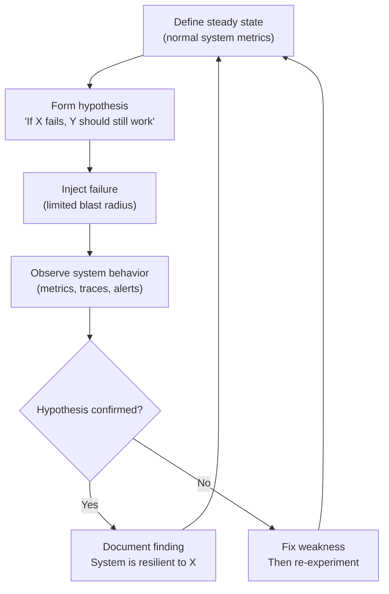

# Module 09: Resilience and Chaos Engineering

[← Module 08: Observability in Distributed Systems](../08_observability-distributed/README.md) | [Topic Home](../../README.md) | [Next → Module 10: Scaling Patterns](../10_scaling-patterns/README.md)

---


> Chaos engineering (Netflix's Chaos Monkey, principles), failure injection, graceful degradation, load shedding, and Service Level Objectives — the discipline of deliberately breaking things to build unbreakable systems.

---

## Table of Contents

1. [Overview](#overview)
2. [Prerequisites](#prerequisites)
3. [Objectives](#objectives)
4. [Theory](#theory)
5. [Key Concepts](#key-concepts)
6. [Examples](#examples)
7. [Common Pitfalls](#common-pitfalls)
8. [Cross-Links](#cross-links)
9. [Summary](#summary)

---

## Overview

Resilience patterns (circuit breakers, bulkheads, retries) are only as good as your confidence that they actually work. The only way to gain that confidence is to test them — and the only meaningful test is to inject real failures into your production system and observe what happens.

This is the insight behind chaos engineering, a discipline pioneered by Netflix. In 2010, Netflix released **Chaos Monkey**, a tool that randomly terminates virtual machine instances in their production environment during business hours. The intent was not to cause outages but to surface resilience weaknesses before they caused unplanned outages. If your system can't survive a single instance being killed during the day when your team is present to respond, it will certainly fail when an instance is killed at 3am with no one watching.

This module covers the principles and practice of chaos engineering: how to design and run chaos experiments responsibly, how to implement graceful degradation so that partial failures produce degraded experiences rather than complete outages, how to implement load shedding so that overloaded systems protect themselves, and how to define Service Level Objectives (SLOs) that give you a quantified resilience target to test against.

---

## Prerequisites

- Module 05: Microservices Patterns — circuit breaker, bulkhead, retry patterns that are the target of chaos experiments
- Module 08: Observability in Distributed Systems — chaos experiments require observability to measure outcomes
- Basic understanding of SLAs and uptime concepts

---

## Objectives

By the end of this module, you will be able to:

1. Explain the principles of chaos engineering and distinguish it from random failure injection
2. Design a chaos experiment with a clear hypothesis, blast radius, and rollback plan
3. Implement graceful degradation for at least two service failure scenarios
4. Implement load shedding to protect a service from being overwhelmed
5. Define Service Level Objectives (SLOs) for a given service and explain how error budgets work
6. Describe Netflix's Chaos Monkey and how modern chaos engineering tools (Chaos Toolkit, LitmusChaos) extend it

---

## Theory

> [!NOTE]
> This module is a stub. Full theory content will be written in a subsequent pass.

### Core Concepts to Cover

**Chaos Engineering Principles (from Principles of Chaos Engineering — principlesofchaos.org):**

1. Build a hypothesis around steady-state behavior
2. Vary real-world events (instance failures, network latency, disk full, etc.)
3. Run experiments in production
4. Automate experiments to run continuously
5. Minimize blast radius (scope of impact)

**The Chaos Experiment Loop:**



**Graceful Degradation:**
Design services so that when a non-critical dependency is unavailable, the service returns a degraded (but still useful) response rather than an error.

```python
from functools import wraps
from typing import TypeVar, Callable

T = TypeVar('T')

def graceful_fallback(fallback_value):
    """Decorator: return fallback_value if the decorated function raises any exception."""
    def decorator(fn: Callable) -> Callable:
        @wraps(fn)
        def wrapper(*args, **kwargs):
            try:
                return fn(*args, **kwargs)
            except Exception as e:
                # Log the failure for observability
                logger.warning(f"Graceful degradation triggered for {fn.__name__}: {e}")
                return fallback_value
        return wrapper
    return decorator

@graceful_fallback(fallback_value=[])
def get_recommendations(user_id: int) -> list:
    """If recommendations service is down, return empty list — homepage still loads."""
    return recommendation_service.get(user_id)

@graceful_fallback(fallback_value={"fraud_score": 0.0, "approved": True})
def check_fraud(order: dict) -> dict:
    """If fraud service is down, allow the order (business decision: accept risk)."""
    return fraud_service.check(order)
```

**Load Shedding:**
When a service is overloaded, it is better to reject some requests fast than to process all requests slowly (and cause a timeout cascade). Load shedding intentionally rejects requests when resource utilization exceeds a threshold.

```python
import threading
import time

class LoadShedder:
    """Reject requests when system is overloaded using token bucket."""
    def __init__(self, max_concurrent: int = 100):
        self.max_concurrent = max_concurrent
        self._current = 0
        self._lock = threading.Lock()

    def __enter__(self):
        with self._lock:
            if self._current >= self.max_concurrent:
                raise OverloadedError("Service is at capacity — request shed")
            self._current += 1
        return self

    def __exit__(self, *args):
        with self._lock:
            self._current -= 1

load_shedder = LoadShedder(max_concurrent=100)

def handle_request(request):
    try:
        with load_shedder:
            return process(request)
    except OverloadedError:
        return Response(status=503, headers={"Retry-After": "2"})
```

**Service Level Objectives (SLOs):**
An SLO is a target for a specific measurement of a service's behavior (availability, latency, error rate). An SLO is the internal engineering target; an SLA is the customer-facing commitment.

```yaml
# Example SLO definition
slo:
  name: "Order Service Availability"
  description: "Order creation requests succeed with status 2xx"
  
  target: 99.9%  # 43.8 minutes downtime per month
  
  indicator:
    metric: "request_success_rate"
    filter:
      service: "order-service"
      endpoint: "POST /orders"
    window: "30d"
  
  error_budget:
    # At 99.9% SLO over 30 days:
    # Total minutes: 43,200
    # Allowed failure minutes: 43.2
    # Error budget in requests at 100 rps:
    # 100 rps * 43.2 * 60 = 259,200 failed requests per month
    monthly_minutes: 43.2
```

**The Error Budget:**
If your SLO is 99.9% availability, your error budget for the month is 0.1% — about 43 minutes of downtime. Chaos engineering experiments consume error budget intentionally in a controlled way, giving you confidence that your resilience patterns work before an uncontrolled failure consumes your budget.

---

## Key Concepts

**Chaos engineering:** The discipline of deliberately injecting failures into a production system (with minimal blast radius) to discover and fix resilience weaknesses before they cause unplanned outages.

**Chaos Monkey:** Netflix's original tool for terminating random EC2 instances in production. Now part of the Netflix "Simian Army" suite of chaos tools.

**Graceful degradation:** The ability to provide a reduced but functional response when a non-critical dependency fails, rather than returning an error.

**Load shedding:** Intentionally rejecting requests when a service is overloaded to protect its ability to serve the remaining requests acceptably.

**SLO (Service Level Objective):** An internal engineering target for a measurable service property (availability, latency, error rate). The foundation of reliability engineering.

**SLA (Service Level Agreement):** A customer-facing commitment (often with financial penalties) backed by one or more SLOs.

**Error budget:** The acceptable amount of "badness" allowed by an SLO within a time window. A 99.9% monthly availability SLO has a 43.2-minute error budget per month.

**Blast radius:** The scope of impact of a chaos experiment. Minimizing blast radius means limiting experiments to a small percentage of instances or traffic.

**Steady state:** The normal, measurable behavior of a system before a chaos experiment. Defined as metrics (error rate, p99 latency, throughput) within acceptable ranges.

---

## Examples

> Full worked examples to be written. Planned examples:
> 1. Designing a chaos experiment for a circuit breaker (hypothesis → injection → observation → conclusion)
> 2. Graceful degradation for a recommendation service with fallback to cached or empty results
> 3. Load shedder implementation with token bucket and proper 503 response
> 4. SLO definition in YAML with error budget calculation

---

## Common Pitfalls

**Pitfall 1: Chaos in production without a hypothesis.**
Random failure injection without a clear hypothesis and measurement plan is not chaos engineering — it is just causing incidents. Every chaos experiment must have: a defined steady state, a specific hypothesis, a measurement plan, and a rollback procedure.

**Pitfall 2: Graceful degradation that lies to users.**
A service that silently returns stale or empty data when its dependency is down is only graceful if the user knows the data might be stale. Showing "Based on data from 2 hours ago" is graceful degradation. Showing "Here are your recommendations" when you're actually showing an empty list is deceptive and potentially harmful.

**Pitfall 3: Setting SLOs too high.**
A 99.99% SLO (52 minutes downtime per year) sounds impressive but may be impossible to achieve with your current architecture. Chaos engineering against an impossible SLO destroys all your error budget in the first experiment. Set SLOs based on actual capability and user tolerance, not aspirational numbers.

---

## Cross-Links

- [[systems-architecture/modules/05_microservices-patterns]] — Circuit breaker, bulkhead, and retry are the resilience patterns that chaos experiments validate
- [[systems-architecture/modules/08_observability-distributed]] — Observability is required to measure steady state and observe experiment outcomes
- [[systems-architecture/modules/10_scaling-patterns]] — Load shedding is also a scaling pattern — the response to overload
- [[devops-platform-engineering]] — SLO monitoring, alerting, and SRE practices are the operational context for this module
- [[feature-flags-monitoring]] — Feature flags are used to gradually enable chaos experiments (canary chaos)

---

## Summary

- Chaos engineering is the discipline of deliberately injecting failures to discover resilience weaknesses before they cause unplanned outages.
- Every chaos experiment needs: steady-state definition, specific hypothesis, minimal blast radius, measurement plan, rollback procedure.
- Graceful degradation: return reduced but useful responses when non-critical dependencies fail.
- Load shedding: intentionally reject requests when overloaded to protect service quality for remaining requests.
- SLOs define measurable reliability targets; error budgets give teams permission to take risk within SLO constraints.
- Netflix's Chaos Monkey (2010) pioneered the discipline; modern tools (Chaos Toolkit, LitmusChaos, AWS Fault Injection Simulator) extend it.
- Chaos experiments are not valid without observability — you need metrics and traces to measure outcomes.
