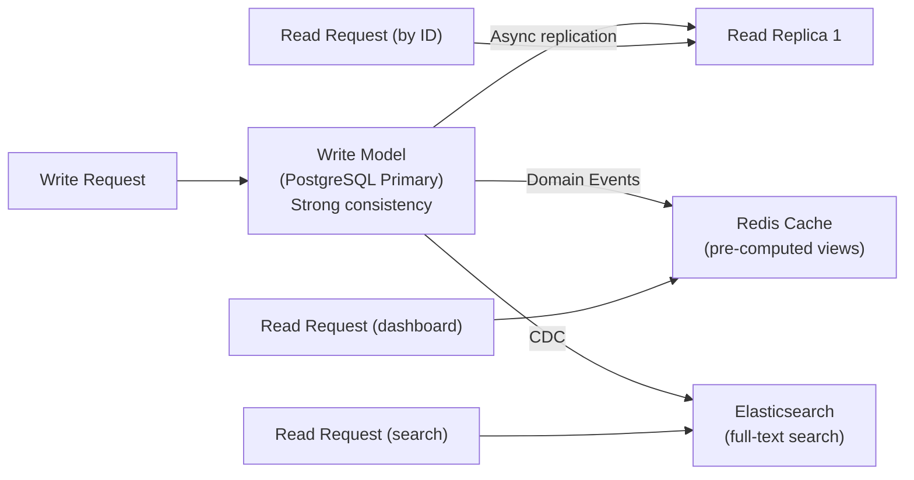

# Module 10: Scaling Patterns

[← Module 09: Resilience and Chaos Engineering](../09_resilience-and-chaos/README.md) | [Topic Home](../../README.md) | [Next → Module 11: Architecture Decision-Making](../11_architecture-decision-making/README.md)

---


> Horizontal scaling, database sharding strategies, CQRS read replicas, CDN and edge caching, rate limiting at scale — how systems grow from 100 to 1,000,000 requests per second.

---

## Table of Contents

1. [Overview](#overview)
2. [Prerequisites](#prerequisites)
3. [Objectives](#objectives)
4. [Theory](#theory)
5. [Key Concepts](#key-concepts)
6. [Examples](#examples)
7. [Common Pitfalls](#common-pitfalls)
8. [Cross-Links](#cross-links)
9. [Summary](#summary)

---

## Overview

Every system that succeeds faces a scaling problem. The decisions you make at 100 requests/second may become obstacles at 10,000 requests/second. Understanding scaling patterns — and crucially, *when* to apply them — is what separates engineers who can grow a system from engineers who need to rewrite it.

Scaling is not just about adding more servers. Adding servers helps for stateless compute but introduces new problems for stateful components: databases, caches, and session stores. This module covers the scaling patterns that address stateful bottlenecks specifically — because stateless horizontal scaling is largely solved by Kubernetes, while database scaling remains one of the hardest problems in production engineering.

The module covers: horizontal scaling and its limits, database sharding strategies (range, hash, directory) with their trade-offs, CQRS read replicas as a scaling pattern, CDN and edge caching for reducing origin load, and rate limiting architectures that protect services from overload at scale.

---

## Prerequisites

- Module 03: Async Patterns — CQRS (introduced there, applied here for scaling)
- Module 04: Microservices Fundamentals — the service topology being scaled
- [[postgresql]] — Database fundamentals (indexes, transactions, replication)

---

## Objectives

By the end of this module, you will be able to:

1. Explain the difference between vertical and horizontal scaling and identify when each is appropriate
2. Describe three database sharding strategies (range, hash, directory) with trade-offs for each
3. Apply CQRS read replicas to scale read-heavy workloads independently from write workloads
4. Design a CDN and edge caching strategy for a given application's traffic pattern
5. Implement token bucket and sliding window rate limiting and choose between them for a given use case
6. Identify the specific bottleneck in a given scaling scenario and select the appropriate pattern

---

## Theory

> [!NOTE]
> This module is a stub. Full theory content will be written in a subsequent pass.

### Core Concepts to Cover

**Vertical vs. Horizontal Scaling:**
- Vertical (scale up): add more CPU, RAM, disk to existing machines. Simple, no code changes, but has physical limits and creates single points of failure.
- Horizontal (scale out): add more machines. Requires stateless application design (no local state that isn't shared), but scales to arbitrary load.

**The Scaling Bottleneck Problem:**
Adding application servers is easy. The database becomes the bottleneck:

```
100 req/s: 1 app server, 1 PostgreSQL — works fine
1,000 req/s: 5 app servers, 1 PostgreSQL — DB starts struggling
10,000 req/s: 50 app servers, 1 PostgreSQL — DB is maxed, all app servers wait
```

Solutions in order of escalating complexity:
1. Optimize queries (add indexes, fix N+1, reduce data transfer)
2. Read replicas (scale reads, not writes)
3. Caching (Redis in front of DB)
4. CQRS (separate read model, optimized independently)
5. Database sharding (distribute data across multiple DB instances)

**Database Sharding Strategies:**

```python
# Range sharding: partition by value ranges
# Shard 1: user_id 1–1,000,000
# Shard 2: user_id 1,000,001–2,000,000
def get_shard_range(user_id: int) -> str:
    if user_id <= 1_000_000:
        return "shard_1"
    elif user_id <= 2_000_000:
        return "shard_2"
    # ...
# Problem: hot spots if recent users are much more active than old users

# Hash sharding: consistent distribution via hash function
def get_shard_hash(user_id: int, num_shards: int = 4) -> str:
    shard_num = hash(user_id) % num_shards
    return f"shard_{shard_num}"
# Problem: adding a shard requires redistributing ~(N-1)/N of all data

# Consistent hashing: minimize redistribution when adding shards
# Used by Cassandra, DynamoDB — assigns keys and nodes to a ring
# Adding a node only requires redistributing 1/N of data
```

**CQRS Read Replicas:**
Separate read model that is updated asynchronously from the write model. The read model can be a database read replica, a Redis cache, an Elasticsearch index, or any other optimized store.



**CDN and Edge Caching:**
Content Delivery Networks cache static and cacheable content at edge nodes close to users, reducing latency and origin server load.

Cache-Control headers determine what is cached and for how long:
```python
from fastapi import Response

@app.get("/products/{product_id}")
def get_product(product_id: int, response: Response) -> dict:
    product = db.get_product(product_id)
    
    if product.is_public and not product.pricing_dynamic:
        # Static product info: cache for 1 hour at CDN, 10 min in browser
        response.headers["Cache-Control"] = "public, max-age=600, s-maxage=3600"
    else:
        # Dynamic pricing: no CDN caching
        response.headers["Cache-Control"] = "no-store"
    
    return product.to_dict()
```

**Rate Limiting:**
Protect services from abuse and overload by limiting request rates per client.

```python
import redis
import time

class TokenBucketRateLimiter:
    """
    Token bucket algorithm: tokens accumulate up to max_tokens at rate tokens_per_second.
    Each request consumes one token. Requests rejected when bucket is empty.
    """
    def __init__(self, redis_client: redis.Redis, tokens_per_second: float, max_tokens: int):
        self.redis = redis_client
        self.tokens_per_second = tokens_per_second
        self.max_tokens = max_tokens
    
    def is_allowed(self, client_id: str) -> bool:
        key = f"rate_limit:{client_id}"
        now = time.time()
        
        pipe = self.redis.pipeline()
        pipe.hgetall(key)
        result = pipe.execute()
        
        data = result[0]
        if data:
            tokens = float(data[b"tokens"])
            last_refill = float(data[b"last_refill"])
            # Add tokens since last request
            elapsed = now - last_refill
            tokens = min(self.max_tokens, tokens + elapsed * self.tokens_per_second)
        else:
            tokens = self.max_tokens
        
        if tokens >= 1.0:
            tokens -= 1.0
            self.redis.hset(key, mapping={"tokens": tokens, "last_refill": now})
            self.redis.expire(key, 3600)
            return True
        return False
```

---

## Key Concepts

**Horizontal scaling:** Adding more instances of a stateless service. Effectively unlimited — the bottleneck shifts to stateful components (databases, caches).

**Vertical scaling:** Adding resources (CPU, RAM) to an existing machine. Has physical limits; creates single point of failure. Use to buy time, not as a permanent strategy.

**Database sharding:** Partitioning a database's data across multiple instances. Eliminates the single-database bottleneck but introduces cross-shard query complexity.

**Range sharding:** Partition by value ranges (e.g., user_id 1–1M on shard 1). Simple but creates hot spots for recent/active data.

**Hash sharding:** Partition by hash of a key. Even distribution but makes range queries cross-shard. Adding shards requires expensive resharding.

**Consistent hashing:** A sharding technique where both keys and nodes are placed on a ring. Adding a node only requires redistributing ~1/N of keys. Used by Cassandra and DynamoDB.

**Read replica:** A database replica that handles read traffic. The primary handles writes; reads are distributed across replicas. Provides read scaling at the cost of eventual consistency on reads.

**CDN (Content Delivery Network):** A geographically distributed cache that stores static and cacheable content at edge nodes close to users. Reduces latency and origin load.

**Token bucket:** A rate limiting algorithm where tokens accumulate at a fixed rate up to a maximum. Each request consumes one token; requests are rejected when the bucket is empty. Allows bursts.

**Sliding window:** A rate limiting algorithm that counts requests in a moving time window. More accurate than token bucket; prevents "boundary exploits" (bursting at window edges).

---

## Examples

> Full worked examples to be written. Planned examples:
> 1. Scaling evolution: single DB → read replicas → sharding → CQRS (with code at each stage)
> 2. Hash vs. consistent hashing: visualizing data distribution and resharding cost
> 3. Cache-Control header strategy for an e-commerce product catalog
> 4. Token bucket rate limiter with Redis and rate limit headers

---

## Common Pitfalls

**Pitfall 1: Sharding before optimizing.**
Sharding is the most complex scaling strategy. Before sharding, verify that query optimization, indexes, read replicas, and caching are fully exploited. Many systems that appear to need sharding actually need an index.

**Pitfall 2: Cache invalidation strategy as an afterthought.**
Adding Redis in front of a database is easy. Deciding when to invalidate cached data is hard. "Cache when written, invalidate on update" sounds simple but has race conditions (stale read between invalidation and rehydration). Plan your invalidation strategy before deploying the cache.

**Pitfall 3: Rate limiting at the wrong layer.**
Rate limiting at the application layer can be bypassed by sending many requests to many application instances. Rate limiting must happen at a shared, centralized layer (API gateway, Redis-backed rate limiter shared by all instances) to be effective.

---

## Cross-Links

- [[systems-architecture/modules/03_async-patterns]] — CQRS, introduced in Module 03, applied here as a scaling pattern
- [[systems-architecture/modules/06_data-consistency]] — Sharding creates cross-shard consistency challenges; see Module 06 for patterns
- [[systems-architecture/modules/09_resilience-and-chaos]] — Rate limiting is also a resilience mechanism — load shedding at the API boundary
- [[postgresql]] — PostgreSQL replication (read replicas), partitioning, and connection pooling
- [[devops-platform-engineering]] — Kubernetes horizontal pod autoscaling, CDN configuration

---

## Summary

- Horizontal scaling is simple for stateless services; the database is almost always the scaling bottleneck.
- Before sharding: optimize queries, add indexes, use read replicas, add caching. Sharding is a last resort.
- Three sharding strategies: range (simple, hot spots), hash (even distribution, costly resharding), consistent hashing (minimal resharding cost, used by Cassandra/DynamoDB).
- CQRS read replicas: separate read models optimized for their specific query patterns, updated asynchronously from the write model.
- CDN and edge caching: Cache-Control headers determine what CDNs cache. Cache public, stable data aggressively; never cache dynamic or personalized data.
- Rate limiting: token bucket allows bursts (good for API clients), sliding window is more accurate (good for preventing abuse). Both require a centralized store (Redis).
