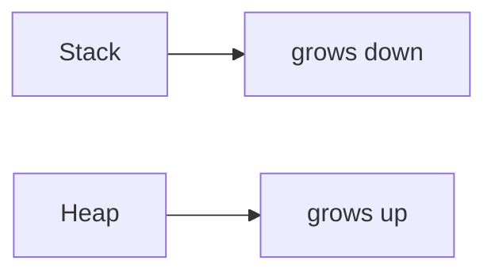

# Assets

Static assets for the **leaps** knowledge base: images, diagrams, screenshots, and other binary or non-text files referenced from Markdown notes.

---

## Purpose

Keeping assets in a dedicated directory rather than scattered across topic folders:

- Makes it easy to audit what media exists and find orphaned files.
- Provides a single place to apply Git LFS rules for large files.
- Ensures consistent paths in cross-topic references (a diagram of memory layout can be referenced from both the C topic and the operating-systems topic without duplication).

---

## Directory Structure

```
assets/
├── README.md          # This file
├── images/            # Screenshots, photos, annotated images
│   └── ...
└── diagrams/          # Exported diagrams (SVG, PNG from draw.io / Excalidraw)
    └── ...
```

Topic-specific assets that are only used within one topic can live in `TOPICS/<topic>/assets/` instead. Anything referenced by two or more topics belongs here.

---

## Naming Conventions

Use lowercase, hyphen-separated names. Include the topic or concept prefix when the asset is domain-specific.

| Type | Pattern | Example |
|---|---|---|
| Diagram (concept) | `<concept>-<description>.<ext>` | `memory-layout-stack-heap.svg` |
| Diagram (algorithm) | `<algorithm>-<step>.<ext>` | `quicksort-partition-step.svg` |
| Screenshot | `<topic>-<description>-screenshot.<ext>` | `python-debugger-screenshot.png` |
| Architecture | `<topic>-architecture.<ext>` | `leaps-repo-architecture.svg` |
| Chart / Plot | `<concept>-<chart-type>.<ext>` | `forgetting-curve-plot.png` |

Rules:
- No spaces. No uppercase. No special characters except hyphens.
- Include the topic/concept prefix — never just `diagram.svg` or `image1.png`.
- Prefer SVG for diagrams (scalable, diffable in some tools). Use PNG for screenshots.
- Do not commit files over 1 MB to Git directly — use Git LFS (see below).

---

## Diagram Format Guidance

### Mermaid (preferred for simple diagrams)

Embed diagrams directly in Markdown as fenced code blocks. No file needed.

````markdown

````

Mermaid diagrams render in:
- Obsidian (with the Mermaid plugin or natively in newer versions)
- VS Code (with the `bierner.markdown-mermaid` extension)
- GitHub Markdown
- The published Zensical book

Use Mermaid for: flowcharts, sequence diagrams, state machines, ER diagrams, Git graphs, simple architecture diagrams.

### SVG (for complex diagrams)

Export from draw.io, Excalidraw, or Figma as SVG. Store in `assets/diagrams/`. Reference with a relative path:

```markdown

```

Use SVG for: anything too complex for Mermaid, diagrams that need precise visual control, diagrams shared with a published site.

### PNG (for screenshots and plots)

Store screenshots and exported plots in `assets/images/`. Compress PNGs before committing:

```bash
# Using ImageOptim (macOS) or optipng (Linux)
optipng -o7 assets/images/python-debugger-screenshot.png
```

Generated plots (matplotlib, plotly exports) should be regenerated from their source script rather than committed — only commit plots that are too expensive to regenerate or that need to be viewed without running the code.

---

## Referencing Assets in Markdown

Use relative paths from the note that references the asset. For notes inside `TOPICS/<topic>/`:

```markdown
<!-- From TOPICS/python/module-01.md — going up two levels -->

```

For notes inside `SHARED/concepts/`:

```markdown
<!-- From SHARED/concepts/memory-management.md — going up two levels -->

```

In Obsidian, you can use the vault-relative path (no `../..` needed):

```markdown
![[memory-layout-stack-heap.svg]]
```

---

## Git LFS for Large Files

Files over 1 MB should be tracked with Git Large File Storage rather than committed directly. Add the following to `.gitattributes` at the repo root:

```gitattributes
assets/images/*.png filter=lfs diff=lfs merge=lfs -text
assets/images/*.jpg filter=lfs diff=lfs merge=lfs -text
assets/diagrams/*.svg filter=lfs diff=lfs merge=lfs -text
*.pkl filter=lfs diff=lfs merge=lfs -text
*.h5  filter=lfs diff=lfs merge=lfs -text
```

Initialize LFS:

```bash
git lfs install
git lfs track "assets/images/*.png"
git add .gitattributes
```

---

## Auditing Orphaned Assets

To find assets not referenced by any Markdown file:

```bash
# From repo root — list all asset files
find assets/ -type f ! -name "README.md" | while read f; do
  name=$(basename "$f")
  if ! grep -rq "$name" --include="*.md" .; then
    echo "ORPHANED: $f"
  fi
done
```

Run this periodically to keep the assets directory lean.
